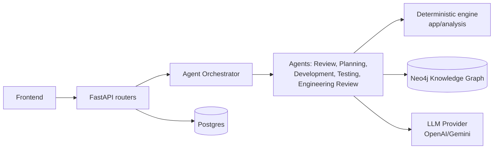

# DEVELOPER_ONBOARDING.md — GraphForge

Read this once, start contributing. If something here disagrees with `docs/graphforge/*`, that
wins — this is a fast-path summary, not a replacement.

## Project Overview

GraphForge is an AI Engineering Intelligence Platform where every feature reads from or writes to
a unified Engineering Knowledge Graph. The Review Agent (change impact analysis on pull requests)
is the first of several specialized agents coordinated by an Agent Orchestrator. Full vision:
`docs/graphforge/PRODUCT_VISION.md`.

## Architecture Overview (60 seconds)



Two rules that explain almost every design decision in this codebase:
1. **Deterministic before probabilistic.** Anything a graph traversal or a rule can compute
   exactly, it does — the LLM only ever adds judgment on top of already-computed facts, never
   invents them. See `app/analysis/` (deterministic) vs. `app/agents/` (probabilistic).
2. **Evidence over assertion.** Every agent confidence score must point to the graph facts or tool
   calls that produced it. A bare confidence number with no evidence is a bug, not a style choice.

Full detail: `docs/graphforge/ARCHITECTURE.md`.

## Repository Layout

```
backend/app/
  core/            config, security, crypto, exceptions — read this before touching auth or secrets
  models/          SQLAlchemy ORM — one file per table, strictly separate from schemas/
  schemas/         Pydantic request/response models — matches models/ 1:1 by field name, not by import
  analysis/        deterministic risk/impact engine — no LLM calls anywhere in this package, ever
  agents/          agent implementations (planning/, development/, testing/, engineering_review/,
                   code_generation/, git_ops/) plus the frozen Agent Contract (_contract.py)
  ai/agent/        the Review Agent's Plan→Tool→Observe→Decide loop, adapted into the framework
                   via app/agents/review_adapter.py
  orchestrator/    Agent Registry, Selector, RunCoordinator
  tools/           Tool Platform — ToolRegistry, ToolExecutor, ContextBuilder, per-tool implementations
  context/         Entry Resolvers + Context Assembler
  integrations/    IVersionControlProvider (GitHub, local git) — narrow, single-purpose interfaces
  graph/           Neo4j session + IGraphRepository
  indexer/         clone → parse (tree-sitter) → extract → build graph
  api/v1/routers/  HTTP boundary only — resolve ownership, delegate, map errors, nothing else

frontend/src/
  app/             AuthContext, AiModelContext, router.tsx (route table exported as data — tests reuse it)
  pages/           one file per route, thin composition of hooks + components
  components/      Card/Table/StatusBadge/RiskBadge (compose these, never fork them) + feature components
  lib/api/         one module per backend resource, thin fetch wrappers over client.ts
  hooks/           data-fetching hooks that assemble multiple lib/api calls into one view-ready shape
  types/           hand-maintained TS mirrors of backend Pydantic schemas, 1:1 field names
```

## How to Run Locally

```bash
scripts/docker-dev.sh     # one command: Postgres + Neo4j + backend (uvicorn --reload) + frontend (Vite), hot reload
```

No local Python or Node install needed. Frontend: `http://localhost:5173`. Backend:
`http://localhost:8000`, API docs at `/docs`. First run: register a user at `/login`, or seed the
local demo environment per `demo/DEMO_GUIDE.md`.

Backend-only (native, if you have `uv` installed): `scripts/dev.sh`. Full command reference:
`docs/setup.md`.

## Coding Standards

- **Naming**: `PascalCase` classes/models, `snake_case` functions (Python); `PascalCase` components,
  `camelCase` functions (TypeScript). Plural kebab-case API paths (`/agent-runs`).
- **Errors**: never swallow an exception. Reuse an existing `AppError` subclass
  (`NotFoundError`, `UnauthorizedError`) before inventing a new one.
- **Types**: full type hints everywhere, no `any` in TypeScript — the existing `mypy`/`tsc` gates
  must stay green.
- **DI**: FastAPI `Depends()` for request-scoped resources; constructor injection for
  services/engines/agents.
- **Config**: everything through `app.core.config.Settings` — no ad hoc env-var reads, no
  hardcoded config.
- **Tests**: real Postgres/Neo4j in integration tests. Mock only the exact external HTTP boundary
  (`httpx.MockTransport`). Never mock the database.

## Branch Strategy

Trunk-based, off `master`. Branch as `feature/<short-name>` or `fix/<short-name>`. Rebase onto
`master` before opening a PR — reviewers should never see conflict markers. Squash-merge only
after CI is green.

## Pull Request Workflow

1. **Before coding**: read the relevant `docs/graphforge/*` section for what you're building.
2. **Before opening the PR**: builds locally, existing tests still pass, your new code has tests in
   the existing style, no invented API shape (see `docs/graphforge/API_CONTRACTS.md`), no
   unrequested rename of a shared model, relevant doc updated in the same PR if you changed what it
   describes.
3. **Review**: at least one reviewer with context on the touched area.
4. **Merge**: squash-merge, only after CI is green on your rebased branch.

## AI Usage Rules

Using an AI coding assistant is expected — it's an accelerant, not a substitute for architectural
discipline.

1. Every prompt should paste in the relevant `docs/graphforge/*` section — don't rely on the
   model's memory of "what GraphForge is."
2. Never let the AI invent an API shape — paste `API_CONTRACTS.md`'s exact contract and ask it to
   implement *that*.
3. Never rename a shared model/schema/component without review sign-off — AI tools "clean up"
   names unprompted; check every diff for unrequested renames.
4. Human review is mandatory before every merge, always — AI-authored code is not review-exempt.

## Testing Expectations

- Real Postgres/Neo4j in integration tests — never a mocked DB session.
- Mock only the exact external HTTP boundary (`httpx.MockTransport` for GitHub, LLM providers).
- Every new function/endpoint/component ships with a test in the same PR, following the existing
  file's conventions exactly.
- Coverage bar: happy path + the documented error/precondition cases from `API_CONTRACTS.md` or
  `AGENT_FRAMEWORK.md` + one adversarial case.

## Definition of Done

- [ ] Reviewer approved
- [ ] Branch rebased on current trunk, no conflict markers
- [ ] CI green
- [ ] New tests exist and pass
- [ ] Relevant `docs/graphforge/*` section updated if this PR changed what it describes
- [ ] For agent/orchestrator work: the agent is actually registered and shows up in `GET /agents`

## Common Mistakes

- **Assuming Redis-backed `RunContext` exists.** It's in-memory, single-process today. See
  `docs/graphforge/ARCHITECTURE.md`'s Shared Memory section — Redis-backing is required before any
  multi-process/multi-replica deployment.
- **Confusing `plan_story` and `plan_freeform`.** The current Planning Agent is the standalone
  free-text variant (`plan_freeform`), not the sequential-handoff one that would consume a
  Requirement Agent's output (`plan_story`, roadmap backlog). See `docs/graphforge/AGENT_FRAMEWORK.md`.
- **Touching `docker/docker-compose*.yml`'s `name:` field or Postgres/Neo4j credentials casually.**
  Changing these orphans running dev volumes that hold real seeded demo data.
- **Forgetting to update `alembic/env.py`'s model imports** when adding a new model — this exact
  bug has happened before in this codebase and silently breaks `alembic revision --autogenerate`
  until caught.
