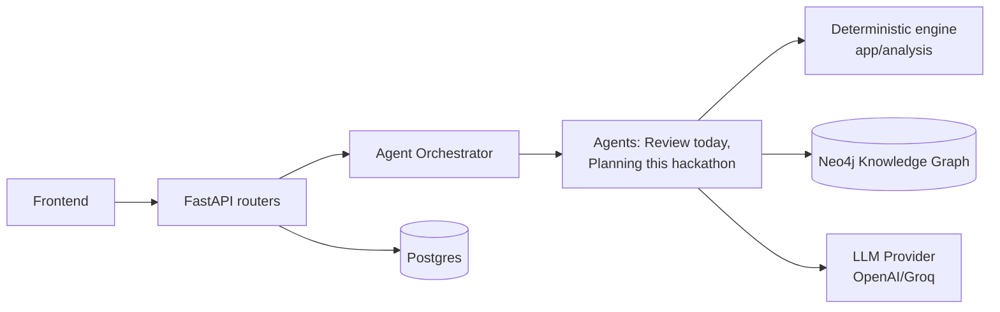

# DEVELOPER_ONBOARDING.md — GraphForge

Read this once, start contributing. If something here disagrees with `docs/graphforge/*` or
`TEAM_IMPLEMENTATION_PLAN.md`, those win — this is a fast-path summary, not a replacement.

## Project Overview

GraphForge is the next evolution of ChangeGuard: an AI Engineering Intelligence Platform where
every feature reads from or writes to a unified Engineering Knowledge Graph. ChangeGuard's
existing Change Investigation Agent becomes the **Review Agent** — the first of several
specialized agents coordinated by a new Agent Orchestrator. Full vision: `PRODUCT_VISION.md`.

## Architecture Overview (60 seconds)



Two rules that explain almost every design decision in this codebase:
1. **Deterministic before probabilistic.** Anything a graph traversal or a rule can compute
   exactly, it does — the LLM only ever adds judgment on top of already-computed facts, never
   invents them. See `app/analysis/` (deterministic) vs. `app/ai/agent/` → soon `app/agents/review/`
   (probabilistic).
2. **Evidence over assertion.** Every agent confidence score must point to the graph facts or tool
   calls that produced it. A bare confidence number with no evidence is a bug, not a style choice.

Full detail: `ARCHITECTURE.md`.

## Repository Layout

```
backend/app/
  core/            config, security, crypto, exceptions — read this before touching auth or secrets
  models/          SQLAlchemy ORM — one file per table, strictly separate from schemas/
  schemas/         Pydantic request/response models — matches models/ 1:1 by field name, not by import
  analysis/        deterministic risk/impact engine — no LLM calls anywhere in this package, ever
  ai/agent/        the Review Agent (Plan→Tool→Observe→Decide loop) — migrating to agents/review/ in WS1
  agents/          NEW this hackathon — _framework/ (shared base), review/, planning/
  orchestrator/    NEW this hackathon — Registry, Selector, RunCoordinator
  context/         NEW this hackathon — Entry Resolvers + Context Assembler
  integrations/    IVersionControlProvider (GitHub, local git) — narrow, single-purpose interfaces
  graph/           Neo4j session + IGraphRepository
  indexer/         clone → parse (tree-sitter) → extract → build graph
  api/v1/routers/  HTTP boundary only — resolve ownership, delegate, map errors, nothing else

frontend/src/
  app/             AuthContext, AiModelContext, router.tsx (route table exported as data — tests reuse it)
  pages/           one file per route, thin composition of hooks + components
  components/      Card/Table/StatusBadge/RiskBadge (compose these, never fork them) + feature components
  lib/api/         one module per backend resource, thin fetch wrappers over client.ts
  hooks/           data-fetching hooks that assemble multiple lib/api calls into one view-ready shape
  types/           hand-maintained TS mirrors of backend Pydantic schemas, 1:1 field names
```

Full ownership map (who touches what this hackathon): `TEAM_IMPLEMENTATION_PLAN.md` §4.

## How to Run Locally

```bash
scripts/docker-dev.sh     # one command: Postgres + Neo4j + backend (uvicorn --reload) + frontend (Vite), hot reload
```

No local Python or Node install needed. Frontend: `http://localhost:5173`. Backend:
`http://localhost:8000`, API docs at `/docs`. First run: register a user at `/login`, or use the
existing seeded demo account if you have its credentials from the Captain.

Backend-only (native, if you have `uv` installed): `scripts/dev.sh`. Full command reference:
`docs/setup.md`.

**Before your first commit**, confirm the repo is on the correct baseline — check with the Captain
that the branch-rename/CI-fix and baseline-commit items in `IMPLEMENTATION_BASELINE.md`'s
checklist are resolved. If they aren't, don't branch yet — ask first.

## Coding Standards (see `TEAM_IMPLEMENTATION_PLAN.md` §9 for the full table)

- **Naming**: `PascalCase` classes/models, `snake_case` functions (Python); `PascalCase` components,
  `camelCase` functions (TypeScript). Plural kebab-case API paths (`/agent-runs`).
- **Errors**: never swallow an exception. Reuse an existing `AppError` subclass
  (`NotFoundError`, `UnauthorizedError`) before inventing a new one.
- **Types**: full type hints everywhere, no `any` in TypeScript — the existing `mypy`/`tsc` gates
  must stay green.
- **DI**: FastAPI `Depends()` for request-scoped resources; constructor injection for
  services/engines/agents.
- **Config**: everything through `app.core.config.Settings` — no ad hoc env-var reads, no
  hardcoded config.
- **Tests**: real Postgres/Neo4j in integration tests. Mock only the exact external HTTP boundary
  (`httpx.MockTransport`). Never mock the database.

## Branch Strategy

Trunk-based. Branch from `main` (confirm this is actually the current branch name before you
start — see `IMPLEMENTATION_BASELINE.md`'s checklist) as `ws/<n>-<short-name>` (e.g.
`ws/2-orchestrator`). Rebase onto `main` before opening a PR — reviewers should never see conflict
markers. Full detail and rationale: `CAPTAIN_GUIDE.md`'s Git Branching Strategy section.

## Pull Request Workflow

1. **Before coding**: read the relevant `docs/graphforge/*` section for what you're building.
   Confirm the folder is yours per `TEAM_IMPLEMENTATION_PLAN.md` §4. If it's a Protected File, stop
   and ask the Captain instead of writing the PR.
2. **Before opening the PR**: builds locally, existing tests still pass, your new code has tests in
   the existing style, no invented API shape, no unrequested rename of a shared model, no new
   dependency without Captain sign-off, relevant doc updated in the same PR if you changed what it
   describes.
3. **Review**: exactly one named reviewer per the ownership table — not "whoever's free."
4. **Merge**: squash-merge, only after CI is green on your rebased branch.

Full checklists: `TEAM_IMPLEMENTATION_PLAN.md` §10, and this document's Definition of Done below.

## AI Usage Rules

You're expected to use Claude/Copilot/Cursor/ChatGPT to move fast. That's an accelerant, not a
substitute for architectural discipline. Ten mandatory rules (full list:
`TEAM_IMPLEMENTATION_PLAN.md` §8) — the five that matter most on day one:

1. Every prompt must paste in the relevant `docs/graphforge/*` section — don't rely on the model's
   memory of "what GraphForge is."
2. Never let the AI invent an API shape — paste `API_CONTRACTS.md`'s exact contract and ask it to
   implement *that*.
3. Never rename a shared model/schema/component without review sign-off — AI tools "clean up"
   names unprompted; check every diff for unrequested renames.
4. Never introduce a new dependency not already in `pyproject.toml`/`package.json` without Captain
   sign-off.
5. Human review is mandatory before every merge, always — AI-authored code is not review-exempt.

### Prompt Templates (copy these, fill in the brackets)

**Backend**:
```
Context: GraphForge backend, FastAPI + async SQLAlchemy + Alembic. Here is the existing
[analogous module] to follow the pattern of: [paste it]. Here is ARCHITECTURE.md's
description of [component]: [paste section].
Task: Implement [module]. Reuse existing interfaces rather than inventing new ones. Use the
existing AppError subclass pattern for errors: [paste an example].
Output: implementation + tests using the existing real-Postgres/real-Neo4j convention.
```

**Agent**:
```
Context: AGENT_FRAMEWORK.md's Agent Contract/Execution Flow/Confidence & Evidence sections:
[paste them]. The AgentManifest contract: [paste it]. The Review Agent's tool-use loop shape
(follow the shape, not the domain logic): [paste investigation_agent.py's planner loop].
Task: Implement [agent]: manifest, prompt, tools, output schema. Every confidence score needs
at least one Evidence entry — no bare numbers.
Output: agent module + manifest registration + tests (happy path, low-confidence retry, a
failing tool call).
```

**Frontend**:
```
Context: UI_GUIDELINES.md section: [paste it]. Existing Card/Table/StatusBadge contract:
[paste]. A page to match the style of: [paste PullRequestDetailPage.tsx].
Task: Build [component/page], composing existing components only — no new colors, spacing,
or primitives.
Output: component + .test.tsx following the existing test pattern: [paste a reference test].
```

**API**:
```
Context: the exact contract from API_CONTRACTS.md: [paste verbatim, including example JSON].
Existing router pattern: [paste ai_analysis.py or similar].
Task: Implement exactly this contract. If something seems wrong, ask — don't silently improve it.
Output: router + schemas + tests for happy path and every listed error status.
```

Full set (Documentation, Testing, Bug Fixes, Refactoring, Review templates): `TEAM_IMPLEMENTATION_PLAN.md` §8.

## Testing Expectations

- Real Postgres/Neo4j in integration tests — never a mocked DB session.
- Mock only the exact external HTTP boundary (`httpx.MockTransport` for GitHub, LLM providers).
- Every new function/endpoint/component ships with a test in the same PR, following the existing
  file's conventions exactly.
- Coverage bar: happy path + the documented error/precondition cases from `API_CONTRACTS.md` or
  `AGENT_FRAMEWORK.md` + one adversarial case.

## Definition of Done

- [ ] Named reviewer approved
- [ ] Branch rebased on current trunk, no conflict markers
- [ ] CI green
- [ ] New tests exist and pass
- [ ] Relevant `docs/graphforge/*` section updated if this PR changed what it describes
- [ ] For agent/orchestrator work: the agent is actually registered and shows up in `GET /agents`

## Common Mistakes (from the architecture reviews already done on this project)

- **Assuming Redis-backed `RunContext` exists.** It doesn't this hackathon — it's in-memory,
  single-process. See `ARCHITECTURE.md`'s Shared Memory addendum.
- **Confusing `plan_story` and `plan_freeform`.** The hackathon's Planning Agent is the standalone
  free-text variant (`plan_freeform`), not the sequential-handoff one that consumes a Requirement
  Agent's output (`plan_story`, Phase 2/3 backlog). See `AGENT_FRAMEWORK.md`'s addendum.
- **Touching `docker/docker-compose*.yml`'s `name:` field or Postgres/Neo4j credentials "to match
  the rebrand."** Don't. It orphans the running dev volumes that hold real seeded demo data. See
  `FINAL_ARCHITECTURE_REVIEW.md` Part 3.
- **Editing `nav-items.ts`/`router.tsx` yourself** because you added a page. These are Developer
  2's files this hackathon — ask them to add the line.
- **Forgetting to update `alembic/env.py`'s model imports** when adding a new model — this exact
  bug already happened once in this codebase (`PullRequestAIAnalysis` was missing) and silently
  breaks `alembic revision --autogenerate` for everyone until caught.

## FAQ

**Q: Do I need to understand the full multi-phase `ROADMAP.md` to contribute this hackathon?**
No. Read `TEAM_IMPLEMENTATION_PLAN.md`'s scoping note at the top — this hackathon builds a
deliberately small slice, not the whole roadmap.

**Q: What if I think the architecture is wrong?**
Say so to the Captain. Don't route around it silently — `TEAM_IMPLEMENTATION_PLAN.md` §16 Rule 1:
architecture changes require Captain approval.

**Q: What if two of us need to touch the same file?**
Check `TEAM_IMPLEMENTATION_PLAN.md` §4's ownership table first — most files have exactly one
owner. If it's a genuinely shared file, announce before touching it (§11).

**Q: My AI tool just generated something that looks great — can I skip review since it's obviously
correct?**
No. See AI Usage Rules above — always reviewed, always.

**Q: Where do I ask questions?**
The team's shared channel, or the Captain directly for anything architecture-adjacent.
