# GraphForge Transformation Plan

**Status**: Engineering blueprint — evolves ChangeGuard into GraphForge.
**Scope**: Architecture evolution only. No code in this document.
**Companion docs** (already written, read first): [`docs/graphforge/PRODUCT_VISION.md`](graphforge/PRODUCT_VISION.md),
[`ARCHITECTURE.md`](graphforge/ARCHITECTURE.md), [`UI_GUIDELINES.md`](graphforge/UI_GUIDELINES.md),
[`API_CONTRACTS.md`](graphforge/API_CONTRACTS.md), [`AGENT_FRAMEWORK.md`](graphforge/AGENT_FRAMEWORK.md),
[`ROADMAP.md`](graphforge/ROADMAP.md). No `TASK_DECOMPOSITION.md` exists in the repository —
this document supersedes the need for one at the transformation-planning level; per-phase task
breakdowns are the responsibility of whoever picks up each `ROADMAP.md` phase.

This document is the bridge between the aspirational design in `docs/graphforge/*` and the actual
repository as it exists today. Where the two disagree on a name or a boundary, **this document
defers to what the running code actually does**, and the `docs/graphforge/*` files should be
read as the target state, not the current state.

---

## 0. Ground Truth — What Actually Exists Today

Verified directly against the repository (not assumed from the design docs):

```
changeguard/
  backend/        FastAPI, uv, pyproject.toml, Dockerfile, alembic/
  frontend/       Vite + React + TS, package.json, Dockerfile
  docker/         docker-compose.yml, docker-compose.demo.yml, docker-compose.prod.yml
  scripts/        dev.sh, docker-dev.sh, docker-prod.sh, demo-up.sh, lint.sh, test.sh, setup.sh
  demo/           demo repo fixtures / seed content
  docs/           adr/ (0001–0009), architecture/, project_documentation.md, setup.md, graphforge/
  .github/        workflows/ci.yml
```

Backend (`backend/app/`):

```
core/            config.py (Settings: app_name="ChangeGuard", jwt, crypto, cors, frontend_base_url)
database/        session.py, base.py
models/          user, github_connection, repository, pull_request, indexing_job,
                 pull_request_analysis, pull_request_ai_analysis
schemas/         per-domain Pydantic request/response models
services/        auth_service, github_service, webhook_service
graph/           Neo4j session + IGraphRepository (real Neo4j driver implementation)
indexer/         scanner, parsers (tree-sitter Java/Spring Boot), extractors, graph builder, workers
analysis/        deterministic engine: risk_classifier, dependency_path_builder, impact models
ai/              agent/ (investigation_agent, planner, tools, models, codeowners),
                 providers/ (OpenAI + Groq factory), prompts/, schemas/, services/
                 (context_builder, persistence, ai_analysis_service, github_comment_formatter)
integrations/    interfaces.py (IVersionControlProvider, IOAuthProvider), github.py, local_git.py, factory.py
api/v1/routers/  health, auth, oauth, github, repositories, pull_requests, ai_analysis, webhooks
utils/           shared helpers
```

Frontend (`frontend/src/`):

```
app/             AuthContext, AiModelContext, App.tsx, router.tsx
pages/           DashboardPage, PullRequestsPage, PullRequestDetailPage, RepositoriesPage,
                 RepositoryDetailPage, ArchitecturePage, ReportsPage, SettingsPage, LoginPage
components/      Card, Table, StatusBadge, RiskBadge, ReasoningLogPanel, AiModelSelector,
                 GitHubIntegrationCard, StatCard, graph/DependencyGraph, layout/(AppLayout,
                 Sidebar, Topbar, RequireAuth, nav-items.ts)
lib/api/         client.ts, auth.ts, github.ts, repositories.ts, analysis.ts
hooks/           useDashboardData, usePullRequestsData
types/            domain, auth, github, pullRequest, analysis, aiModel
```

This is a real, tested, production-shaped codebase — 269 backend tests (268 passing, 1
pre-existing environment-conflict failure, documented in `ROADMAP.md` Technical Debt), 49
frontend tests, full ruff/black/mypy/tsc/oxlint/prettier compliance, real Postgres + Neo4j
integration testing (no mocked DB). This is the foundation. Nothing below proposes discarding it.

---

## 1. Existing Architecture

### Frontend Structure

A Vite + React + TypeScript SPA with a conventional, disciplined layering:

- **`app/`** — cross-cutting React context (`AuthContext` for JWT/session, `AiModelContext` for
  the selected LLM model) and the route table (`router.tsx`, exported as plain `RouteObject[]` so
  tests build a `MemoryRouter` from the identical tree — a notable, deliberate testability choice).
- **`pages/`** — one file per route, each a thin composition of hooks + components. No page
  contains business logic beyond orchestrating its own async calls and local UI state.
- **`components/`** — a small, deliberately non-proliferating shared library (`Card`, `Table`,
  `StatusBadge`, `RiskBadge`) plus feature components (`DependencyGraph`, `ReasoningLogPanel`,
  `AiModelSelector`, `GitHubIntegrationCard`) and a `layout/` subtree for chrome (sidebar, topbar,
  route guard).
- **`lib/api/`** — one module per backend resource group, each a thin `fetch` wrapper over a
  shared `client.ts` (auth header injection, `ApiError` typed errors). No component calls `fetch`
  directly.
- **`hooks/`** — data-fetching hooks (`useDashboardData`, `usePullRequestsData`) that compose
  multiple `lib/api` calls into one view-ready shape, keeping pages free of orchestration logic.
- **`types/`** — hand-maintained TypeScript mirrors of backend Pydantic schemas, one file per
  domain, matching field names 1:1 with the backend (no codegen, but disciplined manual parity).

### Backend Structure

FastAPI with a hexagonal/clean-architecture layering that is **already** close to what
`docs/graphforge/ARCHITECTURE.md` calls for — this is the single most important fact for this
transformation: **the target architecture is an extension of the current one, not a departure
from it.**

- **`api/v1/routers/`** — HTTP boundary only. Every router follows the same shape: resolve
  ownership via a join query, delegate to a service/engine, map domain errors to `AppError`
  subclasses (never ad hoc HTTP responses).
- **`services/`** — cross-cutting application services (auth, GitHub connection management,
  webhook handling) that don't belong to one specific domain engine.
- **`analysis/`** (deterministic) and **`ai/`** (probabilistic) — a strict separation already
  enforced in the code: `analysis/engine/ImpactAnalysisEngine` computes risk and dependency paths
  with zero LLM calls; `ai/agent/InvestigationAgent` consumes that deterministic result as
  grounding before making any LLM call. This is exactly the "deterministic before probabilistic"
  principle `PRODUCT_VISION.md` states as a Core Principle — it is already implemented, not
  aspirational.
- **`integrations/`** — `IVersionControlProvider`/`IOAuthProvider` interfaces with real
  `GitHubVersionControlProvider`/`LocalGitVersionControlProvider` implementations, chosen via a
  `factory.py` keyed off `Settings.vcs_provider`. This is the existing precedent for how
  GraphForge's `IKnowledgeSource` interface (design doc) should be built — same pattern, proven.
- **`indexer/`** — clone → parse (tree-sitter) → extract (controllers, services, Feign clients,
  Kafka producers/consumers, POM dependencies) → build graph → write to Neo4j. Currently
  Java/Spring-Boot-specific by parser choice, not by architecture — the scanner/parser/extractor
  split already anticipates additional language parsers.
- **`models/` + `schemas/`** — SQLAlchemy ORM models and Pydantic I/O schemas are kept strictly
  separate (existing convention, never violated) — this is what made adding
  `release_coordination_plan` to `PullRequestAIAnalysis` a pure additive column, zero API breakage.

### AI Layer

The most mature part of the codebase relative to the GraphForge vision:

- `ai/agent/investigation_agent.py` implements a real **Plan → Select Tool → Execute → Observe →
  Decide** loop (`planner.py`), with a confidence-triggered retry (`should_retry_after_low_confidence`)
  and a CODEOWNERS fallback when git-blame authorship is unavailable. This *is* the Review Agent —
  not a prototype of one, the actual thing, already handling low-confidence retries and tool
  fallback gracefully.
- `ai/providers/` is a provider-agnostic factory (OpenAI primary, Groq fallback for free-tier
  demo use) — already the extensibility point `AGENT_FRAMEWORK.md` assumes exists.
- `ai/services/context_builder.py` assembles an `AIContext` from a `PullRequest` + its
  deterministic analysis — a single-purpose, PR-shaped version of what `ARCHITECTURE.md` calls
  the "Context Builder." It is not general yet (it only resolves from a `PullRequest`), but its
  internal shape (deterministic facts in, structured prompt sections out) is the right shape to
  generalize.
- `ai/services/github_comment_formatter.py` (newest module) is a pure function
  (`AIAnalysisResult` → markdown, zero I/O) — the cleanest existing example of the
  "agent output → external side effect" boundary the framework design wants everywhere.

### Integrations

`IVersionControlProvider` (read: diff, changed files, file content, recent authors) and
`IOAuthProvider` (GitHub OAuth "connect," not "log in as" — a deliberate, documented ADR 0006
distinction) are both real, tested, dual-implemented (GitHub + local git) interfaces. The one
write operation (`post_pull_request_comment`) was deliberately kept **off** the
`IVersionControlProvider` interface because a local git branch has no PR/comment concept — this
exact judgment call is the template for how Jira/Confluence integrations should be scoped in
GraphForge (narrow interfaces, no forced-fit methods).

### Database

Postgres via async SQLAlchemy, one Alembic migration per schema change, always additive to date
(no destructive migration has shipped). `pull_request_analyses` (deterministic) and
`pull_request_ai_analyses` (AI-enriched) are separate tables with a shared `pull_request_id`
foreign key — mirroring the analysis/ai package split at the storage layer.

### Graph

Neo4j, written exclusively by `app/indexer`, read by `app/analysis/graph` (deterministic
traversal) and `app/ai/agent/tools.py` (agent tool calls). Node types today:
`Repository`, `Component`, `Api`, `Topic` (Kafka), `Library`. Edges: `DEPENDS_ON`-family
relationships built from static analysis (Feign clients, Kafka producers/consumers, POM
dependencies). This is a real, populated graph — not a schema sketch.

### Authentication

Local email/password JWT auth (`auth_service.py`, `core/security.py`) is fully separate from
GitHub OAuth "connect" (`github_service.py`) — a deliberate two-identity-system design (ADR 0006):
logging into GraphForge is not the same act as connecting a GitHub account for repo access. This
separation is exactly right for GraphForge, where a user will eventually connect *multiple*
sources (GitHub, Jira, Confluence) under one GraphForge identity — the pattern already
generalizes without modification.

### Routing

Backend: FastAPI `APIRouter` per resource, all mounted under `/api/v1` in `main.py`. Frontend:
`react-router-dom`, route table exported as data (`routes: RouteObject[]`) specifically so tests
can reuse it — already a forward-looking choice for adding new top-level routes (Projects,
Pipeline, Agents, Knowledge Graph) without touching test infrastructure.

### Services

Backend `services/` currently holds only cross-cutting concerns not owned by one engine
(auth, GitHub connection, webhooks) — domain logic correctly lives in `analysis/engine` and
`ai/agent`, not in `services/`. This boundary must be preserved: new agents belong in an
`agents/` package (per `AGENT_FRAMEWORK.md`), not bolted onto `services/`.

### Reusable Components

`Card`, `Table`, `StatusBadge`, `RiskBadge` are genuinely reusable today (used across Dashboard,
PullRequestsPage, PullRequestDetailPage, RepositoryDetailPage) with no page-specific forks.
`ReasoningLogPanel` was built PR-specific but its props (`steps: ReasoningStep[]`) are already
agent-agnostic — it renders any agent's reasoning log, not just the Review agent's, without
modification.

---

## 2. Existing Strengths — What Must Be Preserved

| Strength | Why it matters for GraphForge |
|---|---|
| **Deterministic-before-probabilistic separation** (`analysis/` vs `ai/`) | This *is* the "evidence over assertion" principle from `PRODUCT_VISION.md`, already enforced in code, not just documented. Any new agent must follow this exact split. |
| **Real Plan/Tool/Observe/Decide agent loop with retry + fallback** | This is the entire intra-agent execution model `AGENT_FRAMEWORK.md` specifies — it is proven in production against real GitHub PRs, not a design sketch. |
| **Narrow, single-purpose interfaces** (`IVersionControlProvider`, `IOAuthProvider`) with the discipline to *not* force-fit new methods onto them | Directly informs how `IKnowledgeSource` for Jira/Confluence must be scoped — narrow, not a kitchen-sink interface. |
| **Provider-agnostic LLM factory** (OpenAI + Groq) | Cost-class-aware agent design (`AGENT_FRAMEWORK.md`) builds directly on this — already handles provider swap without caller changes. |
| **Strict ORM/schema separation, always-additive migrations** | Every schema evolution to date (adding `release_coordination_plan`, adding GitHub connection tables) has been zero-downtime and backward compatible. This discipline must continue for every new node/edge type and every new Postgres table. |
| **Real integration testing** (real Postgres, real Neo4j, mocked only at the exact external HTTP boundary via `httpx.MockTransport`) | This is expensive to build and easy to erode. New agents/integrations must be held to the same bar — no mocked DB in integration tests, ever. |
| **Route table exported as data for test reuse** | Already solves the "how do we test a growing set of pages without duplicating router setup" problem GraphForge will face as Projects/Pipeline/Agents/Knowledge Graph pages are added. |
| **Consistent error model** (`AppError` subclasses → uniform JSON, existing status-code precedents reused rather than invented per feature) | Already demonstrated working across 4+ features (auth, GitHub, indexing, AI analysis, publish-review) without a single ad hoc error shape. |
| **Dark, dense, no-nonsense UI with a genuinely small component vocabulary** | Matches the target persona (engineers, not general consumers) exactly — a redesign would actively work against `PRODUCT_VISION.md`'s "developer-native UX" pillar. |
| **CI pipeline + lint/type/test gates already wired** (`.github/workflows/ci.yml`, `scripts/lint.sh`, `scripts/test.sh`) | New agent/integration modules plug into this immediately — zero CI redesign needed. |

---

## 3. Existing Components → GraphForge Mapping

| Current Module | ↓ | GraphForge Module | Notes |
|---|---|---|---|
| `backend/app/analysis/` (deterministic impact engine) | ↓ | **Review Agent — deterministic tool layer** | Becomes the Review agent's primary tool set, unchanged in implementation |
| `backend/app/ai/agent/` (`investigation_agent.py`, `planner.py`, `tools.py`) | ↓ | **Review Agent (full agent)** | Renamed/relocated to `app/agents/review/`, wrapped in `BaseAgent`, zero behavior change |
| `backend/app/ai/agent/codeowners.py` | ↓ | **Review Agent tool: ownership resolution** | Also becomes a shared utility other agents (e.g. future Documentation agent) can reuse |
| `backend/app/ai/services/context_builder.py` | ↓ | **Context Builder (Entry Resolver + Assembler), PR-specific resolver** | Generalized; today's logic becomes `GitHubEntryResolver` + the PR-specific assembly path |
| `backend/app/ai/services/github_comment_formatter.py` | ↓ | **Review Agent output formatter** | Unchanged — the template for how every agent formats its output for an external system |
| `backend/app/ai/providers/` | ↓ | **Agent Framework: LLM Provider Factory** | Unchanged, becomes shared infrastructure under `agents/_framework/` |
| `backend/app/graph/` + `backend/app/indexer/` | ↓ | **Engineering Knowledge Graph (write + read path)** | Unchanged; schema extended additively (new node types), write path gains the `GraphWriter` choke point in front of it |
| `backend/app/integrations/` (`IVersionControlProvider`, `IOAuthProvider`) | ↓ | **Integrations Layer** | `IVersionControlProvider` retained as-is (code-hosting-specific); becomes one specialization alongside new `IKnowledgeSource` for Jira/Confluence |
| `backend/app/api/v1/routers/repositories.py` | ↓ | **Projects API — code-project subset** | Repository management is retained verbatim; "Projects" in GraphForge is a superset that also includes Jira Story/Epic subjects |
| `backend/app/api/v1/routers/pull_requests.py`, `ai_analysis.py` | ↓ | **Review Agent conveniences** | Retained verbatim as thin wrappers once the Orchestrator exists (Phase 4) — no breaking change to these endpoints, ever |
| `backend/app/models/pull_request_analysis.py`, `pull_request_ai_analysis.py` | ↓ | **Review Agent's `AgentOutput` backing tables** | Retained as-is; `AgentOutput` envelope (Phase 4) wraps them, does not replace them |
| `backend/app/services/github_service.py`, `webhook_service.py` | ↓ | **Integrations services** | Unchanged; `get_decrypted_access_token` (already shared/de-duplicated) becomes the template for Jira/Confluence token handling |
| `backend/app/core/crypto.py` | ↓ | **Secrets management for all integrations** | Unchanged Fernet pattern, reused for every future integration token, no new mechanism |
| `frontend/src/pages/RepositoriesPage.tsx`, `RepositoryDetailPage.tsx` | ↓ | **Projects pages (code-project view)** | Retained; a `ProjectPage` (Jira-story-shaped) is added alongside, not a replacement |
| `frontend/src/pages/PullRequestDetailPage.tsx` | ↓ | **Review Agent detail view** | Retained verbatim; its 3-button pattern (Run AI / Investigate / Publish Review) is the reusable template for other agents' action rows |
| `frontend/src/pages/ArchitecturePage.tsx` + `components/graph/DependencyGraph.tsx` | ↓ | **Knowledge Graph page (repo-scoped view)** | `DependencyGraph` component promoted to shared, reused by the new org-wide Knowledge Graph page; `ArchitecturePage` itself retained as the repo-scoped entry point |
| `frontend/src/components/ReasoningLogPanel.tsx` | ↓ | **Agents page: run detail view** | Already agent-agnostic in its props; promoted to shared use across all agents, not moved or rewritten |
| `frontend/src/components/Card.tsx`, `Table.tsx`, `StatusBadge.tsx`, `RiskBadge.tsx` | ↓ | **GraphForge Design System primitives** | Unchanged; every new page composes these, no new primitives introduced without extending this table first (per `UI_GUIDELINES.md`) |
| `frontend/src/components/AiModelSelector.tsx` | ↓ | **Agent Framework: model selection UI** | Unchanged; reused wherever any agent action lets the user pick a model |
| `frontend/src/app/AuthContext.tsx`, `AiModelContext.tsx` | ↓ | **GraphForge platform-level context** | Unchanged; `AiModelContext` generalizes trivially since it's already agent-agnostic (a model choice, not a Review-agent-specific choice) |
| `docker/`, `scripts/`, `.github/workflows/ci.yml` | ↓ | **GraphForge build/deploy pipeline** | Unchanged; new services (Redis for Shared Memory, Phase 4) are additive entries in the existing compose files, not a new pipeline |

---

## 4. Gap Analysis

### Status Legend
- ✅ **Already Exists** — implemented and working today
- 🔧 **Needs Enhancement** — exists but must be generalized/extended
- ⛔ **Missing** — does not exist, must be built
- 🔮 **Future** — explicitly out of scope until a later phase

| Capability (from `docs/graphforge/*`) | Status | Notes |
|---|---|---|
| Deterministic risk/impact engine | ✅ | `app/analysis/*`, no changes needed |
| Single-agent Plan/Tool/Observe/Decide loop | ✅ | `app/ai/agent/*`, no changes needed |
| Confidence scoring + retry on low confidence | ✅ | `planner.py`, no changes needed |
| Neo4j knowledge graph (code-level) | ✅ | `app/graph`, `app/indexer` |
| GitHub integration (OAuth + REST) | ✅ | `app/integrations/github.py` |
| Publish agent output to external system | ✅ | `post_pull_request_comment` + formatter — the working template |
| PR-specific Context Builder | 🔧 | `context_builder.py` must generalize to arbitrary `Subject`s, not just `PullRequest` |
| Evidence formalized as a typed object | 🔧 | Today it's informal tool-observation strings; needs the `Evidence` schema from `AGENT_FRAMEWORK.md` |
| Agent Manifest / Registry | ⛔ | No agent metadata exists today — implicit, single-agent system |
| Agent Orchestrator (Selector + Run Coordinator) | ⛔ | Does not exist; router calls the one agent directly today |
| `Run`/`AgentStep` audit trail (Postgres) | ⛔ | No run-tracking table exists; today's "run" is implicit in the request/response cycle |
| Shared Memory (`RunContext`, Redis-backed) | ⛔ | No cross-agent state exists because there is only one agent |
| `GraphWriter` schema-validation choke point | ⛔ | Indexer writes directly to Neo4j today; no central validation |
| Entry Resolvers for Jira/Confluence | ⛔ | No Jira/Confluence integration exists at all |
| New graph node types (`Story`, `Epic`, `Document`, `ADR`, `TestRun`, `Release`) | ⛔ | Schema does not include these yet |
| Requirement / Planning / Architecture / Development / Testing / Release agents | ⛔ | Only Review agent exists; Release *logic* partially exists inside the AI analysis pipeline (Release Coordination Plan) but is not its own agent module |
| Monitoring / Documentation agents | 🔮 | Explicitly Phase-3-and-beyond / backlog per `ROADMAP.md` |
| Knowledge Graph, Projects, Agents, Pipeline pages | ⛔ | Do not exist; current nav is Dashboard/PRs/Repos/Architecture/Reports/Settings only |
| LLM-based Goal/agent selection | 🔮 | Explicitly deferred to Phase 3 behind `ISelector`, rule-based first |
| Datadog/Grafana/Splunk/K8s/Slack integrations | 🔮 | Backlog, no work started |
| Confidence calibration tracking | ⛔ | No feedback-capture mechanism exists yet |
| GraphForge branding (name, tagline, package metadata) | 🔧 | Currently "ChangeGuard" throughout: `Settings.app_name`, `frontend/index.html` `<title>`/meta, `backend/pyproject.toml` description, sidebar has no product name (nav-items only, no logo/name string found in layout — to confirm during Phase 1 audit) |

### Priority Matrix

```
                    HIGH IMPACT                         LOW IMPACT
              ┌─────────────────────────────┬─────────────────────────────┐
   HIGH       │ P0: Rebrand (Phase 1)        │ P2: Confidence calibration   │
   URGENCY    │ P0: Agent Manifest/Registry  │     tracking (Phase 2)      │
              │ P0: Orchestrator core        │                              │
              │     (Phase 4 prerequisite    │                              │
              │      for any 2nd agent)      │                              │
              ├─────────────────────────────┼─────────────────────────────┤
   LOW        │ P1: Generalized Context      │ P3: Monitoring/Documentation │
   URGENCY    │     Builder (Phase 2)        │     agents (backlog)        │
              │ P1: GraphWriter choke point  │ P3: LLM-based Selector       │
              │     (Phase 3)                │     (Phase 3, opt-in)        │
              │ P1: Jira/Confluence graph     │ P3: Slack/Datadog/K8s        │
              │     node types (Phase 3)      │     (backlog)                │
              └─────────────────────────────┴─────────────────────────────┘
```

**Read this matrix as sequencing, not as "urgent = do first regardless of dependency."** The
Orchestrator (P0, high-urgency) is only urgent *because* Phases 2–5 cannot proceed without it —
it is a blocking prerequisite, not independently important. Rebranding (P0) is urgent because it
is cheap, low-risk, and immediately visible — the right first PR for team momentum, not because
it blocks anything technically.

---

## 5. Refactoring Strategy

| Action | Target | Rationale |
|---|---|---|
| **Keep** | `app/analysis/*`, `app/graph/*`, `app/indexer/*`, `app/integrations/*`, all existing routers, all existing models/schemas, all existing frontend pages/components/hooks | Working, tested, no design-doc gap requires touching them. Touching working code without a reason is the single biggest risk to a 5-engineer parallel effort. |
| **Rename** | `Settings.app_name` (`"ChangeGuard"` → `"GraphForge"`), `frontend/index.html` title/meta, `backend/pyproject.toml` description, README | Pure branding, zero logic risk, high visibility — Phase 1, day 1. |
| **Rename** | `app/ai/agent/` → `app/agents/review/` (package move, not a rewrite) | Aligns with the `AGENT_FRAMEWORK.md` folder convention (`app/agents/<agent>/`) once a second agent is imminent (Phase 2). **Defer this specific rename until Phase 2 starts** — doing it in Phase 1 for a still-single-agent system adds merge-conflict risk for zero immediate benefit. |
| **Move** | `app/ai/services/context_builder.py` → split into `app/context/resolvers/github.py` (Entry Resolver) + `app/context/assembler.py` (Context Assembler) | Only when Phase 2 needs a second resolver (Jira) — a single-resolver "framework" is premature abstraction; do this move exactly when the second resolver is written, not before. |
| **Merge** | Today's separate `investigate` / `ai-analysis` endpoint logic — no merge needed | These are already appropriately separate (single-shot vs. agentic) and both map cleanly onto "Review Agent, invoked with two different Goals" in Phase 4 — no code merge required, only an Orchestrator-level Goal mapping. |
| **Deprecate** | Nothing, in Phase 1–2 | No existing capability is superseded by GraphForge; GraphForge is additive. The only deprecation candidate in the entire plan is the *direct* router→agent call path once the Orchestrator exists (Phase 4) — and even then, the existing endpoints remain as thin wrappers (see API Evolution), never removed. |
| **Extend** | `PullRequestAIAnalysis` model, `AIAnalysisResult` schema | Already the established pattern (this model has taken 3+ additive migrations without issue) — the `AgentOutput` envelope (Phase 4) wraps this, it does not replace it. |
| **Extend** | Neo4j schema | New node/edge types (`Story`, `Document`, etc.) added additively; existing `Repository`/`Component`/`Api`/`Topic`/`Library` types and every Cypher query against them are untouched. |
| **Extend** | `docker/docker-compose*.yml` | Add a `redis` service for Shared Memory (Phase 4) and, later, whatever Jira/Confluence mock/sandbox services local dev needs (Phase 2) — additive service blocks, not a compose-file rewrite. |

**Never rewrite** (explicitly, because the temptation will exist): `investigation_agent.py`'s
core loop, the deterministic `ImpactAnalysisEngine`, the `IVersionControlProvider` interface
shape, or any existing frontend page. Every one of these has already survived multiple real
feature additions without needing a rewrite — that track record is the strongest evidence they
don't need one now either.

---

## 6. Proposed Folder Structure

### Backend

```
Current                                    Future (by end of Phase 4)
────────────────────────────────────────   ─────────────────────────────────────────────
backend/app/                               backend/app/
  core/                                       core/                        (unchanged)
  database/                                   database/                   (unchanged)
  models/                                     models/                     (unchanged)
                                                 + run.py, agent_step.py   (NEW, Phase 4)
                                                 + subject.py              (NEW, Phase 2)
  schemas/                                     schemas/                   (unchanged)
                                                 + orchestrator/           (NEW, Phase 4)
  services/                                    services/                   (unchanged)
  graph/                                       graph/                      (unchanged)
                                              graphwriter/                 (NEW, Phase 3)
  indexer/                                     indexer/                    (unchanged)
  analysis/                                    analysis/                   (unchanged — Review
                                                                             agent's tool layer)
  ai/                                        context/                     (NEW, Phase 2 —
    agent/            ──────rename─────►       resolvers/                  generalizes
      investigation_agent.py                     github.py                 ai/services/
      planner.py                                 jira.py    (Phase 3)      context_builder.py)
      tools.py                                    confluence.py (Phase 3)
      codeowners.py                            assembler.py
      models.py
    providers/         ──────move─────►      agents/                      (NEW package, Phase 2)
    prompts/                                    _framework/                (base_agent, manifest,
    schemas/                                       providers/  ◄───move─── ai/providers/, unchanged)
    services/                                       prompts/    ◄───move─── ai/prompts/, per-agent now
      context_builder.py  (superseded,               tool_registry.py
       see context/ above)                       review/        ◄──rename── ai/agent/*, unchanged logic
      ai_analysis_service.py  (retained,          requirement/   (NEW, Phase 2)
       becomes Review agent's synthesis path)      planning/      (NEW, Phase 2)
      persistence.py  (retained, extended)         architecture/  (NEW, Phase 2, reuses analysis/)
      github_comment_formatter.py (retained,       development/   (NEW, Phase 3)
       becomes review/output_formatter.py)         testing/       (NEW, Phase 3)
                                                    release/       (NEW, Phase 3, extracts existing
                                                                    Release Coordination Plan logic)
  integrations/                               integrations/               (unchanged)
    github.py, local_git.py,                    github.py, local_git.py,   (unchanged)
    interfaces.py, factory.py                    interfaces.py, factory.py
                                                  jira.py       (NEW, Phase 3)
                                                  confluence.py (NEW, Phase 3)
  orchestrator/  ── does not exist ──►        orchestrator/                (NEW, Phase 4)
                                                  registry.py
                                                  selector.py
                                                  run_coordinator.py
                                                  run_context.py            (Redis-backed)
  api/v1/routers/                             api/v1/routers/
    health, auth, oauth, github,                 (all existing routers unchanged, become
    repositories, pull_requests,                  thin Orchestrator wrappers internally
    ai_analysis, webhooks                         in Phase 4 — same paths, same contracts)
                                                 + agent_runs.py   (NEW, Phase 4)
                                                 + knowledge_graph.py (NEW, Phase 3)
                                                 + subjects.py     (NEW, Phase 2)
                                                 + projects.py     (NEW, Phase 2)
  utils/                                       utils/                      (unchanged)
```

**Rationale for deferring the `ai/` → `agents/` move to Phase 2, not Phase 1**: renaming a package
that has exactly one consumer (the single Review agent) buys nothing structurally and creates a
diff that touches every import in the AI layer for no functional gain — pure churn risk against
Phase 1's "minimal changes" mandate. The move earns its keep the moment a second agent
(Requirement, Phase 2) needs the shared `_framework/` base — do it then, in the same PR that
introduces that base, so the rename and its justification land together.

### Frontend

```
Current                                    Future (by end of Phase 4)
────────────────────────────────────────   ─────────────────────────────────────────────
frontend/src/                              frontend/src/
  app/                                        app/                         (unchanged)
  pages/                                      pages/                       (all existing retained)
    DashboardPage, PullRequestsPage,             + ProjectsPage   (NEW, Phase 2)
    PullRequestDetailPage, RepositoriesPage,     + ProjectDetailPage (NEW, Phase 2)
    RepositoryDetailPage, ArchitecturePage,      + KnowledgeGraphPage (NEW, Phase 3, wraps
    ReportsPage, SettingsPage, LoginPage           existing DependencyGraph org-wide)
                                                 + AgentsPage     (NEW, Phase 4)
                                                 + PipelinePage   (NEW, Phase 4)
  components/                                 components/                  (all existing retained)
    Card, Table, StatusBadge, RiskBadge,         agents/          (NEW, Phase 4)
    ReasoningLogPanel, AiModelSelector,             AgentCard.tsx
    GitHubIntegrationCard, StatCard,                ConfidenceBadge.tsx
    graph/DependencyGraph,                          EvidencePanel.tsx
    layout/*                                     pipeline/        (NEW, Phase 4)
                                                    StageColumn.tsx
                                                    StageCard.tsx
  lib/api/                                     lib/api/                     (all existing retained)
    client, auth, github, repositories,           + subjects.ts    (NEW, Phase 2)
    analysis                                      + projects.ts    (NEW, Phase 2)
                                                    + knowledgeGraph.ts (NEW, Phase 3)
                                                    + agentRuns.ts   (NEW, Phase 4)
  hooks/                                        hooks/                      (all existing retained)
    useDashboardData, usePullRequestsData          + useAgentRun.ts (NEW, Phase 4)
                                                    + useKnowledgeGraphSearch.ts (NEW, Phase 3)
  types/                                        types/                      (all existing retained)
                                                    + subject.ts, agent.ts, orchestrator.ts, graph.ts
```

Every "NEW" entry above is additive — no existing file in either tree is deleted or relocated
except the single, deliberately-deferred `ai/` → `agents/` package rename in Phase 2.

---

## 7. Migration Plan

Every phase below ends with the application fully working end-to-end and fully test-covered —
this is the hard constraint, not a suggestion. No phase may leave `main` in a state where
`scripts/test.sh` fails or a previously-working user flow regresses.

### Phase 1 — Rebrand + Baseline (no architecture change)

**Duration signal**: smallest phase, intentionally — momentum + zero-risk validation that the
transformation process itself works before any structural change begins.

- Rename branding. Confirmed via repo-wide grep — "ChangeGuard" appears in exactly these places,
  all in scope for Phase 1:
  - `backend/app/core/config.py` (`Settings.app_name`)
  - `frontend/index.html` (`<title>`, meta description)
  - `frontend/src/components/layout/Sidebar.tsx` (product name label)
  - `frontend/src/components/layout/Topbar.tsx` (fallback page title)
  - `frontend/src/pages/LoginPage.tsx` ("Sign in to ChangeGuard" heading)
  - `frontend/src/pages/SettingsPage.tsx`, `RepositoriesPage.tsx`, `GitHubIntegrationCard.tsx` (copy)
  - `frontend/src/types/github.ts`, `RiskBadge.tsx` (comments only — safe, low-priority)
  - `backend/app/ai/services/github_comment_formatter.py` (the literal `# 🤖 ChangeGuard AI Review`
    markdown header and footer attribution posted to real GitHub PRs — **user-visible in an
    external system**, must not be missed)
  - `backend/app/integrations/local_git.py`, `backend/app/integrations/__init__.py`,
    `backend/app/__init__.py` (module docstrings)
  - `backend/pyproject.toml` (package description), `README.md`
  - `frontend/src/app/App.test.tsx` (test assertions on the strings above — update in the same PR
    so CI doesn't fail on stale expected text)
- Reuse 100% of UI: zero new pages, zero new components.
- Reuse 100% of APIs: zero new endpoints, zero contract changes.
- Reuse 100% of backend: zero new packages.
- **Exit criterion**: full existing test suite green, product now visibly named GraphForge
  end-to-end (browser tab title, login page, any footer/header branding), zero functional diff.

### Phase 2 — Context Builder Generalization + First New Agent

- Introduce `app/context/` (Entry Resolver + Assembler), with `GitHubEntryResolver` wrapping
  today's `context_builder.py` logic byte-for-byte (behavior-preserving extraction, not a
  rewrite).
- Introduce `Subject` as a new, additive Postgres concept (not a new required field on existing
  tables) plus its API (`POST /subjects/resolve`, per `API_CONTRACTS.md`).
- Perform the deferred `app/ai/agent/` → `app/agents/review/` rename, in the same PR that
  introduces `app/agents/_framework/` (`BaseAgent`, `AgentManifest`) — because this is the PR
  where a shared base first has two consumers to justify existing (Review, plus the first new
  agent below).
- Ship **Requirement Agent** (first genuinely new agent) — narrowest possible scope: given a
  Jira story reference, resolve it via a new `JiraEntryResolver`, produce a clarified-requirement
  summary grounded in existing ADRs/docs found via a simple graph search (no new node types
  required yet — search existing `docs/adr/*` content indexed as a minimal `Document` node type,
  the *first* new graph node type).
- Ship `ProjectsPage`/`ProjectDetailPage` (frontend), reusing `Card`/`Table` verbatim.
- **Exit criterion**: existing Review agent flow fully regression-tested and unchanged from a
  user's perspective; a Jira story can be resolved and produce a Requirement Agent output visible
  in a new Projects page — while every existing PR-based flow works identically.

### Phase 3 — Knowledge Graph Enhancements + GraphWriter

- Introduce `GraphWriter` as the single Neo4j write choke point; migrate the existing indexer's
  direct writes through it (behavior-preserving — same facts, same graph, new code path).
- Extend the graph schema additively: `Story`, `Epic`, `Document`, `ADR`, `TestRun`, `TestCase`,
  `Release` node types (per `ARCHITECTURE.md` Domain Model) — added, not migrated onto existing
  types.
- Ship `ConfluenceEntryResolver` + `IKnowledgeSource` implementation for Confluence.
- Ship **Planning Agent** and **Architecture Agent** — Planning consumes Requirement's output via
  the (still manual, pre-Orchestrator) sequential call today's Review agent already demonstrates
  is possible; Architecture Agent reuses the *existing* deterministic `ImpactAnalysisEngine`
  traversal against a Story's linked repositories instead of a PR's diff — zero new traversal
  logic, a new entry point into existing logic.
- Ship `KnowledgeGraphPage` (frontend), wrapping the existing `DependencyGraph` component
  org-wide instead of repo-scoped.
- **Exit criterion**: a Jira story can flow Requirement → Planning → Architecture with visible
  output; all graph facts, old and new, carry `source`/`written_at` provenance via GraphWriter.

### Phase 4 — Agent Orchestrator

- Introduce `app/orchestrator/`: `AgentManifest` registry (already-shipped agents register
  retroactively), rule-based `Selector` (`Goal → [agent_id]`), `RunCoordinator`, `Run`/`AgentStep`
  Postgres tables, Redis-backed `RunContext` for Shared Memory.
- Migrate existing `POST /pull-requests/{id}/ai-analysis`, `.../investigate`,
  `.../publish-review` to internally call the Orchestrator with `goal="review_pr"` pinned to the
  Review agent — **endpoint paths, request/response shapes unchanged**; only their internal
  implementation gains run-tracking.
- Ship `AgentsPage` (run history, reusing `ReasoningLogPanel` verbatim for run detail) and
  `PipelinePage` (SDLC-stage board).
- **Exit criterion**: every existing Review-agent-triggering user action (button click) now
  produces a queryable `Run`; zero change to what the user sees on `PullRequestDetailPage` unless
  they navigate to the new Agents page.

### Phase 5 — Additional Agents (Development, Testing, Release) + Selector Upgrade

- Ship Development Agent (assistive, non-autonomous), Testing Agent (test-result ↔ dependency
  graph correlation), and extract the existing Release Coordination Plan logic (already built,
  inside `ai_analysis_service.py`/`persistence.py`) into its own `agents/release/` module — an
  extraction, not new capability.
- Evaluate LLM-based `Selector` as an A/B alternative to the rule-based one, behind the same
  `ISelector` interface — swap is configuration, not a rewrite.
- **Exit criterion**: a Jira story can flow Requirement → ... → Release with every stage
  evidence-backed and visible in `PipelinePage`.

```mermaid
gantt
    dateFormat  X
    axisFormat %s
    section Phase 1
    Rebrand (zero arch change)         :p1, 0, 1
    section Phase 2
    Context Builder generalization     :p2a, 1, 2
    Requirement Agent + agents/ rename :p2b, after p2a, 2
    section Phase 3
    GraphWriter + schema extension     :p3a, after p2b, 2
    Planning + Architecture Agents     :p3b, after p3a, 2
    section Phase 4
    Agent Orchestrator                 :p4, after p3b, 2
    section Phase 5
    Development/Testing/Release Agents :p5, after p4, 2
```



---

## 8. UI Evolution

### What Already Exists

Dashboard, Pull Requests (list + detail), Repositories (list + detail), Architecture, Reports,
Settings, Login — 8 pages, all built on `Card`/`Table`/`StatusBadge`/`RiskBadge` with a
consistent dark theme, sidebar nav, and a route table shared with tests.

### How They Become GraphForge

- **Dashboard** — unchanged structurally; gains a "recent agent activity" strip (new data source,
  same `Card`/`Table` composition — see `UI_GUIDELINES.md` wireframe).
- **Pull Requests / PullRequestDetailPage** — unchanged. This page's 3-button pattern (Run AI /
  Investigate / Publish Review) becomes the literal template `AgentCard`'s action row copies for
  every future agent — not reimplemented, referenced.
- **Repositories** — unchanged; becomes the code-project-specific subset of the new, broader
  "Projects" concept (Jira stories are the other subset).
- **Architecture** — unchanged; becomes the repo-scoped entry point into the org-wide Knowledge
  Graph page, sharing the `DependencyGraph` component instance-for-instance.
- **Reports, Settings, Login** — unchanged, no GraphForge-specific evolution needed at all.

### What New Pages Are Needed

| Page | Phase | Reuses |
|---|---|---|
| `ProjectsPage` / `ProjectDetailPage` | 2 | `Card`, `Table` |
| `KnowledgeGraphPage` | 3 | `DependencyGraph` (promoted to shared) |
| `AgentsPage` | 4 | `ReasoningLogPanel` (promoted to shared), `Table` |
| `PipelinePage` | 4 | `Card`, `StatusBadge` (as `StageCard` composition) |

### What Can Be Reused

Every single existing component in `frontend/src/components/` — none is PR-specific at the
implementation level even where it was PR-specific at the *original use case* level
(`ReasoningLogPanel` and `DependencyGraph` are the two clearest examples: built for one page,
already generic in their props). **No component rewrite is required anywhere in this plan.**

---

## 9. API Evolution

| Current API | ↓ | Future API | Breaking? |
|---|---|---|---|
| `POST /auth/register`, `/auth/login` | ↓ | unchanged | No |
| `GET/POST /github/*`, `/oauth/github/*` | ↓ | unchanged | No |
| `GET/POST /repositories`, `DELETE /repositories/{id}`, `POST /repositories/{id}/index` | ↓ | unchanged; gains one additive `graph_node_id` response field | No — additive field only |
| `GET/POST /pull-requests/*` | ↓ | unchanged | No |
| `POST /pull-requests/{id}/ai-analysis`, `GET .../ai-analysis`, `POST .../investigate`, `POST .../publish-review` | ↓ | unchanged paths and shapes; internally become Orchestrator calls in Phase 4 | No |
| — (does not exist) | ↓ | `POST /subjects/resolve` (Phase 2) | New, additive |
| — (does not exist) | ↓ | `GET /projects/{subject_id}`, `GET /projects/{subject_id}/pipeline` (Phase 2/4) | New, additive |
| — (does not exist) | ↓ | `GET /knowledge-graph/search`, `GET /knowledge-graph/nodes/{id}`, `.../edges` (Phase 3) | New, additive |
| — (does not exist) | ↓ | `POST /agent-runs`, `GET /agent-runs/{id}`, `GET /agent-runs`, `GET /agents` (Phase 4) | New, additive |

**Zero breaking changes are planned across all five phases.** Every existing endpoint consumed by
the current frontend continues to work, in its current shape, indefinitely — new capability is
additive surface area, never a replacement contract. Where a version bump would ever be needed
(hypothetically, a future incompatible change), it lands on a new `/v2` path per resource, per
the existing versioning convention in `API_CONTRACTS.md` — never as a breaking change to `/v1`.

---

## 10. Technical Risks

| Risk | Category | Impact | Mitigation |
|---|---|---|---|
| Premature `ai/` → `agents/` rename creates unnecessary merge conflicts if done before a second agent exists | Architecture | Medium | Explicitly deferred to Phase 2, bundled with the first PR that needs `_framework/` (see §5, §7) |
| Graph schema sprawl as multiple engineers add node/edge types independently | Architecture | High | `GraphWriter` schema registry (Phase 3) is the only write path once it exists; **Phase 2's new `Document` node type must go through manual review discipline since `GraphWriter` doesn't exist yet** — flag this as a Phase 2 process risk, not just a Phase 3 technical one |
| Orchestrator (Phase 4) becomes a bottleneck / single point of failure as agent count grows | Performance | Medium | Bounded `max_graph_hops` per agent, async run dispatch, per-run concurrency cap — already specified in `ARCHITECTURE.md` § Scalability |
| Full-clone-per-index indexer doesn't scale once Architecture Agent (Phase 3) traverses multiple repos per Story | Performance / Technical debt | Medium-High | Flagged in `ROADMAP.md` Technical Debt; must be resolved before Phase 3's multi-repo use case is exercised beyond demo scale — do not silently defer past Phase 3 |
| Pre-existing failing test (`test_connect_returns_503_when_not_configured`) masks future auth-config regressions if left unfixed | Technical debt | Low-Medium | Fix in Phase 1 alongside the rebrand PR — cheap, and removes noise from every subsequent CI run for the rest of the transformation |
| Five engineers landing PRs against `app/ai/` simultaneously during the Phase 2 rename window | Merge risk | High | Sequence the rename as a single, fast, isolated PR merged before any other Phase 2 work branches off it — see Team Work Distribution below for the exact sequencing |
| Jira/Confluence integrations introduce a second secrets-handling pattern if not disciplined | Integration | Medium | Reuse `app/core/crypto.py` Fernet pattern verbatim — explicitly called out as non-negotiable in `ROADMAP.md` § Release Plan |
| Confidence scores becoming decorative if calibration tracking slips past Phase 2 | Product/technical | High (undermines core thesis) | `ROADMAP.md` explicitly blocks Phase 3 agent additions on calibration shipping — treat this as a hard gate, not a soft goal |
| New agents bypassing the deterministic-first principle (an agent inventing a fact an existing engine could compute exactly) | Architecture / quality | High | Code review checklist item for every new agent PR: "what deterministic tool/engine grounds this claim?" — enforced the same way `analysis/` vs `ai/` separation has been enforced to date |
| Multi-tenancy (`organization_id`) not retrofitted before graph/Postgres data volume grows | Architecture | Medium | Called out in `ARCHITECTURE.md` § Scalability as additive-column work; sequence it no later than Phase 3 if any multi-org pilot is planned before Phase 4 |

---

## 11. Team Work Distribution (5 Engineers)

### Independent Modules (can proceed in parallel with near-zero merge conflict)

| Track | Owns | Depends on |
|---|---|---|
| **A — Rebrand + Hygiene** (Phase 1, then rolls into Track B) | Branding rename, fixing the pre-existing failing test, CI/docs touch-ups | Nothing — start immediately |
| **B — Context Builder & First Agent** (Phase 2) | `app/context/`, `app/agents/_framework/`, the `ai/`→`agents/` rename, Requirement Agent | Track A's rebrand PR merged first (avoid rebasing a rename across a rename) |
| **C — Knowledge Graph & Integrations** (Phase 2–3) | New graph node types, `GraphWriter`, `JiraEntryResolver`, `ConfluenceEntryResolver` | Track B's `app/context/resolvers/` shape (needs the resolver interface to exist first) |
| **D — Frontend Platform** (Phase 2–4) | `ProjectsPage`, `KnowledgeGraphPage`, `AgentsPage`, `PipelinePage`, promoting `DependencyGraph`/`ReasoningLogPanel` to shared | Track B/C's APIs, but can build against mocked responses ahead of backend completion (existing `httpx.MockTransport`-equivalent pattern on frontend via `vi.spyOn` on `lib/api/*`) |
| **E — Orchestrator** (Phase 4) | `app/orchestrator/`, `Run`/`AgentStep` models, migrating existing endpoints to call it internally | Tracks B and C's agents must exist first (Orchestrator needs at least 2 real agents to prove selection logic against) |

### Shared Modules (require coordination / code-owner review, not solo ownership)

- `backend/app/graph/` and the Neo4j schema — any new node/edge type is a reviewed addition
  (Track C proposes, but any track touching the graph must go through the same review gate).
- `frontend/src/components/` (the shared primitive set) — new primitives are rare and reviewed;
  most work composes existing ones, so this file set should see little traffic, but when it does,
  it's cross-track by definition.
- `docs/graphforge/*` and this document — updated by whoever's phase work reveals a design gap,
  but merged only after the affected track leads agree (these are the source of truth for all
  five engineers; drift here is worse than drift in code).

### High-Risk Files (many potential touchers, sequence carefully)

- `backend/app/ai/agent/*` during the Phase 2 rename window — freeze other PRs against this path
  for the duration of the rename PR.
- `backend/app/api/v1/routers/ai_analysis.py` during Phase 4's Orchestrator migration — this file
  has been touched by nearly every feature to date (highest historical churn in the repo); the
  Orchestrator migration PR here should be small, reviewed by two people, and merged in a low-traffic
  window relative to other Phase 4 work.
- `docker/docker-compose*.yml` — every phase that adds a service (Redis in Phase 4) touches this;
  coordinate additions rather than parallel-editing.

### Low-Risk Files (safe for solo, fast-moving work)

- Any new page under `frontend/src/pages/` (additive, no shared state with other new pages).
- Any new agent subpackage under `backend/app/agents/<agent>/` once the framework exists (Phase 2+)
  — by design, per `AGENT_FRAMEWORK.md` § Extensibility, adding an agent touches only its own
  folder plus one line in the registry.
- New Alembic migrations (additive-only per this codebase's established discipline) — low
  conflict risk as long as two engineers don't pick the same `down_revision` simultaneously;
  coordinate migration ordering verbally, not by file lock.

### Suggested Ownership Summary

| Engineer | Primary Track | Secondary |
|---|---|---|
| Eng 1 | A → B (Context Builder + rename) | Reviews Track C's resolver interface usage |
| Eng 2 | B (Requirement Agent) | Pairs with Eng 1 on `_framework/` base |
| Eng 3 | C (Knowledge Graph + Jira/Confluence) | Owns `GraphWriter` design review gate |
| Eng 4 | D (Frontend Platform, all new pages) | Owns `UI_GUIDELINES.md` compliance review for every new component |
| Eng 5 | E (Orchestrator) — ramps up once Tracks B/C produce 2 real agents | Early phases: pairs on Track C's `GraphWriter`, since Orchestrator's `Run`/`AgentStep` model design benefits from the same schema-discipline thinking |

This distribution follows the dependency graph in the plan itself: Track A unblocks everything,
Tracks B and C can run in parallel once A lands, Track D can run almost fully in parallel with B/C
by coding against documented API contracts ahead of implementation, and Track E is deliberately
the last to ramp because the Orchestrator's design is only validated once there's a second real
agent to select between.
