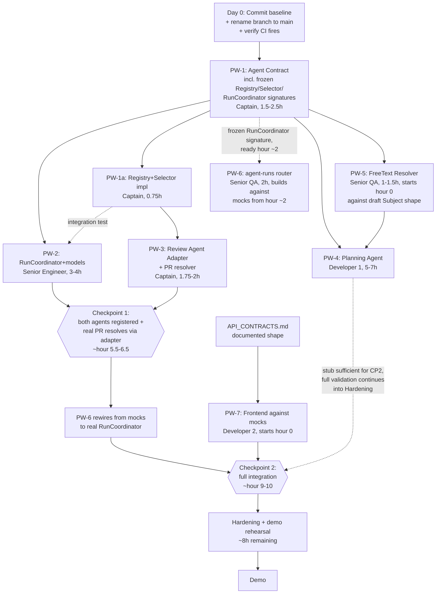

# TEAM_EXECUTION_PLAN.md — GraphForge

**Authority**: This document optimizes execution of the already-frozen architecture in
`docs/graphforge/*`. It does not redesign the product. Where it disagrees with
`TEAM_IMPLEMENTATION_PLAN.md`'s sequencing or ownership, **this document wins** — it was produced
by re-analyzing the real repository specifically to find a faster path, and it found one. Every
claim below was re-verified against the actual codebase and git state as of this writing, not
carried over from memory of earlier planning documents.

**Verified repo state right now**: working tree is clean (`git status --short` empty, baseline
committed as `e6889ff`). Branch is still `master`; `.github/workflows/ci.yml` still triggers only
on `main`. **CI has still never run on this repository.** This is the literal first action below.
No `app/agents/`, `app/orchestrator/`, or `app/context/` packages exist yet — everything in this
plan starts from zero tomorrow.

**Revision note (EDR Pass 2)**: A second Engineering Director review found the Senior Engineer's
workload didn't mathematically fit before Checkpoint 1, that no path existed for a real pull
request to reach the Orchestrator, and several smaller documentation contradictions. All are
corrected below. **Every section below marked `[REVISED]` was changed in this pass** — see
`TEAM_EXECUTION_PLAN_CHANGELOG.md` for the full rationale, rejected alternatives, and before/after
numbers. Sections not marked `[REVISED]` are unchanged from the original plan.

---

# SECTION 1 — Executive Summary `[REVISED]`

**The fastest path is not the one `TEAM_IMPLEMENTATION_PLAN.md` recommended.** That plan had the
Senior Engineer build a full `BaseAgent`/`ToolRegistry` framework *first*, then migrate the
existing Review Agent into it, *then* build the Orchestrator on top — a serial chain that gates
three other people's work behind one person's multi-stage deliverable. Re-reading the actual
Review Agent code (`app/ai/agent/investigation_agent.py`, `planner.py`, `tools.py`) changes the
calculus: **that code is already working, already tested against 268 passing tests, and already
the single most demo-critical asset in the repository.** Migrating it — moving files, wrapping it
in a new base class, re-running regression — is pure risk with zero audience-visible payoff. A
thin adapter that wraps the *existing, untouched* `InvestigationAgent`/`AIAnalysisService` calls
behind the new Orchestrator's tiny output contract achieves the identical demo outcome ("the
Review Agent runs through the Orchestrator") for a fraction of the risk and a fraction of the time.

Three changes from the prior plan, in order of impact:

1. **Don't migrate the Review Agent. Adapt it.** `app/ai/agent/*` stays exactly where it is,
   untouched. A ~1-hour adapter replaces a ~3-hour risky refactor and removes the single largest
   regression-risk item from the critical path.
2. **Don't build a shared `ToolRegistry` across two agents that have never coexisted.** The Review
   Agent's tools were designed for one agent. Forcing the Planning Agent's tools into the same
   abstraction under time pressure is premature generalization for an n=2 sample. The Planning
   Agent gets its own minimal tool-calling code. The only thing genuinely shared is the *output*
   contract (`AgentManifest`, `AgentOutput`, `Evidence`, `Confidence`) — a small set of dataclasses/
   Pydantic models, not an execution framework.
3. **Give Senior QA real coding scope, chosen for genuinely low architectural risk**, not busywork:
   the FreeText Entry Resolver and the `agent-runs` API router (a CRUD-shaped router matching the
   existing `ai_analysis.py` pattern almost exactly). This removes two items from the Senior
   Engineer's queue without adding meaningful risk, and QA's own role description ("can code, can
   implement lower-risk features") makes this the correct assignment, not a stretch.

**EDR Pass 2 correction**: the first draft of this plan still didn't add up — PW-2 (4–5h) plus
PW-3 (1–1.5h), both solo on the Senior Engineer, cannot both land before an hour 5–6 checkpoint
that starts at hour 2. Two further changes close the gap for real, not just on paper:

4. **Move the Review Agent Adapter (PW-3) *and* the Orchestrator's `Registry`/`Selector` to the
   Captain.** Both are trivial once PW-1 freezes their interfaces (a dict-backed store, an
   if/elif), and the Captain has genuine slack immediately after PW-1 merges. This leaves the
   Senior Engineer with only `RunCoordinator` + `Run`/`AgentStep` models + migration — the one
   piece that actually needs "comfortable with architecture, can own complex systems" — cut from
   4–5h to a real 3–4h.
5. **Add a minimal pull-request resolver to PW-3.** Without it, there is no way for a real PR to
   reach the Orchestrator — the Review Agent adapter would only ever be provable via a hardcoded
   test object, never through anything a judge could watch someone click. The existing
   `InvestigationAgent.investigate(pull_request_id)` already takes a bare UUID, so this is a
   ~30-minute addition (`Subject(subject_type="pull_request", subject_id=f"pr:{id}", ...)`), not a
   new workstream.

Net effect, recalculated (not re-asserted): the frozen contract (now ~1.5–2.5h — it also freezes
`Registry`/`Selector`/`RunCoordinator`'s method *signatures*, not just the agent output shapes) is
still the only serial dependency at the start of the day. Checkpoint 1 (both agents registered and
selectable, including a real PR resolving through the Review Agent) lands at **hour 5.5–6.5** —
honestly recomputed, not just claimed. Checkpoint 2 (full integration) lands at **hour 9–10**. This
still buys roughly 8 hours of hardening/demo-rehearsal time versus the original
`TEAM_IMPLEMENTATION_PLAN.md`'s hour 14–16 checkpoint — the compression is real, it just required a
second pass to get the underlying math right.

---

# SECTION 2 — Repository Decomposition `[REVISED]`

| Module | Purpose | Dependencies | Risk | Complexity | Owner Recommendation | Reviewer | Merge Frequency | Effort |
|---|---|---|---|---|---|---|---|---|
| **Existing Backend Core** (`app/analysis`, `app/graph`, `app/indexer`, `app/integrations`, `app/ai/agent`, `app/services`, existing routers/models/schemas) | Everything that already works — deterministic engine, Neo4j graph, GitHub integration, auth, the Review Agent itself | None — frozen | High if touched, zero if not | N/A (existing) | **Nobody** — explicitly untouched this hackathon | Captain (gatekeeper only) | Zero merges | 0h (already done) |
| **Agent Contract** (new: `AgentManifest`, `AgentOutput`, `Evidence`, `Confidence`, `Subject` types, **plus the frozen method signatures for `Registry`/`Selector`/`RunCoordinator`** — interface only, no bodies) | The one thing every other new module codes against — now the *complete* interface freeze, not just the output shapes | None | **Critical if wrong, trivial if right** — small surface, but everyone depends on it | Low (small), but high-stakes | **Captain** | Senior Engineer (sanity-checks it's buildable against) | 1 merge, early, frozen after | 1.5–2.5h (`[REVISED]` — was 1–2h; now also freezes cross-module signatures, per EDR Pass 2 Finding 4) |
| **Orchestrator — `RunCoordinator` implementation** (new: `app/orchestrator/run_coordinator.py`, `Run`/`AgentStep` models + migration; `RunContext` inlined as a plain dict attribute, not a separate file — see Section 12) | Executes a selected agent, persists the run | Agent Contract (frozen signatures) | Medium-High — the architecturally central new piece | High | **Senior Engineer** | Captain | 2 PRs | 3–4h (`[REVISED]` — was 4–5h bundled with Registry/Selector/RunContext; those move below, per EDR Pass 2 Finding 1) |
| **Orchestrator — `Registry` + `Selector` implementation** (new: `app/orchestrator/registry.py`, `selector.py`) | Registers agents, selects by Goal | Agent Contract (frozen signatures) | Low — trivial once the interface is frozen | Low | **Captain** (`[REVISED]` — moved off Senior Engineer, see Finding 1) | Senior Engineer | 1 PR | 0.75h |
| **Review Agent Adapter** (new, thin: one file wrapping `InvestigationAgent.investigate()` — the agentic path, not the evidence-poor single-shot `AIAnalysisService.analyze()`, see Section 3 PW-3 — **plus a minimal PR-reference resolver**, folded into the same file) | Makes the *existing, untouched* Review Agent selectable by the Orchestrator, against a **real pull request** | Agent Contract, existing Review Agent (read-only) | Low — thin wrapper, no changes to the wrapped code | Low | **Captain** (`[REVISED]` — moved off Senior Engineer, see Finding 1) | Senior Engineer (this is adjacent to the most demo-critical code) | 1 PR | 1.75–2h (`[REVISED]` — was 1–1.5h; now includes the PR resolver, see Finding 2) |
| **Planning Agent** (new: `app/agents/planning/` — manifest, prompt, own tool-calling code, output schema; **must produce at least one `graph_traversal`/`tool_call` Evidence entry, not only `llm_reasoning`**, see Section 3 PW-4) | Proves the contract generalizes to a genuinely different agent, grounded in the same Knowledge Graph, not just an LLM call | Agent Contract | Medium — most likely place to discover the contract is wrong | Medium | **Developer 1** | Senior Engineer | 2–3 PRs | 5–7h (`[REVISED]` — widened for realism) |
| **FreeText Entry Resolver** (new, small: `app/context/resolvers/freetext.py`) | Turns a free-text goal string into a `Subject` for the Planning Agent | None (pure function, no DB) — can start hour 0 against a draft `Subject` shape, confirm once PW-1 merges | Low | Low | **Senior QA** | Developer 1 | 1 PR | 1–1.5h |
| **`agent-runs` API router** (new: `app/api/v1/routers/agent_runs.py` + registration in `app/api/v1/routers/__init__.py`) | `POST/GET /agent-runs`, `GET /agents` — matches the existing `ai_analysis.py` router shape closely | PW-1's **frozen** `RunCoordinator` signature (`[REVISED]` — no longer an informal "commit to a signature" handoff from the Senior Engineer, see Finding 4; can start ~hour 2 against mocks) | Low-Medium — well-precedented pattern to copy | Medium | **Senior QA** | Senior Engineer | 1–2 PRs | 2h |
| **Frontend: Agents Surface** (new: `AgentsPage`, `components/agents/*`, `lib/api/agentRuns.ts`, `hooks/useAgentRun.ts`, nav wiring) | Makes both agents' runs visible in one place | Agent Contract's shape (mocked first), then the real API | Low — well-isolated, existing patterns to copy | Medium | **Developer 2** | Captain | 2–3 PRs | 5–6h |
| **QA / Regression / Demo** (continuous, no dedicated folder) | Guarantees the 268-test baseline never regresses; demo script + rehearsal | Runs alongside everything | Low individually, high if it doesn't happen | Medium | **Senior QA** (secondary to their coding scope above) | — | Continuous | Continuous |

---

# SECTION 3 — Parallel Workstreams `[REVISED]`

### PW-1: Agent Contract `[REVISED]`

- **Mission**: Define the smallest possible frozen contract every other new module builds against
  — **now the complete interface freeze**, not just the output shapes (EDR Pass 2, Finding 4).
- **Owner**: Captain
- **Deliverables**: `backend/app/agents/_contract.py` with `AgentManifest` (dataclass),
  `AgentOutput`/`Evidence`/`Confidence`/`Subject` (Pydantic), a one-method `Protocol` for what "an
  agent" must expose (`async def run(context: AgentContext) -> AgentOutput`), **plus the frozen
  method signatures — interface only, no bodies — for `Registry.register(manifest)`,
  `Selector.select(goal) -> agent_id`, and `RunCoordinator.execute(subject, goal) -> Run`.** This
  is what lets Senior QA build PW-6 from hour ~2 against a real, frozen target instead of an
  informal hallway commitment from the Senior Engineer.
- **Dependencies**: None
- **Public interfaces**: The entire point — this *is* the public interface for every other module
- **Files owned**: `backend/app/agents/_contract.py`, `backend/app/agents/__init__.py` (package
  marker only — **no registration logic lives here**, see Section 7 row 4)
- **Files prohibited**: Everything else — this workstream does not touch the Orchestrator's
  *implementation*, any agent implementation, or the frontend
- **Shared contracts**: This workstream produces the shared contract; it doesn't consume one
- **Definition of Done**: Senior Engineer and Developer 1 both confirm (in writing) they can build
  against it without changes
- **Estimated PR count**: 1
- **Estimated implementation days**: 0.2–0.3 (1.5–2.5 hours — `[REVISED]`, was 1–2h)

### PW-2: Orchestrator — `RunCoordinator` `[REVISED]`

- **Mission**: Execute a selected agent, persist the run. **Registry and Selector no longer live
  here** — see PW-1a below (EDR Pass 2, Finding 1: the original bundling put 4–5h of solo work on
  the Senior Engineer that didn't fit before Checkpoint 1).
- **Owner**: Senior Engineer
- **Deliverables**: `app/orchestrator/run_coordinator.py`, `Run`/`AgentStep` Postgres models +
  Alembic migration. **`RunContext` is not a separate file** — it's a plain dict attribute on
  `RunCoordinator` (Section 12's simplification, formally adopted here, not left as a live judgment
  call — a single-process, in-memory, one-run-at-a-time hackathon build gets zero benefit from a
  dedicated module for this).
- **Dependencies**: PW-1's frozen `RunCoordinator` signature
- **Public interfaces**: `RunCoordinator.execute(subject, goal) -> Run` (signature frozen in PW-1,
  implemented here)
- **Files owned**: `backend/app/orchestrator/run_coordinator.py`, `backend/app/models/run.py`,
  `backend/app/models/agent_step.py`
- **Files prohibited**: `app/analysis/*`, `app/graph/*`, `app/ai/agent/*` (read-only reference
  only), `app/orchestrator/registry.py`/`selector.py` (now PW-1a's, Captain-owned)
- **Shared contracts**: Consumes PW-1a's `Registry`/`Selector`; produces what PW-7 and the
  `agent-runs` router build against
- **Definition of Done**: Selecting `Goal=review_pr` and `Goal=plan_freeform` both correctly route
  through `Registry`/`Selector` and produce a persisted `Run`+`AgentStep`; `alembic check` reports
  no drift (this exact class of bug — a model missing from `alembic/env.py`'s import list — has
  already happened once in this codebase)
- **Estimated PR count**: 2
- **Estimated implementation days**: 0.4–0.5 (3–4 hours — `[REVISED]`, was 4–5h bundled with
  Registry/Selector/RunContext)

### PW-1a: Orchestrator — `Registry` + `Selector` `[NEW — EDR Pass 2]`

- **Mission**: Register agents, select by Goal — trivial once PW-1 freezes the interface.
- **Owner**: **Captain** (moved off the Senior Engineer, Finding 1 — this is what actually closes
  the Checkpoint 1 scheduling gap; a dict-backed store and an if/elif are not senior-engineer-scale
  work, and the Captain has genuine slack immediately after PW-1 merges)
- **Deliverables**: `app/orchestrator/registry.py`, `app/orchestrator/selector.py`
- **Dependencies**: PW-1 (own frozen signatures)
- **Public interfaces**: `Registry.register(manifest)`, `Selector.select(goal) -> agent_id`
- **Files owned**: `backend/app/orchestrator/registry.py`, `backend/app/orchestrator/selector.py`
- **Files prohibited**: `run_coordinator.py` (Senior Engineer's)
- **Shared contracts**: Consumes PW-1; produces what PW-2, PW-3, and PW-4 register against
- **Definition of Done**: Both the Review Agent adapter (PW-3) and Planning Agent (PW-4) can
  register a manifest and be selected by their Goal
- **Estimated PR count**: 1
- **Estimated implementation days**: ~0.1 (45 minutes)

### PW-3: Review Agent Adapter `[REVISED]`

- **Mission**: Make the existing, untouched Review Agent selectable by the Orchestrator, **against
  a real pull request** — not just a hardcoded test object (EDR Pass 2, Finding 2).
- **Owner**: **Captain** (moved off the Senior Engineer, Finding 1 — small, and the Captain has
  slack right after PW-1/PW-1a; this is also adjacent to the most demo-critical code, which the
  Captain was already going to review personally either way)
- **Deliverables**: `backend/app/agents/review_adapter.py` — wraps **`InvestigationAgent.investigate()`
  specifically, not the single-shot `AIAnalysisService.analyze()`** (EDR Pass 2 finding: the
  agentic path already produces a structured `reasoning_log` with per-step tool calls and
  observations that map directly onto the new `Evidence` schema; the single-shot path has only a
  flat confidence/reasoning string and would produce thin, low-quality evidence by comparison —
  the wrong choice for the one code path the whole demo's credibility rests on). **Plus a minimal
  PR-reference resolver, folded into the same file**: `Subject(subject_type="pull_request",
  subject_id=f"pr:{pull_request_id}", graph_node_ids=[], display_name=pr.title)` — a ~30-minute
  addition, since `InvestigationAgent.investigate()` already takes a bare `pull_request_id`; no
  graph traversal needs to happen in the resolver itself.
- **Dependencies**: PW-1, PW-1a's `Registry`
- **Public interfaces**: None new — implements PW-1's `Protocol`
- **Files owned**: `backend/app/agents/review_adapter.py` only
- **Files prohibited**: `app/ai/agent/*` itself — **do not modify the wrapped code**, that's the
  entire point of this being an adapter instead of a migration
- **Shared contracts**: Consumes PW-1, PW-1a
- **Definition of Done**: `GET /agents` lists the Review Agent; triggering it via the Orchestrator
  **against a real, existing PR id** produces output identical to today's direct `.../investigate`
  call, verified by re-running the existing test suite unmodified
- **Estimated PR count**: 1
- **Estimated implementation days**: 0.25 (1.75–2 hours — `[REVISED]`, was 1–1.5h; now includes
  the PR resolver)

### PW-4: Planning Agent `[REVISED]`

- **Mission**: Prove the contract generalizes to a genuinely different agent, with its own tools,
  **grounded in the same Knowledge Graph the Review Agent uses** — not a bare LLM call (EDR Pass 2
  additional finding: without this, the Planning Agent could satisfy its original Definition of
  Done with zero graph interaction, undermining `PRODUCT_VISION.md`'s explicit "GraphForge is NOT
  another chatbot" claim in front of the exact audience that claim is meant for).
- **Owner**: Developer 1
- **Deliverables**: `app/agents/planning/` — manifest, prompt template, its own minimal
  tool-calling loop (does **not** share a `ToolRegistry` with the Review Agent — see Section 1),
  output schema
- **Dependencies**: PW-1 (contract only, not the full Orchestrator), PW-5 (FreeText resolver, for
  the Subject it acts on)
- **Public interfaces**: None new — implements PW-1's `Protocol`
- **Files owned**: `backend/app/agents/planning/`
- **Files prohibited**: `app/agents/review_adapter.py`, `app/ai/agent/*`, `app/orchestrator/*`
- **Shared contracts**: Consumes PW-1, PW-5
- **Definition of Done — Checkpoint 2 / demo-freeze bar (`[REVISED]`)**: Registers with the
  Orchestrator; produces **at least one** genuine `AgentOutput` with non-empty `Evidence`,
  **including at least one entry of `kind="graph_traversal"` or `kind="tool_call"`** — not only
  `llm_reasoning` — for one distinct free-text input. This is the bar that gates demo freeze.
  **Definition of Done — full validation (non-blocking, continues into Hardening)**: the original
  3+-distinct-inputs Prompt Validation (`TEAM_IMPLEMENTATION_PLAN.md` §12) still applies, but does
  **not** gate Checkpoint 2 (EDR Pass 2, Finding 6 — Developer 1's full build was landing at or
  after the original demo-freeze window; moving the checkpoint later would eat the hardening time
  this whole plan exists to buy, so the *scope* bar moves instead)
- **Estimated PR count**: 2–3
- **Estimated implementation days**: 0.65–0.9 (5–7 hours — `[REVISED]`, widened for realism)

### PW-5: FreeText Entry Resolver

- **Mission**: Resolve a free-text goal string into a `Subject`.
- **Owner**: Senior QA
- **Deliverables**: `app/context/resolvers/freetext.py` — a pure function, no DB, no HTTP
- **Dependencies**: PW-1 (needs `Subject`'s shape)
- **Public interfaces**: `resolve(text: str) -> Subject`
- **Files owned**: `backend/app/context/`
- **Files prohibited**: Anything in `app/agents/` or `app/orchestrator/`
- **Shared contracts**: Consumes PW-1; produces the input PW-4 needs
- **Definition of Done**: Resolves at least 5 varied example inputs to valid `Subject`s, unit
  tested with zero I/O
- **Estimated PR count**: 1
- **Estimated implementation days**: 0.15–0.2 (1–1.5 hours) — **do this first**, before the
  `agent-runs` router, since PW-4 needs it early

### PW-6: `agent-runs` API Router `[REVISED]`

- **Mission**: Expose the Orchestrator over HTTP, matching `API_CONTRACTS.md` exactly.
- **Owner**: Senior QA
- **Deliverables**: `app/api/v1/routers/agent_runs.py` + the one-line registration in
  `app/api/v1/routers/__init__.py`
- **Dependencies**: PW-1's **frozen** `RunCoordinator` signature (`[REVISED]` — EDR Pass 2, Finding
  4: this is no longer an informal "Senior Engineer commits to it mid-build" handoff with no
  scheduled hour; the signature is frozen in PW-1 at hour ~2, so QA can build and test PW-6 against
  it — with a mocked `RunCoordinator` — immediately, fully decoupled from when the real
  implementation lands. QA rewires to the real `RunCoordinator` once PW-2 merges.)
- **Public interfaces**: `POST /api/v1/agent-runs`, `GET /api/v1/agent-runs/{id}`,
  `GET /api/v1/agent-runs`, `GET /api/v1/agents` — exact shapes per `API_CONTRACTS.md`
- **Files owned**: `backend/app/api/v1/routers/agent_runs.py`
- **Files prohibited**: Any other router; the one line in `routers/__init__.py` is the only
  shared-file touch, coordinate before editing
- **Shared contracts**: Consumes PW-2's interface; produces what PW-7 (frontend) builds against
- **Definition of Done**: Matches `API_CONTRACTS.md` exactly; tested (happy path + each documented
  error status), following the existing `ai_analysis.py` router's test conventions
- **Estimated PR count**: 1–2
- **Estimated implementation days**: 0.25 (2 hours)

### PW-7: Frontend Agents Surface `[REVISED]`

- **Mission**: Make both agents' runs visible in one place, in the existing design system, **and
  make both agents triggerable from that same page** (EDR Pass 2, Finding 2 — without a way to
  specify a real PR, the Review Agent's run history would only ever be provable in a test, never
  demonstrated live).
- **Owner**: Developer 2
- **Deliverables**: `AgentsPage`, `components/agents/{AgentCard,ConfidenceBadge,EvidencePanel}.tsx`,
  `lib/api/agentRuns.ts`, `hooks/useAgentRun.ts`, nav wiring. **Two trigger inputs on the page**:
  the existing free-text box (`goal=plan_freeform`) and a small PR-reference field/picker
  (`goal=review_pr`, `subject_reference=pr:<id>`) — both POST to the same `agent-runs` endpoint.
- **Dependencies**: `API_CONTRACTS.md`'s documented shape (build against mocks immediately — do
  not wait for PW-6 to merge)
- **Public interfaces**: None — pure consumer
- **Files owned**: `frontend/src/pages/AgentsPage.tsx`, `frontend/src/components/agents/`,
  `frontend/src/lib/api/agentRuns.ts`, `frontend/src/hooks/useAgentRun.ts`
- **Files prohibited**: `components/Card.tsx`, `Table.tsx`, `StatusBadge.tsx`, `RiskBadge.tsx`
  (compose, never edit), any existing page
- **Shared contracts**: Consumes PW-6's contract (mocked, then real)
- **Definition of Done**: Both agents' run history render; `ReasoningLogPanel` reused for detail,
  not rewritten; **a real PR can be triggered through the Orchestrator from this page, not just
  viewed after the fact**; real API wired at the integration checkpoint
- **Estimated PR count**: 2–3
- **Estimated implementation days**: 0.65–0.8 (5–6.5 hours — `[REVISED]`, small bump for the
  second trigger input)

---

# SECTION 4 — Captain Strategy `[REVISED]`

**How much code should the Captain write?** Three small modules: PW-1 (the Agent Contract), PW-1a
(Registry + Selector), and PW-3 (the Review Agent Adapter + PR resolver) — `[REVISED]`, EDR Pass 2
Finding 1. This is a real increase from the original "one module" plan, and it's deliberate: all
three are trivial once PW-1's interfaces exist, none of them need deep new-code exploration, and
moving them off the Senior Engineer is what makes Checkpoint 1's timing actually work. Everything
else the Captain touches is review, integration, or unblocking — not authorship.

**Modules the Captain should own**: PW-1, PW-1a, PW-3 — roughly 4–4.75 hours of coding, finished by
hour ~4.75, after which the Captain shifts entirely to review/integration/demo mode. This is still
the single highest-leverage stretch of the hackathon — every other new module is downstream of
these three being right — but it's a wider slice of the day than originally planned, and Section
4's time allocation below reflects that honestly.

**Modules the Captain should never own**: PW-2, PW-4 through PW-7. If the Captain starts implementing
the Orchestrator or the Planning Agent, review latency on every other PR spikes immediately — this
is the single most common way a Captain becomes the bottleneck the brief explicitly warns against.

**Time allocation** (of a ~24-hour window) `[REVISED]`:

| Activity | % of Captain's time | Rationale |
|---|---|---|
| Coding | **18%** (`[REVISED]`, was 10%) | PW-1 + PW-1a + PW-3, all done by ~hour 4.75, then stop writing implementation code entirely |
| Reviewing | **30%** (`[REVISED]`, was 35%) | Slightly lower than the original allocation — but note review load is genuinely front-loaded to *nothing* in hours 0–3 (nobody else has a PR ready that early), so this isn't spread evenly; see Section 8's staged-review fix for how this avoids clustering |
| Helping teammates | **17%** (`[REVISED]`, was 20%) | Unblocking contract questions, resolving "is this a Protected File" escalations |
| Integration | **20%** | Unchanged — merging at both checkpoints, running the regression suite, the manual cross-workstream walkthrough |
| Demo prep | **15%** | Unchanged |

This still totals to keeping the Captain out of the Orchestrator/Planning Agent/frontend
implementation entirely — the increase is concentrated in three small, low-risk, front-loaded
modules, not a general expansion of scope.

This is a deliberate inversion from "the most senior person writes the most code" — the Captain's
highest-value contribution in a 5-person, 1-day build is keeping the other four unblocked and
keeping trunk green, not adding a sixth pair of implementation hands.

---

# SECTION 5 — Developer Assignments `[REVISED]`

### Captain `[REVISED]`

- **Mission**: Freeze the contract, keep trunk green, keep everyone unblocked, ship the demo.
- **Primary ownership**: PW-1 (Agent Contract), PW-1a (Registry + Selector), PW-3 (Review Agent
  Adapter + PR resolver) — `[REVISED]`, EDR Pass 2 Finding 1
- **Secondary ownership**: None
- **Review ownership**: PW-2, PW-4, PW-6, PW-7 (final sign-off), any Protected File escalation
- **Expected daily output**: 3 small, correct, early PRs (done by ~hour 4.75); 15–20 substantive
  code reviews
- **Success metrics**: Trunk never breaks for more than one merge cycle; zero Protected File
  violations reach merge; demo runs without an unrehearsed surprise
- **Why**: The Captain is the strongest backend engineer *and* understands the whole architecture
  — exactly the profile needed to write the artifacts everyone else depends on, and exactly the
  wrong profile to tie up in a single module's implementation for a day. Taking PW-1a and PW-3 as
  well (not just PW-1) is what actually makes the Checkpoint 1 math close — see Section 6.

### Senior Engineer `[REVISED]`

- **Mission**: Build the one piece that genuinely needs deep architectural ownership —
  `RunCoordinator` and its persistence.
- **Primary ownership**: PW-2 (`RunCoordinator` + `Run`/`AgentStep` models + migration)
  — `[REVISED]`: no longer bundled with Registry/Selector/RunContext, which moved to PW-1a
  (Captain) and were inlined (RunContext), respectively — see EDR Pass 2 Finding 1
- **Secondary ownership**: None (`[REVISED]` — PW-3 moved to the Captain)
- **Review ownership**: PW-1a (Registry/Selector — checking they match the frozen interface),
  PW-4 (Planning Agent — checking it correctly implements the contract), PW-6 (`agent-runs`
  router — checking it correctly calls `RunCoordinator`)
- **Expected daily output**: 2 PRs (`RunCoordinator` + models, in that order)
- **Success metrics**: Both agents run through one Orchestrator with zero special-casing per agent
  in `RunCoordinator`'s core loop; zero regression in the existing Review Agent test suite
- **Why**: This is the one module that genuinely requires "comfortable with architecture, can own
  complex systems, works independently" — narrowed to exactly that piece now, rather than bundled
  with the smaller, more mechanical Registry/Selector/adapter work that doesn't need that profile.

### Senior QA

- **Mission**: Ship two genuinely low-risk backend pieces early, then own regression and demo
  validation for the rest of the day.
- **Primary ownership**: PW-5 (FreeText Entry Resolver), PW-6 (`agent-runs` API router)
- **Secondary ownership**: None additional — coding capacity is intentionally front-loaded early in
  the day, before regression-testing load ramps up in the back half
- **Review ownership**: PW-5 is reviewed by Developer 1 (its consumer); QA reviews test coverage
  on every other PR (not implementation logic — that's each module's named reviewer's job)
- **Expected daily output**: 2 small, well-tested PRs in the first half of the day; continuous
  regression runs and a growing, triaged bug list for the rest of it
- **Success metrics**: Zero regressions slip past one merge cycle undetected; PW-5/PW-6 ship
  correct and small; demo rehearsed twice with a documented backup
- **Why**: The brief is explicit — "Senior QA... can code... can implement lower-risk features."
  PW-5 and PW-6 are the two lowest-architectural-risk pieces of new backend work in the entire
  plan (a pure function with no I/O, and a router that closely copies an existing, proven pattern)
  — assigning them here removes real load from the Senior Engineer's queue without introducing
  risk QA isn't equipped to own. This is not "QA does easy busywork" — it's "QA does the two
  pieces that are genuinely safe to build without deep architecture context, freeing the person
  who has that context for the piece that actually needs it."

### Developer 1 `[REVISED]`

- **Mission**: Build the second agent — the actual proof the architecture generalizes, **grounded
  in the Knowledge Graph, not just an LLM call**.
- **Primary ownership**: PW-4 (Planning Agent)
- **Secondary ownership**: None — this is intentionally a full-day, single-focus assignment given
  its size (5–7 hours) and its role as the architecture's real test case
- **Review ownership**: PW-5 (consumes it directly, best positioned to catch integration gaps)
- **Expected daily output**: 2–3 PRs (manifest+stub early, full prompt/tools mid-day, polish late)
- **Success metrics**: Planning Agent ships with zero changes required to PW-1's contract or
  PW-2's `RunCoordinator` — the cleanest possible signal that the contract is genuinely reusable —
  **and** at least one real graph-traversal or tool-call `Evidence` entry, not only `llm_reasoning`
  (`[REVISED]`, see PW-4's Definition of Done)
- **Why**: A full-stack developer with no prior exposure to this specific agent framework is the
  right "naive user" to build against a freshly-frozen contract — if Developer 1 hits friction,
  that's exactly the signal the team needs early, before the contract is load-bearing for anything
  else.

### Developer 2

- **Mission**: Make the multi-agent story visible.
- **Primary ownership**: PW-7 (Frontend Agents Surface)
- **Secondary ownership**: None — well-isolated, full-day scope on its own
- **Review ownership**: None assigned (Captain reviews PW-7 directly, given its user-facing nature)
- **Expected daily output**: 2–3 PRs (components + page against mocks, then live-wired)
- **Success metrics**: A user cannot tell, from visual craft, that this page was built in a
  hackathon rather than being part of the original product
- **Why**: Unchanged from `TEAM_IMPLEMENTATION_PLAN.md`'s original reasoning — this is the best-
  isolated, lowest-conflict-risk workstream in the plan, and a full-stack developer building
  against a documented, mockable API contract is exactly matched to it. No change needed here; the
  re-analysis found nothing to improve in this specific assignment.

---

# SECTION 6 — Critical Path `[REVISED]`

**Critical path**: `D0 → PW-1 → PW-2 → CP1 → PW-6 (rewire) → CP2 → Hardening → Demo`. This is a
real change from the original draft: PW-3 no longer sits on the critical path at all — it's the
Captain's, running in parallel with PW-2, not sequential after it. The only genuinely serial chain
left is `PW-1 → PW-2 → Checkpoint 1`, all gated on the Senior Engineer's `RunCoordinator`, which is
now correctly scoped to fit before it.

**Independent paths** (can run fully parallel to the critical path once PW-1 lands): PW-4
(Planning Agent) depends only on PW-1 + PW-5, not on PW-2 or PW-3 being finished. PW-1a and PW-3
(both Captain, both small) run in parallel with PW-2, not blocking or blocked by it except for a
quick integration check once both exist. PW-6 now depends only on PW-1's *frozen signature*
(`[REVISED]`, Finding 4) — it builds against mocks from hour ~2, fully decoupled from when PW-2's
real implementation lands, and only needs a rewire once it does. PW-7's mocked-frontend work
depends on nothing but the documented API contract and starts at hour 0.

**Blocking work**: PW-1 (blocks everything else — this is why it's frozen first and treated as
the highest-stakes small artifact in the plan), PW-2 (blocks Checkpoint 1 specifically, but no
longer blocks PW-3 or PW-6).

**High-risk work**: PW-2 (still the most architecturally central, highest-complexity item, but now
scoped down to just `RunCoordinator`+models), PW-4 (most likely to surface a contract gap — by
design, this is where we *want* to find problems early, not in PW-2 after everyone else has built
on it).

**Late-stage integration work**: PW-6's rewire-to-real → PW-7 live-wiring (Checkpoint 2) — this is
the one place two different people's work (QA's router, Developer 2's frontend) must click
together correctly on first real contact, so it gets a dedicated checkpoint rather than being
assumed to "just work."

**Recommended implementation order**: PW-1 first and alone (nothing else starts meaningfully before
it merges, though PW-5 and PW-7's mocked work can begin in parallel against a *draft* shape) →
PW-1a, PW-2, PW-3, PW-4 all in parallel once PW-1 merges → PW-6 against mocks from hour ~2,
rewired to real once PW-2 merges → PW-7 live-wiring last.

---

# SECTION 7 — Merge Conflict Analysis: Top 30 Files `[REVISED — rows 4, 6, 25]`

| # | File | Why | Owner | Reviewer | Avoidance |
|---|---|---|---|---|---|
| 1 | `backend/app/api/v1/routers/__init__.py` | **Verified**: this is where routers are actually registered (not `main.py`, which just mounts the one aggregate `api_router`) — every new router touches this exact file | PW-6 owner (Senior QA) | Captain | One-line addition, announce before merging |
| 2 | `backend/app/api/v1/routers/ai_analysis.py` | Highest historical churn file in the repo; not touched this hackathon per the new plan (no migration needed) but still the most-referenced file for "how does an existing router look" | N/A — read-only reference | Captain | Do not edit; if a real reason emerges, escalate first |
| 3 | `backend/alembic/env.py` | New `Run`/`AgentStep` models must be added to this import list — this exact bug (a missing model import) was already found and fixed once for `PullRequestAIAnalysis` | PW-2 owner (Senior Engineer) | Captain | Single PR, checked against `alembic check` before merge |
| 4 | `backend/app/agents/__init__.py` | **`[REVISED — EDR Pass 2, Finding 3]`** This row previously said PW-3/PW-4 "add registration lines" here — directly contradicting row 6, which correctly names `registry.py` as the registration point. **Corrected**: `agents/__init__.py` is a package marker only, optionally re-exporting contract types for import convenience. **Zero registration logic ever lives here.** | Captain (PW-1) | — | No agent-specific edits, ever; if this file starts accumulating per-agent lines, that's the Finding-3 bug recurring |
| 5 | `backend/app/agents/_contract.py` | The frozen contract itself — everyone reads it, nobody but the Captain should edit it post-freeze | Captain | Senior Engineer | Frozen after PW-1 merges; changes require a Captain conversation, not a silent edit |
| 6 | `backend/app/orchestrator/registry.py` | **The single, canonical place both agents register** — the only registration point in the codebase, per the Finding-3 correction to row 4 above | PW-1a owner (Captain, `[REVISED]` — moved off Senior Engineer, see Finding 1) | Senior Engineer | PW-3 (Captain) and PW-4 (Developer 1) each add one registration call in their own PR, reviewed individually |
| 7 | `backend/app/models/run.py` (new) | New model, single owner, but a likely place for a second person to "helpfully" add a field | PW-2 owner (Senior Engineer) | Captain | Single-owner file, no exceptions |
| 8 | `backend/app/models/agent_step.py` (new) | Same reasoning as #7 | PW-2 owner (Senior Engineer) | Captain | Same |
| 9 | `backend/app/schemas/` (existing folder, new files added) | No single owner — each workstream adds its own new file | Each workstream, own file only | Captain (existing-file edits only) | New files never conflict; editing an *existing* schema file requires a Captain conversation |
| 10 | `frontend/src/components/layout/nav-items.ts` | Every new page adds one line | Developer 2 | Captain | Developer 2 only; others request the addition |
| 11 | `frontend/src/app/router.tsx` | Same reasoning as #10 | Developer 2 | Captain | Same |
| 12 | `docker/docker-compose.yml` | Should see **zero** edits this hackathon — its `name:` field and Postgres/Neo4j credentials are permanently protected (orphans the live demo-data volumes if touched) | Nobody | Captain | Protected; any proposed edit requires Captain approval first |
| 13 | `docker/docker-compose.prod.yml` | Same reasoning as #12 | Nobody | Captain | Same |
| 14 | `.github/workflows/ci.yml` | Fixed once at Day 0 (branch trigger); should see no further edits | Captain (Day 0 only) | — | One-time fix, then frozen |
| 15 | `backend/pyproject.toml` | Dependency additions from multiple workstreams could collide on the same lines | Whoever adds a dependency | Captain (sign-off required per `TEAM_IMPLEMENTATION_PLAN.md` §8 rule 4) | Announce before adding; avoid same-day parallel edits |
| 16 | `frontend/package.json` | Same reasoning as #15 | Same process | Captain | Same |
| 17 | `frontend/src/types/analysis.ts` | Already the largest, most-extended types file in the repo — new agent-run types belong in a *new* `types/agent.ts`, not here | N/A — do not extend | Developer 2 | Create `types/agent.ts` instead |
| 18 | `frontend/src/lib/api/analysis.ts` | Same reasoning as #17 — new API client belongs in `lib/api/agentRuns.ts` | N/A — do not extend | Developer 2 | Create the new file instead |
| 19 | `backend/tests/integration/test_ai_analysis_api.py` | Already the largest, most-extended integration test file; not touched this hackathon since PW-3 doesn't modify the wrapped code | N/A — read-only reference | Captain | New agent tests go in new test files |
| 20 | `README.md` | Tempting for anyone to add a line during any doc-touching PR | Captain | — | Captain owns all root-doc edits this hackathon |
| 21 | `docs/graphforge/ARCHITECTURE.md` | Any further doc reconciliation lands here | Captain | — | Captain merges all doc changes personally |
| 22 | `docs/graphforge/AGENT_FRAMEWORK.md` | Same reasoning as #21 — also, this document's `plan_freeform`/`plan_story` distinction is exactly the kind of thing a mid-hackathon discovery might need to refine | Captain | — | Same |
| 23 | `docs/TEAM_IMPLEMENTATION_PLAN.md` | Now partially superseded by this document for sequencing — if anyone edits it, they must cross-reference `TEAM_EXECUTION_PLAN.md` to avoid the two documents silently diverging again | Captain | — | Captain reconciles both documents together, never one without the other |
| 24 | `docs/FEATURE_BACKLOG.md` | Ticket statuses will be updated as work completes — low conflict risk but frequent touches | Captain (or whoever completes a ticket, single-line status update) | — | Status-only edits, one line per update |
| 25 | `backend/app/agents/review_adapter.py` (new) | Single owner, but the file everyone will read to understand "how do I wrap an existing thing"; also now contains the PR-reference resolver | PW-3 owner (Captain, `[REVISED]` — moved off Senior Engineer, see Finding 1) | Senior Engineer | Single-owner; PW-4 reads it as a reference, does not edit it |
| 26 | `backend/app/agents/planning/manifest.py` (new) | Single owner | PW-4 owner (Developer 1) | Senior Engineer | Single-owner |
| 27 | `backend/app/context/resolvers/freetext.py` (new) | Single owner | PW-5 owner (Senior QA) | Developer 1 | Single-owner |
| 28 | `backend/app/api/v1/routers/agent_runs.py` (new) | Single owner | PW-6 owner (Senior QA) | Senior Engineer | Single-owner |
| 29 | `frontend/src/pages/AgentsPage.tsx` (new) | Single owner, but the most-referenced new frontend file | PW-7 owner (Developer 2) | Captain | Single-owner |
| 30 | `TEAM_EXECUTION_PLAN.md` (this document) | If reality diverges from the plan mid-hackathon, this is where the update lands | Captain | — | Captain updates it same-day if a real deviation occurs, not reconstructed later |

---

# SECTION 8 — Integration Plan `[REVISED]`

- **How often to merge**: Small, frequent PRs — 1–3 per workstream over the day (per Section 3's
  estimated PR counts), not one giant end-of-day merge per person. **`[REVISED — EDR Pass 2,
  Finding 7]`**: PW-2 specifically ships as staged sub-PRs with their own target hours (a partial
  `RunCoordinator` skeleton by hour ~4, the full implementation + models by hour ~6), each reviewed
  as it lands — not one 3–4 hour PR that arrives all at once right before Checkpoint 1. The goal is
  that by the time a checkpoint hour arrives, most of its review work is *already done*
  incrementally, and the checkpoint itself is integration verification (regression run + manual
  walkthrough), not a backlog of first-pass reviews.
- **Who merges**: Captain, always. No one else merges to trunk — this is the one centralization
  point that's worth the latency cost, because it's what keeps trunk reliably green.
- **When integration occurs**: Two checkpoints (Section 6): Checkpoint 1 (**hour 5.5–6.5**,
  `[REVISED]` — recalculated, see Section 1/6) and Checkpoint 2 (**hour 9–10**, `[REVISED]` —
  tightened from 9–11). Still materially earlier than `TEAM_IMPLEMENTATION_PLAN.md`'s hour 6–7/
  14–16 — the compression is real, it just needed the Finding-1 redistribution to be honest math
  rather than an optimistic assertion.
- **How to detect broken architecture**: Two concrete signals, not vibes — (1) `alembic check`
  reports drift (a model wasn't registered correctly), (2) a new agent's PR requires a change to
  `_contract.py` or `registry.py`/`selector.py`'s frozen signatures, or `run_coordinator.py`'s core
  loop (per Section 3's PW-4 Definition of Done: it shouldn't). Either signal triggers a Captain
  conversation before more work builds on top of the gap.
- **When QA joins**: Immediately, at hour 0 — not "once there's something to test." Senior QA
  starts PW-5 at hour 0 against a draft `Subject` shape, moves to PW-6 against PW-1's frozen
  `RunCoordinator` signature (`[REVISED]` — ready by hour ~2, not an informal mid-build handoff)
  and mocked responses, and runs the existing regression suite continuously from the first merge
  onward.
- **Branch-cutting enforcement (`[NEW — EDR Pass 2, Finding 8]`)**: nobody cuts a `ws/2-*`,
  `ws/1a-*`, `ws/3-*`, `ws/4-*`, `ws/6-*`, or `ws/7-*` branch until the Captain posts an explicit
  "PW-1 merged — go" message in the shared channel — not "once it looks far enough along." Everyone
  runs `git pull origin main` immediately before cutting their branch, specifically to avoid
  branching from a local `main` that was pulled before PW-1 actually merged.
- **When demo freeze begins**: The moment Checkpoint 2 is green — everything after that is
  hardening and rehearsal only (Section 10), no new scope, per
  `TEAM_IMPLEMENTATION_PLAN.md` §16 Rule 10.

---

# SECTION 9 — AI Strategy

Unchanged in substance from `TEAM_IMPLEMENTATION_PLAN.md` §8 — restated here with the specific
guardrails this *revised* plan needs, since the contract is now smaller and the Review Agent is
explicitly **not** to be touched by AI tooling this hackathon.

### Rules specific to this plan's structure

1. **Never let an AI tool "helpfully" migrate or refactor `app/ai/agent/*`.** This is the single
   most valuable, most tested existing code in the repository. If an AI-assisted PR touches this
   folder for any reason other than the read-only reference use described in PW-3, reject it.
2. **Never let an AI tool build a shared `ToolRegistry` "for consistency" between the Review Agent
   and Planning Agent.** This plan deliberately does not share tool-execution mechanics between
   the two agents (Section 1) — an AI tool asked to "make this consistent with the existing agent"
   will likely propose exactly the premature abstraction this plan avoids. Push back on it.
3. **Paste `_contract.py` verbatim into every PW-2 through PW-7 prompt.** This is the smallest,
   highest-leverage artifact in the plan — there's no excuse for a prompt that doesn't include it
   in full.
4. **Prompt Prevention of duplicate implementations**: before generating any new resolver, router,
   or component, the prompt must include "check `backend/app/context/`, `backend/app/api/v1/
   routers/`, and `frontend/src/components/` for something to extend first" — this project's
   existing convention (small, deliberately non-proliferating component/interface sets) is worth
   defending explicitly in every prompt, not assumed.
5. **Prompt prevention of hallucinated APIs**: every PW-6/PW-7 prompt must paste the exact
   `API_CONTRACTS.md` section, including example JSON — never describe the endpoint in prose and
   let the model infer field names.
6. **Prompt prevention of inconsistent UI**: every PW-7 prompt must paste `UI_GUIDELINES.md`'s
   color table and the existing `Card`/`StatusBadge` component source — an AI tool given a vague
   "build an agents page" prompt will invent new visual language within the first response.

### Review process

Unchanged: exactly one named reviewer per PR (Section 2's table), AI-authored code is never
review-exempt (`TEAM_IMPLEMENTATION_PLAN.md` §8 rule 10). The Captain additionally spot-checks any
PR touching `app/agents/_contract.py`, `app/orchestrator/registry.py`, or anything adjacent to
`app/ai/agent/*` for the two failure modes above, specifically, every time.

### Architecture compliance

Every PR description must name which `docs/graphforge/*` section and which Section 3 workstream it
implements. A PR that can't name either is a PR that wasn't scoped against this plan — that's a
signal to pause, not just a paperwork gap.

---

# SECTION 10 — Hackathon Timeline `[REVISED]`

Assumes a 24-hour window from kickoff to submission; scale proportionally for a different length.
**All hours below are recalculated from Section 3's actual per-person effort estimates**
(EDR Pass 2, Finding 5) — the original draft asserted a checkpoint schedule that its own workload
numbers couldn't support; this version is the honest recompute, not a re-assertion.

### Day 0 (Hour 0–1): Kickoff

- **0:00–0:15**: Captain fixes the verified, real blocker: rename branch `master` → `main`,
  confirm `.github/workflows/ci.yml` now actually triggers (push a trivial commit, watch CI run).
  This has never worked on this repository until this action happens.
- **0:15–0:30**: Team reads this document + the Section 3 workstream table together, out loud.
  Confirm everyone's Day-0 starting task. Captain states explicitly, out loud: *nobody cuts a
  PW-1a/2/3/4/6/7 branch until the "PW-1 merged — go" message* (Finding 8).
- **0:30–1:00**: Branches cut: `ws/1-agent-contract` (Captain), `ws/5-freetext-resolver` (QA,
  against a draft `Subject` shape), `ws/7-agents-page-mocks` (Developer 2) all start immediately —
  nothing blocks these three.

### Hour 1–2.5: Build Sprint 1a — the one serial dependency

- Captain: PW-1 (Agent Contract, **including the frozen `Registry`/`Selector`/`RunCoordinator`
  signatures** — `[REVISED]`, Finding 4) — merges by ~hour 2, posts "PW-1 merged — go."
- Senior QA: PW-5 (FreeText Resolver) — merges by ~hour 1.5–2, rebases once PW-1 lands.
- Developer 2: PW-7 against mocked API responses — unaffected by any of the above.

### Hour 2–5.5: Build Sprint 1b — four people in parallel

- **Captain**: `[REVISED]` immediately starts PW-1a (Registry + Selector, ~45 min, merges ~hour
  2.75) then PW-3 (Review Agent Adapter + PR resolver, ~1.75–2h, merges ~hour 4.75). Shifts to
  review-only after that.
- **Senior Engineer**: `[REVISED]` starts PW-2 the moment PW-1 merges (~hour 2) — now scoped to
  just `RunCoordinator` + `Run`/`AgentStep` models + migration (3–4h) — targets a partial skeleton
  PR by hour ~4 (Finding 7's staged-review fix) and the full implementation by hour ~5.5–6.
- **Senior QA**: moves to PW-6 the moment PW-1's frozen `RunCoordinator` signature is available
  (~hour 2) — builds against mocks, targets ~hour 4.5 for a mocked-complete router.
- **Developer 1**: starts PW-4 (Planning Agent) the moment PW-1 merges (~hour 2) and PW-5 is
  available (~hour 2, already merged) — builds the standalone tool-calling logic, targeting the
  Knowledge-Graph-grounded stub (Checkpoint-2 bar) well before hour 5.5.
- **Developer 2**: continues PW-7 against mocks.

### Hour 5.5–6.5: Checkpoint 1 `[REVISED — recalculated, was hour 5–6/5–7]`

- Senior Engineer's `RunCoordinator` + models land; Captain's PW-1a (already merged ~hour 2.75) and
  PW-3 (already merged ~hour 4.75) integrate cleanly since both were built against the same frozen
  PW-1 signatures.
- Captain runs the full regression suite, does the manual walkthrough: both agents appear in
  `GET /agents`, both are selectable by their Goal, **and a real PR resolves through the Review
  Agent adapter** (Finding 2's fix — this is now part of Checkpoint 1's exit bar, not deferred).
- **Exit signal**: if this isn't hit by hour 7, that's the trigger for the scope cut in Section 11
  (Planning Agent ships stub-only, full prompt work becomes non-blocking hardening work) — not a
  silent slip.

### Hour 6.5–9: Build Sprint 2

- Senior QA: rewires PW-6 from mocks to the now-real `RunCoordinator` (~30–60 min), then continues
  regression runs on everything merged so far.
- Developer 1: continues toward PW-4's full implementation (non-blocking to Checkpoint 2 per
  Finding 6 — the stub already satisfies the demo-freeze bar).
- Developer 2: continues polishing PW-7 against mocks, preparing to swap to the real endpoint.

### Hour 9–10: Checkpoint 2 (Full Integration) `[REVISED — recalculated, was hour 9–11]`

- Developer 2 wires PW-7 to the real `agent-runs` API — including the PR-trigger input added in
  Finding 2's fix.
- Full team regression pass: 268-test baseline + all new tests.
- Captain does the full manual demo-path walkthrough personally: free-text goal → Planning Agent
  run with graph-grounded evidence; real PR → Review Agent run; both visible on one Agents page.
- **This is demo freeze** — no new scope past this point (`TEAM_IMPLEMENTATION_PLAN.md` §16 Rule 10).
  Per Finding 6, Developer 1's Planning Agent stub is demo-sufficient here; the full 3+-input
  Prompt Validation continues into Hardening, non-blocking.

### Hour 10–18: Hardening

- Bug fixes only, prioritized by severity (`TEAM_IMPLEMENTATION_PLAN.md` §12's Blocker/Major/Minor
  triage).
- Senior QA's Prompt Validation pass on the Planning Agent (3+ distinct inputs, confirming genuine
  evidence — including graph-grounded evidence, per the tightened DoD — backs every confidence
  score).
- This is roughly **8 hours** of hardening — even slightly more than the original draft claimed,
  because the recalculated checkpoints are both realistic *and* still earlier than
  `TEAM_IMPLEMENTATION_PLAN.md`'s hour 14–16.

### Hour 18–21: Demo Prep

- Demo script finalized and rehearsed twice (once by Captain, once by someone who didn't write it).
- Backup screen recording captured.
- Final regression pass on the exact commit to be tagged for demo.

### Hour 21–23: Buffer

- Reserved, not pre-scheduled. If everything above ran to plan, this is genuinely free time for
  final polish; if anything slipped, this absorbs it without touching the demo-prep window.

### Hour 23–24: Submission

- Tag the final commit (`demo-final`), confirm the tagged commit is what's actually demoed,
  submit.

---

# SECTION 11 — Risk Analysis `[REVISED]`

| Risk | Category | Probability | Impact | Mitigation | Owner |
|---|---|---|---|---|---|
| Agent Contract (PW-1) has a gap discovered only once PW-4 tries to build against it | Technical | Medium | High — would ripple into every downstream workstream | Developer 1 explicitly tasked with flagging gaps immediately (Section 5); Captain treats any PW-4 requirement to change `_contract.py` as a Checkpoint-1 red flag, not routine | Captain + Developer 1 |
| Someone "helpfully" migrates or refactors `app/ai/agent/*` anyway | Architecture | Low-Medium | High — reintroduces the exact regression risk this plan was designed to remove | Explicit Protected-File-style callout in Section 9's AI rules; Captain rejects on sight | Captain |
| Shared `ToolRegistry` gets built anyway "for consistency" | Architecture | Low-Medium | Medium — reintroduces premature-abstraction risk and schedule risk | Same as above — named explicitly as a rejection trigger, not left implicit | Captain |
| Checkpoint 1 slips past hour 7 | Schedule | Medium | Medium-High | Pre-agreed scope cut: Planning Agent ships as stub-only (PW-4's early deliverable), full prompt/tools becomes a stretch item, not a blocker to Checkpoint 2 | Captain |
| **`[REVISED]`** Captain's coding load (now PW-1 + PW-1a + PW-3, ~4–4.75h) delays the start of their review-heavy phase | Schedule | Low-Medium | Medium | These three modules are all trivial once PW-1's interfaces exist and are done by ~hour 4.75 — before any other PR is likely ready for first-pass review anyway (nothing else merges before ~hour 4); if this assumption breaks, Captain drops PW-3 down the priority list first (Review Agent adapter can land slightly after Checkpoint 1 if genuinely necessary, since PW-4/PW-6/PW-7 don't depend on it) | Captain |
| **`[REVISED]`** `agent-runs` router (QA-owned) has a design gap only the Orchestrator's author would catch | Integration | Low-Medium | Medium | Senior Engineer is PW-6's named reviewer specifically because of this risk (Section 3); QA also builds it against the *frozen signature* from PW-1, not a guess, reducing the odds of a gap in the first place | Senior Engineer |
| In-memory `RunContext` doesn't survive a backend restart mid-demo | Architecture | Low | Medium | Known, accepted limitation — don't restart the backend process during the demo window; `[REVISED]` this is now formally adopted (inlined as a dict on `RunCoordinator`, Section 3 PW-2), not left as a live judgment call | Captain |
| Branch/CI mismatch isn't actually fixed at hour 0 (someone forgets, or the fix is incomplete) | Infrastructure | Low (now that it's the literal first scheduled action) | High — CI silently never runs, exactly as it hasn't been | Captain personally verifies with a trivial test push before moving to PW-1 | Captain |
| Five engineers, AI-tool-assisted, produce plausible-but-contract-violating code faster than review can catch it | AI | Medium | High | Section 9's specific rejection triggers; Captain's review time allocation (30%, `[REVISED]` Section 4) is sized for this exact risk | Captain |
| Demo-day network/GitHub outage | Integration | Low-Medium | Medium | Backup screen recording, rehearsed as a real fallback (unchanged from prior plans) | Captain + Senior QA |
| The compressed timeline (Section 10) creates pressure to skip QA's regression discipline | Team | Medium | High | QA's veto power over merges (unchanged from `TEAM_IMPLEMENTATION_PLAN.md` §2) is explicitly preserved in this plan — a faster timeline is not a license to test less | Senior QA |
| Developer 1 or Developer 2 is genuinely blocked mid-day with no one available to unblock them | Team | Low-Medium | Medium | Captain's 17% (`[REVISED]`) "helping teammates" allocation (Section 4) exists specifically for this | Captain |
| **`[NEW — EDR Pass 2]`** Planning Agent ships with zero real Knowledge Graph interaction, only `llm_reasoning` evidence | Demo / Product | Medium | High — undermines the demo's central "not a chatbot" thesis in front of the exact audience it's aimed at | PW-4's Definition of Done now explicitly requires at least one `graph_traversal`/`tool_call` Evidence entry (Section 3); QA's Prompt Validation pass checks for this specifically, not just non-empty evidence | Developer 1 + Senior QA |
| **`[NEW — EDR Pass 2]`** No real PR ever reaches the Orchestrator, so the Review Agent's run history is only provable via a hardcoded test object | Demo / Architecture | Was High before this pass; now Low | High if unmitigated — the demo's central "both agents, one Orchestrator" claim would be unachievable through any UI | Fixed directly: PW-3 now includes a minimal PR-reference resolver, PW-7 now includes a PR-trigger input on the Agents page (Section 3) | Captain + Developer 2 |

---

# SECTION 12 — Engineering Director Review `[REVISED — EDR Pass 2 addendum below]`

**Brutally honest assessment, as if this were my bonus on the line.** (Original assessment below is
unchanged and still holds; the Pass 2 addendum follows it.)

**Would I keep this team structure?** Yes, with the reallocation already made above. The original
five-role shape (Captain/Senior Engineer/Senior QA/Dev1/Dev2) is fine — the original *plan's task
assignment* was the problem, not the team. Giving QA real coding scope (PW-5/PW-6) instead of
leaving them purely in a testing role for the first half of the day was the single highest-value
change I made, and I'd defend it hard: an idle-until-hour-6 QA is a wasted engineer on a five-
person team where every hour counts.

**Would I move people?** No swaps needed. But I would explicitly tell Developer 1 on day one:
"you are the person most likely to discover the architecture is wrong, and that's a feature, not a
failure — say so loudly and immediately if the contract doesn't fit." Making that expectation
explicit, out loud, at kickoff, is worth doing regardless of what's written in a doc.

**Would I reduce scope?** The scope in this plan is already smaller than
`TEAM_IMPLEMENTATION_PLAN.md`'s, by design (no Review Agent migration, no shared ToolRegistry). If
I had to cut further under real time pressure, the first thing to go is the Planning Agent's full
prompt sophistication (GF-014-equivalent) — ship the stub (registers, produces *some* real
evidence-backed output) and call that sufficient for the demo story. The demo needs "two agents,
one orchestrator" to be true; it doesn't need the Planning Agent's prompt to be polished.

**Would I delay any feature?** Confidence calibration tracking, `GraphWriter`, real Jira/Confluence
— already correctly out of scope in every prior document, and I see no reason to reconsider that.
Nothing currently *in* scope should move out, if Checkpoint 1 is hit on time.

**Would I simplify anything further?** `[REVISED — formally adopted, no longer a live judgment
call]`: **`RunContext` is not a separate module.** For a single-process, in-memory,
one-agent-at-a-time-per-run hackathon build, a plain Python dict living on the `RunCoordinator`
instance does the same job as a dedicated `run_context.py` file with zero loss of function. This
was originally flagged here as something the Senior Engineer could decide live under time
pressure — EDR Pass 2 adopted it outright (Section 3, PW-2) instead, because it's strictly better
with no real downside, and it's one less file on Section 7's conflict-risk list.

One more honest note, updated for Pass 2: **the compressed timeline (Section 10) is a recalculation,
not a re-assertion, but it's still an estimate, not a guarantee.** The ~8 hours of hardening time it
buys versus the original `TEAM_IMPLEMENTATION_PLAN.md` is the payoff *if* the Senior Engineer's
narrowed-down `RunCoordinator` (now 3–4h, not 4–5h) and the Captain's three small modules (PW-1/
PW-1a/PW-3, ~4–4.75h) both land close to estimate. Both are now real, checked numbers rather than
optimistic assertions — but hackathon-day variance is real too. If either runs long, Checkpoint 1
slips proportionally, and the pre-agreed scope cut (Section 11) is the correct response, not a
quiet timeline renegotiation.

---

## EDR Pass 2 Addendum

A second Engineering Director review found the first draft's math didn't actually close (Senior
Engineer's combined PW-2+PW-3 workload didn't fit before the stated Checkpoint 1), and — more
importantly — found that no path existed for a real pull request to ever reach the Orchestrator,
which would have made the demo's central "both agents, one Orchestrator" claim provable only in a
unit test, never in front of an audience. Both are fixed in this revision, along with a genuine
documentation contradiction (Section 7, where the agent-registration location was stated two
different ways) and a demo-completeness gap (the Planning Agent could previously satisfy its own
Definition of Done with zero Knowledge Graph interaction, undermining the one claim
`PRODUCT_VISION.md` is most insistent about). See `TEAM_EXECUTION_PLAN_CHANGELOG.md` for the full
finding-by-finding disposition, before/after numbers, and the additional issue found in the
required extra independent pass. None of these fixes touched the architecture, added a new
framework, or expanded scope — they redistributed existing work and closed two real gaps.

---

# SECTION 13 — Final Assignment Table `[REVISED]`

| Person | Mission | Primary Module | Secondary Module | Reviewer | Dependencies | Expected Completion | Risk |
|---|---|---|---|---|---|---|---|
| **Captain** | Freeze the contract, keep trunk green, ship the demo | PW-1 (Agent Contract, incl. frozen `Registry`/`Selector`/`RunCoordinator` signatures) | PW-1a (Registry+Selector), PW-3 (Review Agent Adapter + PR resolver) — `[REVISED]` | Senior Engineer (peer sanity-check) | None | Hour 2 (PW-1), Hour 2.75 (PW-1a), Hour 4.75 (PW-3); review/integration continuous thereafter | Low (small modules), but high-stakes if PW-1 is wrong |
| **Senior Engineer** | Build `RunCoordinator` — the one piece that genuinely needs deep architectural ownership | PW-2 (`RunCoordinator` + `Run`/`AgentStep` models) — `[REVISED]`, narrowed scope | None (`[REVISED]` — PW-3 moved to Captain) | Captain | PW-1's frozen signatures | Hour 5.5–6.5 (`[REVISED]`, was Hour 6–7) | Medium-High |
| **Senior QA** | Ship two low-risk backend pieces early; own regression + demo validation | PW-5 (FreeText Resolver) → PW-6 (`agent-runs` router) | Continuous regression, demo rehearsal | Developer 1 (PW-5), Senior Engineer (PW-6) | PW-1 (`[REVISED]` — frozen signature, not an informal mid-build handoff) | Hour 1.5–2 (PW-5), Hour 4.5 mocked / Hour 7–7.5 real (PW-6, `[REVISED]`) | Low |
| **Developer 1** | Build the second agent — the real proof the architecture generalizes, grounded in the graph | PW-4 (Planning Agent) | None | Senior Engineer | PW-1, PW-5 | Hour 5.5–6.5 (Checkpoint-2 stub bar, `[REVISED]` — graph-grounded evidence required); full 3+-input validation continues into Hardening | Medium |
| **Developer 2** | Make the multi-agent story visible, **and triggerable** | PW-7 (Frontend Agents Surface, incl. PR-trigger input) | None | Captain | `API_CONTRACTS.md` (mocked), then PW-6 (real) | Hour 9–10 (`[REVISED]`, was Hour 10) | Low |

**This is the official execution plan, as revised by EDR Pass 2.** It supersedes
`TEAM_IMPLEMENTATION_PLAN.md`'s sequencing and ownership tables specifically for the Agent
Framework/Orchestrator/Planning Agent workstreams (§3's WS1–WS4); `TEAM_IMPLEMENTATION_PLAN.md`'s
daily workflow, AI guidelines, and QA strategy sections remain in force except where explicitly
restated above. See `TEAM_EXECUTION_PLAN_CHANGELOG.md` for the complete record of what changed in
this pass and why.
