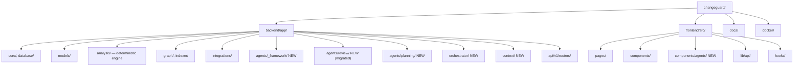
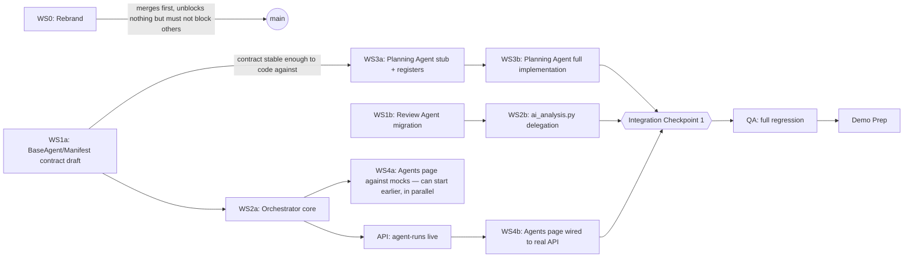
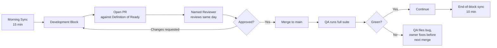

# TEAM_IMPLEMENTATION_PLAN.md — GraphForge Hackathon Execution

**Status**: Operational. Architecture is closed — this document does not reopen it.
**Authority order**: `docs/graphforge/*.md` → `docs/GRAPHFORGE_TRANSFORMATION_PLAN.md` → this
document. If this document ever appears to conflict with either, the conflict is a bug in this
document, not a license to improvise — flag it to the Captain, don't silently resolve it either way.

**Hackathon scoping note**: `docs/graphforge/ROADMAP.md` describes a 5-phase, multi-week evolution.
A hackathon cannot execute all five phases. This plan executes a **deliberately chosen slice**:
Phase 1 (Rebrand) in full, plus the minimum viable cut of Phase 2 + Phase 4 needed to prove the
core GraphForge thesis end-to-end — *a second agent, running through a real Orchestrator, grounded
in the same Knowledge Graph the Review Agent already uses* — without building real Jira/Confluence
integrations (those stay Phase 2/3 backlog; a free-text Entry Resolver stands in for them here).
This is not a scope cut made silently: it is the explicit, single most important judgment call in
this plan, and every workstream below is sized against it.

---

## 1. Executive Summary

**Vision**: GraphForge is the next evolution of ChangeGuard — an AI Engineering Intelligence
Platform where every feature either reads from or writes to a unified Engineering Knowledge Graph,
and ChangeGuard's existing Change Investigation Agent becomes the first of many specialized agents
coordinated by a shared Agent Orchestrator.

**Implementation strategy for this hackathon**: preserve 100% of ChangeGuard's working
functionality untouched, rebrand it, and build the smallest possible slice of new architecture that
*proves* the multi-agent thesis rather than just renaming the product. Concretely: introduce the
Agent Framework (`BaseAgent`, `AgentManifest`), the Agent Orchestrator (Registry, rule-based
Selector, Run Coordinator), a second real agent (Planning Agent, operating on free-text input
resolved through a minimal Entry Resolver), and a new Agents page in the frontend that shows both
the existing Review Agent and the new Planning Agent running through the same Orchestrator. Five
engineers work in five largely independent workstreams (§3) sequenced so that nobody is blocked
waiting on another person's code for more than one integration checkpoint (§5).

**Success criteria**:
1. Every existing ChangeGuard capability (auth, GitHub integration, repository indexing, PR
   review/investigate/publish) works identically at the end of the hackathon as it did at the
   start — zero functional regression, verified by the full existing test suite staying green.
2. A user can trigger the Planning Agent (via free-text input) and the Review Agent (via an
   existing PR) and see both runs recorded and rendered in one new Agents page — proving one
   Orchestrator genuinely coordinates more than one agent, not just re-skinning the Review Agent.
3. The demo (§13) tells a coherent story: "this used to be ChangeGuard, one agent reviewing PRs;
   this is GraphForge, one graph, one orchestrator, multiple agents" — visibly, live, without
   fabricated data.
4. No merge conflict costs the team more than 15 minutes at any point (§11) — if this happens
   twice, the Captain calls a scope cut, not a process fix.

---

## 2. Team Organization

### Captain (Architecture + Integration)

- **Mission**: Keep the five workstreams coherent, keep `main` always demoable, make the scope
  calls nobody else has authority to make.
- **Responsibilities**: Owns `docs/graphforge/*` and this document as living references (updates
  them when reality diverges, never lets them silently rot); designs and reviews the Agent
  Manifest schema and Orchestrator API contract before anyone codes against them; final reviewer
  on every PR touching `app/orchestrator/`, `app/agents/_framework/`, or any router; merges
  integration checkpoints personally.
- **Decision authority**: Final say on scope cuts, on any architecture deviation from
  `docs/graphforge/*`, and on merge-order disputes. Does **not** unilaterally rewrite another
  engineer's workstream — raises concerns, the owner fixes it.
- **Expected deliverables**: `app/agents/_framework/manifest.py` (the `AgentManifest` contract,
  written first, before Developer 1's agent or Developer 2's UI can proceed), final integration
  branch merges at each checkpoint, the demo script (§13).
- **Daily responsibilities**: Morning sync facilitation (§7), reviews every open PR before end of
  day, unblocks whoever is stuck longest.
- **Review responsibilities**: `app/orchestrator/*`, `app/agents/_framework/*`, any change to
  `docs/graphforge/*` or this document, any new public API contract.
- **Definition of success**: At demo time, nobody is explaining away a broken feature as "that's
  a known issue" — everything shown is real and was true five minutes before the demo, not just
  at some earlier point in the day.

### Senior Engineer (Backbone: Agent Framework + Orchestrator)

- **Mission**: Build the load-bearing new infrastructure — the Agent Framework and Orchestrator —
  that both the Planning Agent and the frontend depend on.
- **Responsibilities**: `app/agents/_framework/` (`BaseAgent`, `ToolRegistry`, retry policy —
  extracted from the existing `investigation_agent.py`/`planner.py` pattern, not invented fresh),
  `app/orchestrator/` (Registry, rule-based Selector, Run Coordinator, in-memory `RunContext` —
  see the Redis-vs-in-memory call in §9), the `Run`/`AgentStep` Postgres models + migration, the
  `agent-runs` API router, and migrating the existing Review-agent endpoints to call the
  Orchestrator internally without changing their external contract.
- **Decision authority**: Final say on the internal shape of the Orchestrator implementation
  (within the contract the Captain set), on retry/error semantics inside the framework.
- **Expected deliverables**: A working `app/orchestrator/` that can register the (migrated) Review
  Agent and Developer 1's Planning Agent, select correctly by `Goal`, and execute either.
- **Daily responsibilities**: Publishes the `AgentManifest`/`AgentOutput` contract shape to the
  team the moment it's stable enough to code against — even before the full implementation lands
  — so Developer 1 and Developer 2 are never blocked waiting for the whole thing to finish.
- **Review responsibilities**: Developer 1's Planning Agent (does it correctly implement
  `BaseAgent`?), any PR touching `app/agents/review/` (the migrated existing agent).
- **Definition of success**: Both agents run through one Orchestrator with zero special-casing per
  agent in the Run Coordinator's core loop.

### Developer 1 (Second Agent: Planning Agent)

- **Mission**: Build the proof that the Agent Framework generalizes — a second, genuinely
  different agent, not a copy-paste of the Review Agent.
- **Responsibilities**: `app/agents/planning/` — manifest, prompt template, tool set (reuses
  existing deterministic graph-read tools from `app/analysis`/`app/graph` where sensible; does
  **not** duplicate them), output schema, and the minimal `app/context/resolvers/freetext.py`
  Entry Resolver that turns a free-text goal into a `Subject` the Planning Agent can act on
  (standing in for the Jira/Confluence resolvers that are out of scope for the hackathon).
- **Decision authority**: The Planning Agent's own prompt design, tool selection, and output
  schema shape (within the `AgentOutput` envelope the Senior Engineer defines).
- **Expected deliverables**: A working Planning Agent, registered in the Orchestrator, producing a
  real `AgentOutput` with confidence + evidence for a free-text goal like "plan the work to add
  Slack notifications to release events."
- **Daily responsibilities**: Codes against the Senior Engineer's published contract shape as soon
  as it's stable (even a draft), rather than waiting for a finished framework — flags contract gaps
  immediately rather than working around them silently.
- **Review responsibilities**: Reviews the Senior Engineer's `AgentManifest`/`ToolRegistry` shape
  from a "can I actually build a second agent against this?" perspective — the most valuable
  review this plan has, because it's the only one that tests generality, not just correctness.
- **Definition of success**: The Planning Agent's code required zero changes to `app/agents/review/`
  or the Orchestrator core to ship.

### Developer 2 (Frontend: Agents Surface)

- **Mission**: Make both agents visible, in one place, in the existing design system — no new
  visual language.
- **Responsibilities**: Rebrand (WS0, §3 — first task, small, unblocks nothing else but must not
  be skipped), `frontend/src/pages/AgentsPage.tsx`, `components/agents/` (`AgentCard`,
  `ConfidenceBadge`, `EvidencePanel`), `lib/api/agentRuns.ts`, `hooks/useAgentRun.ts`, nav wiring
  (`nav-items.ts` + `router.tsx`).
- **Decision authority**: Component composition details within `UI_GUIDELINES.md`'s existing
  constraints — does not introduce new colors, spacing, or primitives without Captain sign-off.
- **Expected deliverables**: An Agents page showing run history for both the Review Agent and
  Planning Agent, reusing the existing `ReasoningLogPanel` for run detail (not rewriting it).
- **Daily responsibilities**: Builds against the documented `agent-runs` API contract
  (`API_CONTRACTS.md`) using mocked responses (`vi.spyOn`-style, matching existing test
  conventions) *before* the backend endpoint is done, so frontend and backend proceed in parallel,
  wiring the real endpoint only at the integration checkpoint.
- **Review responsibilities**: Any PR touching `frontend/src/components/` (shared primitives) —
  catches accidental new-component sprawl early.
- **Definition of success**: A user cannot tell, from the Agents page's visual craft, that it was
  built in a hackathon rather than being part of ChangeGuard's original UI.

### Senior QA

- **Mission**: Be the only person whose job is to make sure the *whole* product still works, not
  just their own workstream's slice.
- **Responsibilities**: Owns WS0 (rebrand — see §2 Developer roles above; QA does this because it's
  small, safe, and QA has the least new-feature-dependent work at hour 0), the regression test
  pass against the existing ChangeGuard test suite after every integration checkpoint, new test
  coverage review for the Orchestrator/Planning Agent/Agents page, the demo rehearsal, and bug
  triage/severity classification (§12).
- **Decision authority**: Can block a merge at an integration checkpoint if regression tests fail
  — this is the one veto in the whole plan that isn't the Captain's, and it's absolute.
- **Expected deliverables**: A written regression checklist (§10), a bug list with severities
  triaged continuously (not batched at the end), the demo rehearsal sign-off.
- **Daily responsibilities**: Runs the full test suite (`scripts/test.sh` equivalent for both
  backend and frontend) after every merge to `main`, not just at the end of the day.
- **Review responsibilities**: Every PR's test coverage specifically (not the implementation logic
  itself, which the relevant domain reviewer already covers) — QA asks "is this tested the way the
  rest of this codebase tests things," not "is this code good."
- **Definition of success**: Zero surprises during the demo — every failure mode was already known
  and either fixed or explicitly accepted as a documented risk before the demo started.

---

## 3. Workstreams

### WS0 — Rebrand & Baseline Hygiene

| | |
|---|---|
| **Purpose** | Make the product visibly GraphForge with zero architectural risk, and fix the one pre-existing failing test so it stops generating noise for the rest of the hackathon |
| **Owner** | Senior QA |
| **Scope** | String/branding replacement only; `monkeypatch.delenv` fix for `test_connect_returns_503_when_not_configured` |
| **Deliverables** | One PR, merged first, before any other branch is cut |
| **Dependencies** | None |
| **Public APIs** | None changed |
| **Folders owned** | Touches files across many folders but changes nothing structural — see exact file list below |
| **Files frequently modified** | `backend/app/core/config.py`, `frontend/index.html`, `frontend/src/components/layout/{Sidebar,Topbar}.tsx`, `frontend/src/pages/{LoginPage,SettingsPage,RepositoriesPage}.tsx`, `frontend/src/components/GitHubIntegrationCard.tsx`, `backend/app/ai/services/github_comment_formatter.py`, `README.md`, `backend/pyproject.toml`, `frontend/src/app/App.test.tsx` |
| **Files that should NOT be modified** | Anything not on the list above — this workstream does not touch logic, only literal strings |
| **Expected merge frequency** | Once, as the very first merge |
| **Complexity** | Low |
| **Risk level** | Low — but sequencing risk is high if delayed (see §11) |

### WS1 — Agent Framework Core

| | |
|---|---|
| **Purpose** | Generalize the existing Review Agent's execution loop into a reusable base every future agent extends |
| **Owner** | Senior Engineer |
| **Scope** | `BaseAgent`, `AgentManifest`, `AgentOutput`/`Evidence` schemas, `ToolRegistry`, retry policy — extracted from `app/ai/agent/{investigation_agent,planner}.py` behavior-preserving, not rewritten |
| **Deliverables** | `app/agents/_framework/` package; `app/ai/agent/` migrated to `app/agents/review/` with zero behavior change (regression-tested) |
| **Dependencies** | None to start (can begin immediately reading existing `investigation_agent.py`) |
| **Public APIs** | The `BaseAgent`/`AgentManifest` Python interface — the single most important contract in this hackathon, since WS2 and WS3 both code against it |
| **Folders owned** | `backend/app/agents/_framework/`, `backend/app/agents/review/` (migration only) |
| **Files frequently modified** | `backend/app/agents/_framework/*.py` |
| **Files that should NOT be modified** | `backend/app/analysis/*` (the deterministic engine — reused as a tool, never edited), `backend/app/integrations/*` |
| **Expected merge frequency** | 2–3 PRs: framework skeleton first (published early for others to code against), migration second, hardening third |
| **Complexity** | High |
| **Risk level** | High — everyone depends on this; delays here cascade |

### WS2 — Agent Orchestrator

| | |
|---|---|
| **Purpose** | Prove one coordinator can select and run more than one agent |
| **Owner** | Senior Engineer (same owner as WS1 — these two are sequential parts of one backbone, not independent) |
| **Scope** | `Registry`, rule-based `Selector` (`Goal → [agent_id]`), `RunCoordinator`, `Run`/`AgentStep` Postgres models + migration, in-memory `RunContext`, `POST/GET /agent-runs` API |
| **Deliverables** | An Orchestrator that runs the migrated Review Agent and (once ready) the Planning Agent identically |
| **Dependencies** | WS1's `BaseAgent`/`AgentManifest` must be stable (not necessarily finished) |
| **Public APIs** | `POST /api/v1/agent-runs`, `GET /api/v1/agent-runs/{id}`, `GET /api/v1/agent-runs`, `GET /api/v1/agents` — exact shapes per `API_CONTRACTS.md` |
| **Folders owned** | `backend/app/orchestrator/`, `backend/app/models/{run,agent_step}.py`, `backend/app/api/v1/routers/agent_runs.py` |
| **Files frequently modified** | `backend/app/orchestrator/*.py` |
| **Files that should NOT be modified** | `backend/app/api/v1/routers/ai_analysis.py` beyond the minimal internal-delegation change (see WS2 integration note below) — this file has the highest historical churn in the whole repo; touch it once, carefully, reviewed by the Captain |
| **Expected merge frequency** | 2 PRs: Orchestrator core + models, then the `ai_analysis.py` internal-delegation migration as its own small, isolated, Captain-reviewed PR |
| **Complexity** | High |
| **Risk level** | High |

### WS3 — Planning Agent (Second Agent)

| | |
|---|---|
| **Purpose** | Prove the framework generalizes to a genuinely different agent, not a Review Agent clone |
| **Owner** | Developer 1 |
| **Scope** | `app/agents/planning/` (manifest, prompt, tools, output schema), `app/context/resolvers/freetext.py` (minimal Entry Resolver for free-text goals). **Note**: this is the standalone-input variant of the Planning Agent (`Goal=plan_freeform`, per `AGENT_FRAMEWORK.md`), not the sequential-handoff Planning Agent described in `ARCHITECTURE.md`/`ROADMAP.md` Phase 2, which consumes a real Requirement Agent's output (`Goal=plan_story`) — that version remains Phase 2/3 backlog work. |
| **Deliverables** | A working Planning Agent producing a real `AgentOutput` with confidence + evidence, registered in WS2's Orchestrator |
| **Dependencies** | WS1's `BaseAgent` contract (can start against a draft; the manifest schema itself, not the full implementation) |
| **Public APIs** | None new beyond what WS2 already defines — the Planning Agent is a consumer of the Orchestrator API, not a new API surface |
| **Folders owned** | `backend/app/agents/planning/`, `backend/app/context/resolvers/freetext.py` |
| **Files frequently modified** | `backend/app/agents/planning/*.py` |
| **Files that should NOT be modified** | `backend/app/agents/review/*`, `backend/app/agents/_framework/*` (report gaps to Senior Engineer, don't patch the framework yourself mid-hackathon) |
| **Expected merge frequency** | 2–3 PRs: manifest + stub first (so it can register with the Orchestrator early), full prompt/tool implementation second, polish third |
| **Complexity** | Medium |
| **Risk level** | Medium — the most likely place to discover the framework contract is wrong, which is exactly why it should start early |

### WS4 — Frontend Agents Surface

| | |
|---|---|
| **Purpose** | Make the multi-agent story visible and demoable |
| **Owner** | Developer 2 |
| **Scope** | `AgentsPage`, `components/agents/*`, `lib/api/agentRuns.ts`, `hooks/useAgentRun.ts`, nav wiring. The "trigger a run" button on the Agents page uses `violet-600` (agentic action, consistent with the existing "Investigate" button) — confirmed explicitly here so it isn't re-litigated mid-build. |
| **Deliverables** | A working Agents page showing run history for both agents, reusing `ReasoningLogPanel` for detail |
| **Dependencies** | WS2's API contract (can build against mocked responses immediately; needs the real endpoint only at the final integration checkpoint) |
| **Public APIs** | None — pure consumer |
| **Folders owned** | `frontend/src/pages/AgentsPage.tsx`, `frontend/src/components/agents/`, `frontend/src/lib/api/agentRuns.ts`, `frontend/src/hooks/useAgentRun.ts` |
| **Files frequently modified** | The files above, plus one-line additions to `nav-items.ts` and `router.tsx` |
| **Files that should NOT be modified** | `components/Card.tsx`, `Table.tsx`, `StatusBadge.tsx`, `RiskBadge.tsx` (compose, never edit — per `UI_GUIDELINES.md`), any existing page |
| **Expected merge frequency** | 2 PRs: page + components against mocks, then real-API wiring |
| **Complexity** | Medium |
| **Risk level** | Low — well-isolated, existing patterns to copy |

### WS5 — QA, Regression & Demo

| | |
|---|---|
| **Purpose** | Guarantee nothing that used to work stops working, and that new work is genuinely tested, not just demoed once and hoped for |
| **Owner** | Senior QA |
| **Scope** | WS0 (see above), continuous regression runs, new-code test coverage review, demo script + rehearsal |
| **Deliverables** | Regression checklist (§10), bug list with severities, demo rehearsal sign-off |
| **Dependencies** | Runs continuously alongside every other workstream, not sequentially after them |
| **Public APIs** | None |
| **Folders owned** | `backend/tests/`, `frontend/src/**/*.test.tsx` (review, not primary authorship — each workstream owner still writes their own tests; QA reviews coverage and runs the suite) |
| **Files frequently modified** | Test files across the repo, as a reviewer/contributor, not sole author |
| **Files that should NOT be modified** | Non-test source files — QA files a bug, the workstream owner fixes it; QA does not silently patch someone else's implementation |
| **Expected merge frequency** | Continuous, small PRs (test additions, regression fixes) |
| **Complexity** | Medium |
| **Risk level** | Low individually, but this workstream *not* happening is the highest-impact risk in the whole plan |

---

## 4. Repository Ownership



| Folder | Primary Owner | Secondary Owner | Reviewer | Shared? |
|---|---|---|---|---|
| `backend/app/core/`, `database/` | (unowned this hackathon — no changes planned) | — | Captain | No |
| `backend/app/models/` | Senior Engineer (new `Run`/`AgentStep` only) | — | Captain | No — additive only |
| `backend/app/analysis/` | (unowned — reused, not modified) | — | Captain | **No — frozen for this hackathon** |
| `backend/app/graph/`, `indexer/` | (unowned — reused, not modified) | — | Captain | **No — frozen** |
| `backend/app/integrations/` | (unowned — reused, not modified) | — | Captain | **No — frozen** |
| `backend/app/agents/_framework/` | Senior Engineer | Captain | Developer 1 (generality check) | No |
| `backend/app/agents/review/` | Senior Engineer (migration only) | — | Captain | No |
| `backend/app/agents/planning/` | Developer 1 | — | Senior Engineer | No |
| `backend/app/context/` | Developer 1 | Senior Engineer | Captain | No |
| `backend/app/orchestrator/` | Senior Engineer | Captain | Captain | No |
| `backend/app/api/v1/routers/ai_analysis.py` | Senior Engineer (one small migration PR) | Captain | Captain | **Yes — highest historical churn, single-PR discipline required** |
| `backend/app/api/v1/routers/agent_runs.py` | Senior Engineer | — | Captain | No |
| `frontend/src/pages/AgentsPage.tsx` | Developer 2 | — | Captain | No |
| `frontend/src/components/agents/` | Developer 2 | — | Captain | No |
| `frontend/src/components/` (existing shared primitives) | (unowned — reused, not modified) | — | Developer 2 | **No — frozen** |
| `frontend/src/components/layout/nav-items.ts`, `router.tsx` | Developer 2 | — | Captain | **Yes — one-line additions only, coordinate before editing** |
| `backend/app/schemas/` (existing folder) | No single owner — each workstream adds its own new file (e.g. `schemas/orchestrator.py`, `schemas/planning_agent.py`) | — | Captain (any edit to an *existing* schema file) | No for new files, Yes for existing files |
| `backend/tests/`, `frontend/**/*.test.tsx` | Each workstream owner (their own code) | Senior QA (coverage review) | Senior QA | Yes — everyone writes tests, QA reviews all of them |
| `docs/graphforge/*`, `docs/GRAPHFORGE_TRANSFORMATION_PLAN.md`, this document | Captain | — | — | Yes — Captain merges, anyone can propose |

**High Conflict Areas**: `nav-items.ts`/`router.tsx` (one-line additions from WS4 only — no one
else should touch these), `ai_analysis.py` (WS2's one migration PR, nothing else).

**Low Conflict Areas**: `agents/_framework/`, `agents/planning/`, `orchestrator/`,
`components/agents/` — all net-new folders with a single owner each.

**Critical Files** (breaking these breaks the demo): `app/agents/_framework/base_agent.py` (WS1),
`app/orchestrator/registry.py` (WS2), the existing `investigation_agent.py`/`planner.py` before
migration (do not let anyone "clean up" this file mid-hackathon — it's the proof this all works).

**Protected Files** (frozen, no hackathon PR should touch these at all): `app/analysis/*`,
`app/graph/*`, `app/indexer/*`, `app/integrations/*`, every existing frontend page except through
WS4's additive nav change, and — critically — **`docker/docker-compose*.yml`'s `name:` field and
every `POSTGRES_*`/`NEO4J_*` credential value in those files, `.env`, and `.env.example`**.
Renaming any of these orphans the currently-running dev Postgres/Neo4j volumes (which hold real,
non-trivially-reproducible seeded data — a real GitHub connection, four indexed repositories,
seeded PR rows) rather than updating them in place; see `FINAL_ARCHITECTURE_REVIEW.md` Part 3 for
the full analysis. If a workstream believes one of these needs a change, that's an escalation to
the Captain, not a PR.

---

## 5. Development Order

### Dependency Graph



Note: WS4a (frontend against mocks) and WS0 (rebrand) can start immediately with zero dependency.
WS3a (Planning Agent stub) only needs the *shape* of `AgentManifest`, which the Senior Engineer
should publish as a draft within the first working block — not wait for the full framework.

### Timeline

Assumes a 24-hour hackathon window; scale each block proportionally for a different duration
(e.g., a 48-hour hackathon roughly doubles every block below).

| Block | Hours | What happens |
|---|---|---|
| **Kickoff** | 0–1 | Team reads `docs/graphforge/*` + `GRAPHFORGE_TRANSFORMATION_PLAN.md` + this document together (not silently, out loud, 30 min max). WS0 branch cut immediately. |
| **Build Sprint 1** | 1–6 | WS0 merges (hour ~2). Senior Engineer publishes `AgentManifest` draft (hour ~3) and continues on `BaseAgent`. Developer 1 starts Planning Agent stub against the draft. Developer 2 starts Agents page against mocked `agent-runs` responses. QA writes the regression checklist (§10) and starts running the *existing* suite continuously. |
| **Integration Checkpoint 1** | 6–7 | Senior Engineer's framework + orchestrator core merge. Developer 1's Planning Agent stub registers successfully. Captain reviews and merges the `ai_analysis.py` delegation PR personally. |
| **Build Sprint 2** | 7–14 | Developer 1 completes the real Planning Agent (prompt, tools, evidence). Developer 2 wires the Agents page to the now-live `agent-runs` API. QA runs regression after every merge, files bugs immediately (not batched). |
| **Integration Checkpoint 2** | 14–16 | Everything merges to `main`. Full regression pass. Captain does an end-to-end manual walkthrough of the exact demo path. |
| **Hardening** | 16–20 | Bug fixes only — no new scope. QA has veto power here (§2). |
| **Demo Prep** | 20–22 | Demo rehearsal (§13), backup plan confirmed. |
| **Buffer** | 22–24 | Reserved. Do not schedule work into this block in advance — it exists because Block estimates are always optimistic. |

---

## 6. Integration Strategy

- **When integration happens**: at the two named checkpoints above, not continuously in an ad hoc
  way, and not only once at the very end. Two checkpoints is the right number for a 24-hour
  window — more adds ceremony, fewer risks a big-bang integration failure with no time to recover.
- **Who integrates**: the Captain merges at both checkpoints, personally, after confirming with
  each workstream owner that their branch is ready (see Definition of Ready below).
- **Merge strategy**: squash-merge per PR (keeps `main` history readable — one commit per logical
  change, matching this repo's existing commit discipline).
- **Branch strategy**: trunk-based. `main` is always the integration target — no long-lived
  `develop` or `integration` branch (that's ceremony this hackathon can't afford). Each workstream
  branches directly from `main` as `ws/<n>-<short-name>` (e.g. `ws/2-orchestrator`), rebases onto
  `main` before opening a PR, and merges back into `main`. `main` must remain green (tests passing)
  after every merge — nobody merges onto a broken `main`.
- **Code review strategy**: exactly one required reviewer per PR, per the Reviewer column in §4 —
  not two, not "whoever's free." A named reviewer means no PR waits because "someone" was supposed
  to look at it.
- **Conflict resolution**: the PR author resolves conflicts against `main` before requesting
  review (rebase, not merge-commit) — reviewers should never see merge-conflict markers.
- **Definition of Ready** (to open a PR): builds locally, existing tests pass, new code has tests
  matching the existing test conventions (real DB in integration tests, mocked only at the exact
  external boundary — no new convention introduced), no `TODO`/placeholder left in changed files.
- **Definition of Done** (to merge): review approved by the named reviewer, `main`'s CI green after
  merge, and — for anything touching an agent or the Orchestrator — the change is registered
  (manifest exists, appears in `GET /agents`), not just implemented and forgotten.

---

## 7. Daily Workflow



**Morning (start of hackathon day / start of each work block for a multi-day event)**: 15-minute
sync — each person states what they're about to do and what (if anything) they're blocked on.
This is not a status theater ritual; if nobody is blocked, it's genuinely 5 minutes.

**Development**: heads-down, in your own workstream's folders (§3, §4). If you're about to touch a
file outside your ownership, that's a Slack/Discord message to its owner *before* you touch it,
not after.

**PR**: opened against Definition of Ready (§6). Small PRs — a workstream should open 2–3 PRs
over the hackathon, not one giant PR at the end (see per-workstream "Expected merge frequency"
in §3).

**Review**: same-day, by the named reviewer only. If the named reviewer is genuinely unavailable,
the Captain reviews as a fallback — never "whoever has time."

**Merge**: squash-merge to `main` per §6.

**Testing**: QA runs the full suite after every merge (not just at checkpoints) — catching a
regression within one merge of it happening is the entire point of continuous QA in §2.

**Demo (end of hackathon)**: see §13.

**Meeting cadence for a distributed team**: morning sync (15 min) + one mid-point sync at each
Integration Checkpoint (§5) to confirm readiness before the Captain merges + the demo rehearsal
(§13). That's it — three synchronous touchpoints in a 24-hour window. Everything else is async
(PR comments, a shared channel for "I'm about to touch X" pings).

---

## 8. AI Development Guidelines

Every engineer on this team uses an AI coding tool. That is an accelerant, not a substitute for
architectural discipline — the rules below exist because AI tools left unconstrained will
cheerfully invent a new API shape, rename a shared model, or hand-roll a new UI component that
duplicates an existing one, all with total confidence. Every rule below is mandatory, not advisory.

### Mandatory Rules

1. **Every prompt that generates backend or frontend code must reference the specific
   `docs/graphforge/*` file(s) governing that code** — paste the relevant section in, don't rely
   on the model's memory of an earlier conversation turn.
2. **Never let the AI invent an API shape.** If `API_CONTRACTS.md` defines the endpoint, paste that
   exact contract into the prompt and ask the model to implement *that*, not "an endpoint for X."
3. **Never rename a shared model, schema, or component** without the Reviewer (§4) approving it
   first — an AI tool asked to "clean up" `PullRequestAnalysis` will rename fields without being
   asked to; review diffs for unrequested renames specifically.
4. **Never introduce a new framework, library, or dependency** not already in `pyproject.toml` /
   `package.json` without Captain sign-off — AI tools default to whatever's popular, not what this
   repo already uses.
5. **Always reuse existing abstractions before writing a new one.** Before asking an AI tool to
   write a new tool/resolver/component, grep the existing codebase for something close enough to
   extend — paste what you found into the prompt and ask it to extend that, not start fresh.
6. **Update the relevant doc in the same PR as the code**, if the code changes something a doc
   describes (a new endpoint, a new agent, a new component) — a docs-drift PR filed "later" never
   happens.
7. **Every generated function/endpoint/component ships with a generated test in the same PR**,
   following this repo's existing test conventions exactly (real DB for backend integration tests,
   `vi.spyOn` for frontend API mocks) — never a new testing pattern.
8. **Never duplicate a component.** Before generating a new React component, check
   `frontend/src/components/` and `UI_GUIDELINES.md`'s Component Library table first.
9. **Maintain UI consistency** — every new page/component prompt must include the relevant
   `UI_GUIDELINES.md` sections (colors, spacing, existing component contracts) so the AI tool
   doesn't invent new visual language.
10. **Human review is mandatory before merge, always** — no PR generated primarily by an AI tool
    skips the named-reviewer step in §6. AI-assisted is not review-exempt.

### Prompt Templates

Each template below is a starting structure — fill in the bracketed parts, don't skip the
"paste the actual doc/code" steps; that's what makes these different from a generic prompt.

**Frontend**
```
Context: I'm working on GraphForge (evolved from ChangeGuard). Read this UI_GUIDELINES.md
section: [paste relevant section]. Here is the existing Card/Table/StatusBadge component
contract: [paste component source]. Here is the existing page it should match the style of:
[paste PullRequestDetailPage.tsx or similar].

Task: Build [specific component/page], composing existing components only. Do not introduce
new colors, spacing values, or primitives. Follow the existing loading/empty/error state
conventions exactly: [paste those conventions from UI_GUIDELINES.md].

Output: component code + a .test.tsx file following the existing test pattern in
[paste a reference test file].
```

**Backend**
```
Context: GraphForge backend, FastAPI + async SQLAlchemy + Alembic. Here is the existing
[analogous module, e.g. github_service.py] I should follow the pattern of: [paste it].
Here is ARCHITECTURE.md's description of [relevant component]: [paste section].

Task: Implement [specific module/function]. Reuse existing interfaces
(IVersionControlProvider/IKnowledgeSource/etc.) rather than inventing new ones. Follow the
existing error-handling convention: never swallow an exception, use the existing AppError
subclass pattern: [paste an existing AppError subclass example].

Output: implementation + tests using the existing real-Postgres/real-Neo4j integration test
convention (mock only the exact external HTTP boundary): [paste a reference test file].
```

**Agent**
```
Context: GraphForge Agent Framework, per AGENT_FRAMEWORK.md: [paste relevant sections —
Agent Contract, Execution Flow, Confidence & Evidence]. Here is the AgentManifest contract:
[paste it]. Here is the existing Review Agent's tool-use loop I should follow the shape of
(not copy the domain logic of): [paste investigation_agent.py's planner loop].

Task: Implement the [Agent Name] agent: manifest, prompt template, tool set, output schema.
Every confidence score must be backed by at least one Evidence entry — no bare confidence
numbers. Reuse [specific existing tool/engine] rather than reimplementing its logic.

Output: agent module + manifest registration + tests covering: happy path, low-confidence
retry, a failing tool call.
```

**API**
```
Context: Here is the exact contract from API_CONTRACTS.md for this endpoint: [paste it
verbatim, including example JSON]. Here is the existing router pattern to follow:
[paste an existing router file, e.g. ai_analysis.py].

Task: Implement exactly this contract — do not add fields, do not change field names, do not
change the status codes listed. If something in the contract seems wrong, stop and ask, don't
silently "improve" it.

Output: router code + Pydantic request/response schemas + tests for: happy path, each listed
error status code.
```

**Documentation**
```
Context: This PR changes/adds [describe the change]. Here is the existing doc section that
now needs updating: [paste the relevant docs/graphforge/*.md or API_CONTRACTS.md section].

Task: Update the doc to reflect exactly what the code now does — no aspirational language,
no restating the design intent if the implementation differs from it (flag the difference
instead).

Output: a minimal diff to the existing doc file, not a rewrite of the whole file.
```

**Testing**
```
Context: Here is the code to test: [paste it]. Here is this repo's existing test convention
for this kind of code: [paste a closely analogous existing test file in full].

Task: Write tests matching that exact convention — same fixture patterns, same assertion
style, same real-infrastructure-over-mocking philosophy. Cover: happy path, the documented
error/precondition cases from API_CONTRACTS.md or AGENT_FRAMEWORK.md, and one adversarial
case (empty input, missing dependency, upstream failure).

Output: test file only, ready to run against the existing test fixtures.
```

**Bug Fixes**
```
Context: Bug report: [paste QA's exact repro steps and expected vs. actual]. Here is the
relevant code: [paste it]. Here is its existing test file: [paste it].

Task: Fix the root cause, not the symptom — do not add a special-case branch that papers
over the actual defect. Add a regression test that would have caught this bug, in the
existing test file, not a new one.

Output: minimal diff + one new test case.
```

**Refactoring**
```
Context: Here is the code I want to refactor: [paste it]. Here is why: [state the concrete
reason — duplication across N call sites, a shape that doesn't fit AGENT_FRAMEWORK.md, etc.].

Task: Refactor with zero behavior change — every existing test must still pass unmodified,
unless a test was asserting the specific thing being fixed. Do not rename anything not
directly related to the stated reason. Do not take the opportunity to also improve unrelated
nearby code ("while I'm here" scope creep is explicitly out of bounds this hackathon).

Output: diff + confirmation that the existing test suite passes unmodified.
```

**Review**
```
Context: Here is a PR diff: [paste it]. Here is the relevant contract/doc it should conform
to: [paste API_CONTRACTS.md / AGENT_FRAMEWORK.md / UI_GUIDELINES.md section].

Task: Check specifically for: (1) invented API shapes not matching the contract, (2)
unrequested renames of shared models/fields, (3) new dependencies not already in
pyproject.toml/package.json, (4) new UI components/colors not in UI_GUIDELINES.md, (5)
missing tests for the new code, (6) swallowed exceptions / silently-defaulted error paths.

Output: a list of concrete findings with file:line references — not a general "looks good"
or vague style commentary.
```

---

## 9. Coding Standards

All standards below are **existing conventions in the codebase**, restated so AI-generated code
follows them without rediscovering them from scratch each time.

| Area | Standard |
|---|---|
| **Naming** | `PascalCase` classes/Pydantic models, `snake_case` functions/variables (Python); `PascalCase` components, `camelCase` functions/variables (TypeScript). Resource paths: plural kebab-case (`/agent-runs`). Request/response models suffixed `Request`/`Response`. |
| **Folder structure** | One module per responsibility, matching §4's ownership map exactly — a new agent is a new folder under `agents/`, never a file dropped into an existing agent's folder. |
| **Logging** | Structured `loguru`, existing convention. Every new agent/orchestrator log line includes `run_id`, `agent_id`, `subject_id` (per `AGENT_FRAMEWORK.md`). |
| **Error handling** | Never swallow an exception. Use existing `AppError` subclasses where one fits (`NotFoundError`, `UnauthorizedError`); introduce a new subclass only when no existing one fits, and only with Captain sign-off (this hackathon should not need a new HTTP status code — reuse 404/401/422/502 per existing precedent). |
| **API responses** | Match `API_CONTRACTS.md` exactly — field names, status codes, error envelope shape (`{"error": {"code": ..., "message": ...}}`). |
| **Testing** | Real Postgres/Neo4j in integration tests, mock only the exact external HTTP boundary (`httpx.MockTransport` convention). No new test framework or convention. |
| **Documentation** | Docstrings explain *why*, not *what* — existing convention (e.g. `PostedComment`'s docstring explains why it lives where it does, not what its two fields are). |
| **Comments** | Same rule as docstrings — only for non-obvious rationale, never restating what the code already says. |
| **Type safety** | Full type hints (Python), no `any` (TypeScript) — existing `mypy --strict`-equivalent and `tsc --noEmit` gates stay green. |
| **State management** | React Context for cross-cutting concerns (existing `AuthContext`/`AiModelContext` pattern) — no new state library. Local `useState` for page-local state (existing convention throughout). |
| **Dependency injection** | FastAPI's `Depends()` for request-scoped resources (existing convention: `get_db_session`, `get_current_user`); constructor injection for services/engines/agents (existing convention throughout `analysis/`, `ai/agent/`). |
| **Configuration** | All config through `app.core.config.Settings` (existing `pydantic-settings` pattern) — no new env-var reading mechanism, no hardcoded config anywhere new. |
| **Security** | Secrets encrypted at rest via existing `app.core.crypto` Fernet pattern — no plaintext secret ever committed or logged, no new secrets mechanism introduced for the hackathon's scope. |

---

## 10. Feature Implementation Checklist

### Before Coding
- [ ] Read the relevant `docs/graphforge/*` section(s) for this feature — not skimmed, read.
- [ ] Confirm the folder/ownership per §4 — you're building in your own workstream's territory.
- [ ] If touching a Protected File (§4), stop and escalate to the Captain instead.
- [ ] Check `frontend/src/components/` or the backend's existing interfaces for something to
      extend before writing anything new.

### Before Opening a PR
- [ ] Code builds locally; existing test suite passes unmodified.
- [ ] New tests exist, following the existing convention (§9), covering happy path + at least one
      error/edge case.
- [ ] No invented API shape — cross-checked against `API_CONTRACTS.md`.
- [ ] No unrequested rename of a shared model/field.
- [ ] No new dependency without Captain sign-off.
- [ ] Relevant doc updated in the same PR if this change makes a doc inaccurate.
- [ ] No `TODO`/placeholder/commented-out code left in.

### Before Merging
- [ ] Named reviewer (§4/§6) approved.
- [ ] Branch rebased on current `main`, no conflict markers.
- [ ] CI green.
- [ ] For agent/orchestrator changes: the agent is actually registered and appears in `GET /agents`.

### Before Release (i.e. before the demo)
- [ ] Full regression suite green (QA sign-off, §2).
- [ ] The exact demo path (§13) walked through manually, live, end-to-end, by the Captain.
- [ ] Backup plan (§13) confirmed working, not just written down.
- [ ] `docs/graphforge/*` and this document reflect what was actually built, not just what was
      planned — Captain updates any section that drifted.

---

## 11. Merge Conflict Prevention

### Likely Merge Conflict Files
1. `frontend/src/components/layout/nav-items.ts`, `router.tsx` — every new page adds one line here.
2. `backend/app/api/v1/routers/ai_analysis.py` — highest historical churn file in the repo.
3. `backend/app/main.py` (or equivalent router-mounting file) — every new router needs one line
   here.
4. `docker/docker-compose*.yml` — if any new service is added (unlikely at this hackathon's scope,
   since Redis/in-memory `RunContext` decision below avoids it).

### Strategies to Avoid Them
- **Single-owner discipline** (§4): exactly one person edits `nav-items.ts`/`router.tsx` this
  hackathon (Developer 2). Nobody else adds a nav entry themselves — they ask Developer 2 to add
  it in the same PR cycle.
- **One migration PR for `ai_analysis.py`** (WS2), reviewed by the Captain specifically, merged
  as its own small, isolated change — not bundled with unrelated Orchestrator work.
- **In-memory `RunContext` instead of Redis** for this hackathon's scope: avoids adding a new
  `docker-compose` service entirely, removing an entire class of possible conflict. (This is an
  explicit, temporary scope reduction from `ARCHITECTURE.md`'s Redis-backed design — acceptable
  because Shared Memory only needs to survive one synchronous run in this hackathon's slice, not
  a distributed, multi-process deployment. Flag this in the doc-update pass at the end.)
- **Router mounting**: whoever adds a new router (`agent_runs.py`) adds the one mount line
  themselves, in their own PR, and pings the channel before merging so nobody else is mid-edit on
  that exact line.

### Communication Expectations
- Post in the shared channel *before* touching a Shared Ownership file from §4 ("about to add the
  `agent-runs` router mount, merging in 10 min").
- If you discover you need to touch someone else's folder, message them first — don't just do it
  and explain in the PR description after the fact.

### Ownership Boundaries
Exactly as mapped in §4 — restated here as the operating rule: **if it's not in your workstream's
folder list, it's not your file to edit without a conversation first.**

### Review Rules
One named reviewer per PR (§6). The reviewer's job includes checking the diff doesn't touch files
outside the PR author's declared workstream without a documented reason.

---

## 12. QA Strategy

- **Developer Testing**: every engineer writes their own tests for their own code (§8 rule 7, §10
  checklists) — QA does not write first-draft tests for other people's features, only reviews
  coverage.
- **Integration Testing**: at both checkpoints (§5), QA runs the full backend + frontend suite
  against the merged `main`, plus a manual walkthrough of the cross-workstream path (trigger the
  Planning Agent, trigger the Review Agent, confirm both show up correctly on the Agents page).
- **Regression**: the full pre-existing ChangeGuard test suite (269 backend tests, 49 frontend
  tests, per `GRAPHFORGE_TRANSFORMATION_PLAN.md` §0) must stay green throughout — this is the
  single most important QA signal in the whole hackathon, because a multi-agent demo means
  nothing if the existing Review Agent flow broke along the way.
- **Prompt Validation**: for the Planning Agent specifically, QA manually reviews at least 3
  distinct free-text goal inputs and confirms the output has genuine evidence (not a hallucinated
  confidence score with an empty evidence list — the exact failure mode `AGENT_FRAMEWORK.md`
  explicitly forbids).
- **Demo Validation**: the exact demo script (§13) run start-to-finish, live, at least twice before
  the actual demo — once by the Captain, once by someone who didn't write the demo script, to
  catch any assumption the author baked in unconsciously.
- **Performance**: informal for this hackathon's scope — confirm the Planning Agent's run
  completes in a demo-reasonable time (under ~30s); no formal load testing planned or needed at
  this scale.
- **Acceptance Criteria**: the 4 Success Criteria in §1, verbatim — QA signs off against those
  specifically, not a vague "seems to work."
- **Bug Severity**:

| Severity | Definition | Action |
|---|---|---|
| **Blocker** | Breaks the demo path or regresses an existing ChangeGuard capability | Stop other merges, fix immediately, Captain involved |
| **Major** | A workstream's stated deliverable doesn't work, but doesn't block the demo path | Fix before Integration Checkpoint 2 |
| **Minor** | Cosmetic, or an edge case outside the demo path | File it, fix if time remains, otherwise documented as a known limitation |

---

## 13. Demo Preparation

### Demo Story

"This is ChangeGuard — it reviews pull requests using one AI agent grounded in a real dependency
graph. [Show existing Review Agent flow on a real PR: Investigate → confidence-scored breaking
changes → Publish Review to the real GitHub PR.] This is GraphForge — the same graph, but now a
real Orchestrator coordinates *multiple* agents. [Trigger the Planning Agent with a free-text
goal.] Both runs — the Review Agent's and the Planning Agent's — show up here, on one Agents page,
through one orchestrator. ChangeGuard didn't get replaced. It became the first agent in a
platform built to hold many."

### Demo Roles
- **Captain**: narrates, drives the browser.
- **Senior Engineer**: on standby to explain the Orchestrator/Agent Framework if a technical
  question comes up.
- **Developer 1**: on standby to explain the Planning Agent's reasoning if asked.
- **Developer 2**: on standby for any UI question.
- **Senior QA**: watches for anything visibly wrong in real time, silently signals the Captain if
  something needs to be skipped.

### Backup Plan
- A screen recording of the full demo path, captured during the final rehearsal (§12 Demo
  Validation), ready to play if live demo infrastructure fails (network, server crash, etc.).
- A second real PR pre-selected and pre-verified as a fallback if the primary demo PR's live
  GitHub state has changed unexpectedly.

### Failure Recovery
If something breaks mid-demo: narrate through it honestly ("this would normally show X — let me
show you the recording of it working"), do not attempt a live fix in front of the audience. The
Captain makes the call to switch to the backup recording, not any other team member unilaterally.

### Offline Demo Strategy
If live network/GitHub access is unavailable at demo time: the screen recording (Backup Plan) is
the entire demo. Rehearse narrating over the recording as if it were live, so this isn't a visibly
degraded fallback.

### Demo Checklist
- [ ] Primary demo PR verified real and unchanged since last rehearsal.
- [ ] Backup PR verified.
- [ ] Screen recording captured and playable offline.
- [ ] Full regression suite green as of the final rehearsal.
- [ ] Agents page shows both agents' run history correctly, live, right before the demo starts.
- [ ] Everyone knows their standby role and has watched the full rehearsal at least once.

---

## 14. Risk Register

| Risk | Category | Impact | Mitigation |
|---|---|---|---|
| `BaseAgent`/`AgentManifest` contract changes after WS3/WS4 have started coding against it | Architecture | High | Senior Engineer publishes a draft early (Block 1) specifically so this is discovered *before* both dependents have built on it, not after |
| `ai_analysis.py` migration PR conflicts with concurrent unrelated work | Integration | Medium | Single, small, isolated PR, Captain-reviewed, merged at Checkpoint 1 — see §11 |
| Planning Agent produces confidence scores without real evidence (the exact anti-pattern `AGENT_FRAMEWORK.md` forbids) | AI / Quality | High | QA's explicit Prompt Validation step (§12); code-level check in review (§8 template) |
| A team member's AI tool generates a plausible-looking but contract-violating implementation and it slips through review | AI | High | §8's mandatory rules + §6's named-reviewer requirement — review checks the diff against the pasted contract specifically, not just "does it look reasonable" |
| Distributed team, no co-location — a blocker goes unnoticed for hours | Team | Medium | Morning sync + explicit "post before touching a shared file" norm (§11) surfaces blockers same-block, not same-day |
| In-memory `RunContext` (hackathon scope reduction from Redis) doesn't survive a server restart mid-demo | Architecture / Schedule | Low-Medium | Known, accepted limitation for this hackathon's scope; do not restart the backend process during the demo window |
| Full regression suite takes long enough that QA can't run it after every single merge | Schedule | Medium | QA runs it after every merge to `main` specifically (not every branch push) — merges are infrequent enough (§3's "expected merge frequency") that this stays feasible |
| Demo-day network/GitHub outage | Integration | Medium | Backup screen recording (§13) — rehearsed as a real fallback, not an afterthought |
| Scope creep — someone "while I'm here" touches a Protected File (§4) | Team / Architecture | Medium | §4's explicit Protected Files list + §8's refactoring prompt template explicitly forbidding "while I'm here" changes |
| Five engineers is genuinely tight for this scope in 24 hours | Schedule | Medium-High | The hackathon slice (§0 note, top of document) was deliberately sized down from the full `ROADMAP.md` Phase 2/4 — if Block estimates in §5 slip past Integration Checkpoint 1 by more than ~2 hours, Captain cuts WS3/WS4's scope to "Planning Agent stub only, no full prompt" rather than slipping the demo |

---

## 15. Milestones

| Milestone | Objectives | Owners | Deliverables | Dependencies | Exit Criteria |
|---|---|---|---|---|---|
| **M0: Baseline Green** | Product is visibly GraphForge, zero functional change | Senior QA | WS0 merged | None | Full existing test suite green, product renamed end-to-end |
| **M1: Framework Contract Stable** | `BaseAgent`/`AgentManifest` shape is real enough to build against | Senior Engineer | Draft framework package | M0 | Developer 1 confirms they can build the Planning Agent stub against it |
| **M2: Orchestrator Runs One Agent** | Existing Review Agent runs through the new Orchestrator, unchanged behavior | Senior Engineer, Captain | Migrated `agents/review/`, working `orchestrator/`, `ai_analysis.py` delegation | M1 | Regression suite green against the migrated path |
| **M3: Second Agent Registered** | Orchestrator selects and runs two different agents correctly | Developer 1, Senior Engineer | Planning Agent stub, registered | M1, M2 | `GET /agents` lists both; triggering each by `Goal` selects the correct one |
| **M4: Multi-Agent UI** | Both agents' runs are visible in one place | Developer 2 | `AgentsPage` wired to live API | M3 | A run from each agent renders correctly, using `ReasoningLogPanel` for detail |
| **M5: Feature Complete** | Planning Agent produces real, evidence-backed output; full regression green | Developer 1, Senior QA | Full Planning Agent implementation | M3, M4 | QA's Prompt Validation (§12) passes on 3+ real inputs |
| **M6: Demo Ready** | Demo path rehearsed twice, backup confirmed | Captain, Senior QA | Demo script, recording, checklist (§13) | M5 | Demo Checklist (§13) fully checked |

---

## 16. Team Rules

1. **Architecture changes require Captain approval.** If `docs/graphforge/*` needs to change to
   make your workstream work, that's a conversation with the Captain before you code around it.
2. **No direct commits to `main`.** Every change is a PR, reviewed by its named reviewer (§4/§6),
   no exceptions for "just a one-liner."
3. **No duplicate components.** Check `frontend/src/components/` before writing a new one — this
   is checked in review (§8 rule 8), but the author's job is to not need that catch in the first
   place.
4. **No API changes without updating `API_CONTRACTS.md` in the same PR.** A contract that doesn't
   match the code is worse than no contract.
5. **Documentation must stay current.** If your PR makes a doc inaccurate, the doc update is part
   of your PR, not a follow-up ticket that won't happen this hackathon.
6. **Keep commits focused.** One logical change per commit within a PR; the PR itself should map
   to one workstream deliverable, not a grab-bag.
7. **Ask before changing a Shared Ownership file** (§4, §11) — `nav-items.ts`, `router.tsx`,
   `ai_analysis.py`. This is the single highest-leverage rule for keeping merge conflicts near
   zero across a distributed team.
8. **Protected Files are off-limits without an explicit Captain conversation.** `app/analysis/*`,
   `app/graph/*`, `app/indexer/*`, `app/integrations/*`, every existing frontend page beyond WS4's
   additive nav change. These already work — the entire premise of this hackathon is not touching
   them.
9. **AI-generated code is not review-exempt.** Every rule in §8 applies whether a human or an AI
   tool wrote the first draft — the named reviewer's job doesn't change either way.
10. **When in doubt, under-scope, don't over-build.** A working Planning Agent stub with honest,
    evidence-backed output beats a half-finished "full" implementation with fabricated confidence
    scores. §14's risk register explicitly authorizes cutting WS3/WS4 scope rather than slipping
    the demo — use that authorization if you're behind, don't quietly push through and hope.
