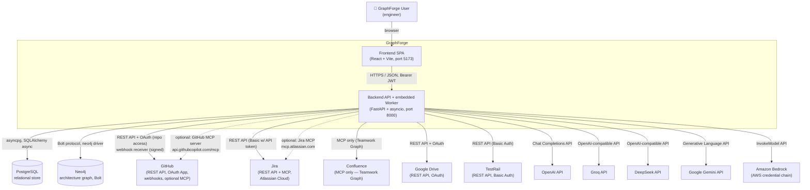

# 1. System Context Diagram

Declared-but-not-implemented external sources (present as catalog entries with
`available=False`, no working transport/tool): **GitLab**, **Azure DevOps**,
**S3 / Object Storage**, and generic **Filesystem** (used only for local
demo repositories, not a network integration). These are omitted from the
diagram above except by this note — see [10-integration-architecture.md](10-integration-architecture.md).

## Explanation

GraphForge is a single deployable unit — one FastAPI backend process (which
also runs an embedded background-job worker in the same process, see
[11-deployment-runtime-architecture.md](11-deployment-runtime-architecture.md))
and one React single-page frontend — that talks to two data stores it owns
(PostgreSQL for relational/application state, Neo4j for the architecture
knowledge graph) and to a fixed set of external systems: a version-control
provider (GitHub, by far the primary one), two project/knowledge sources
(Jira, Confluence), a documentation source (Google Drive), a test-management
source (TestRail), and five interchangeable LLM providers reached through
one internal abstraction (see [05](05-ai-agent-architecture.md)).

GitHub is unique among the integrations in appearing three ways at once:
outbound REST calls (via `GitHubVersionControlProvider`), an OAuth App used
for both "connect a repo" and (currently unimplemented, returns 501)
"sign in with GitHub", and an inbound signed webhook receiver
(`POST /api/v1/webhooks/github`).

Confluence has **no REST call path** in this codebase — document discovery
goes exclusively through Atlassian's hosted MCP server (Teamwork Graph). Jira
prefers MCP when configured but falls back to REST.

## Confirmed vs. Uncertain

- **Confirmed**: GitHub, Jira, Confluence, Google Drive, TestRail, and all
  five AI providers each have a working `ITool`/provider implementation
  reachable from a registered code path.
- **Uncertain / requires verification**: GitLab, Azure DevOps, and S3 are
  registered as `KnowledgeSourceSpec` catalog entries only
  (`available=False` — `backend/app/knowledge/registry.py:361-421`); no
  `ITool` implementation for them exists anywhere in `backend/app/tools/implementations/`.
  They are architecture *placeholders*, not integrations.

## Sources

- `backend/app/main.py` — process composition (API + embedded worker).
- `backend/app/core/config.py` — every external endpoint/credential field
  (`neo4j_uri`, `database_url`, `github_client_id`, `jira_mcp_default_server_url`,
  `confluence_mcp_default_server_url`, `openai_api_key`, `groq_api_key`,
  `deepseek_api_key`, `gemini_api_key`, `bedrock_region`, ...).
- `backend/app/graph/session.py` — Neo4j Bolt driver.
- `backend/app/database/session.py` — Postgres async engine.
- `backend/app/integrations/github.py`, `integrations/google_drive.py`,
  `integrations/local_git.py`, `integrations/factory.py`.
- `backend/app/tools/implementations/{github_tool,jira_tool,testrail_tool,neo4j_tool,google_drive_tool}.py`.
- `backend/app/knowledge/registry.py` — canonical list of all 9 declared
  knowledge sources, including the 3 `available=False` placeholders.
- `backend/app/api/v1/routers/webhooks.py` — GitHub inbound webhook.
- `backend/app/ai/providers/{openai_provider,gemini_provider,bedrock_provider,registry}.py`.
