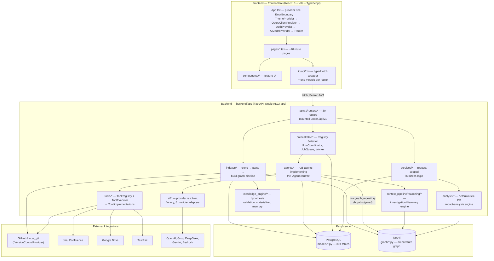

# 2. High-Level Architecture Diagram

## Explanation

The system is a conventional layered monolith with two structurally distinct
"brains" layered on top of it:

1. **A deterministic pipeline** (`indexer/` → `analysis/`) that never calls
   an LLM: clone a repository, parse it with a tree-sitter/AST-based parser,
   build a graph payload, write it to Neo4j, and (separately, on-demand)
   diff a pull request's changed files against that graph to classify risk.
2. **An agentic layer** (`agents/`, `orchestrator/`, `context_pipeline/`,
   `ai/`) where a `RunCoordinator` dispatches one of ~25 registered agents,
   each of which may call an LLM (through the provider-resolution layer in
   `ai/`), read the graph (`graph_repository`, hop-budgeted per agent), and
   call external tools (`tools/`) through a single `ToolExecutor`.

Both layers write to the same two stores: PostgreSQL (`models/`, everything
relational — runs, workflows, users, repositories, evidence, learning
events) and Neo4j (`graph/`, the architecture knowledge graph). The frontend
is a pure SPA that only talks to the backend's REST API — no direct
database or external-system access from the browser.

## Sources

- `backend/app/main.py` — top-level app wiring (`register_agents()`,
  `register_all_tools()`, router mounting).
- `backend/app/api/v1/routers/__init__.py` — router → API surface.
- `backend/app/orchestrator/{registry,selector,run_coordinator,worker,job_queue}.py`.
- `backend/app/agents/setup.py` — full agent registration list.
- `backend/app/tools/setup.py` — full tool registration list.
- `backend/app/ai/providers/factory.py`, `ai/config/resolver.py`.
- `backend/app/indexer/services/indexing_service.py`.
- `backend/app/analysis/engine/impact_analysis_engine.py`.
- `backend/app/graph/session.py`, `database/session.py`.
- `frontend/src/app/App.tsx`, `app/router.tsx`, `lib/api/client.ts`.
