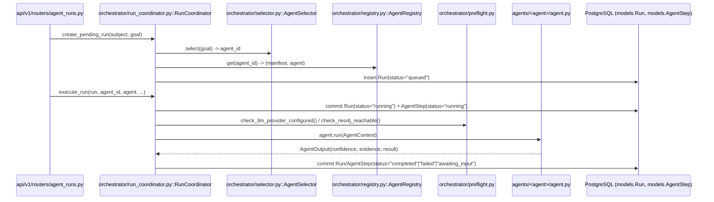

# 3. Backend Architecture

## 3.1 Package map

```mermaid
flowchart TB
    main["main.py<br/>create_app(), lifespan"]

    subgraph EntryLayer["Entry / cross-cutting"]
        core["core/<br/>config, security, crypto,<br/>error_handlers, request_id_middleware,<br/>rate_limit, redact, logging"]
        api["api/v1/routers/<br/>30 FastAPI routers"]
        database["database/<br/>session, base (SQLAlchemy)"]
        graph["graph/<br/>session, neo4j_repository,<br/>models, interfaces, hop_budget, health"]
    end

    subgraph DomainLayer["Domain services"]
        services["services/<br/>request-scoped business logic<br/>(auth, github, workflow, session,<br/>evidence, decision, belief, ...)"]
        repositories["repositories/<br/>Postgres query layer for<br/>Engineering Memory entities"]
        models["models/<br/>SQLAlchemy ORM — 30+ tables"]
        schemas["schemas/<br/>Pydantic request/response DTOs"]
    end

    subgraph AgenticLayer["Agentic layer"]
        orchestrator["orchestrator/<br/>Registry, Selector, RunCoordinator,<br/>JobQueue, Worker, preflight"]
        agents["agents/<br/>~25 agent packages"]
        context_pipeline["context_pipeline/<br/>reasoning/ — investigation<br/>planner, engine, memory, ledger"]
        ai["ai/<br/>providers/, config/, services/,<br/>agent/ (freeform investigation agent)"]
        tools["tools/<br/>ToolRegistry, ToolExecutor,<br/>implementations/"]
        knowledge["knowledge/<br/>source registry,<br/>access_resolver"]
        knowledge_engine["knowledge_engine/<br/>hypothesis validators,<br/>materializer, memory_service,<br/>parity/shadow_compare"]
    end

    subgraph DeterministicLayer["Deterministic pipelines"]
        indexer["indexer/<br/>scanner/, parsers/, extractors/,<br/>graph/builder, hypotheses/, workers/"]
        analysis["analysis/<br/>engine/, graph/, services/,<br/>models/ — PR impact analysis"]
        decision["decision/<br/>merge_rule, renderers/<br/>(check-run, PR comment)"]
        context["context/<br/>resolvers/ (github, freetext)"]
    end

    subgraph OtherLayer["Other"]
        integrations["integrations/<br/>github, google_drive, local_git,<br/>factory, interfaces"]
        investigation_intelligence["investigation_intelligence/<br/>contracts, repository, service"]
        learning_engine["learning_engine/<br/>engine, aggregation, service"]
        mappers["mappers/<br/>engineering_understanding_mapper"]
        utils["utils/"]
    end

    main --> core
    main --> api
    main --> database
    main --> graph
    main --> orchestrator
    main --> agents
    main --> tools
    main --> ai

    api --> services
    api --> orchestrator
    api --> schemas
    api --> indexer
    api --> analysis
    api --> decision

    services --> repositories
    services --> models
    services --> database
    services --> integrations
    services --> ai
    services --> analysis
    services --> learning_engine

    orchestrator --> agents
    orchestrator --> models
    orchestrator --> database
    orchestrator --> graph

    agents --> context_pipeline
    agents --> ai
    agents --> tools
    agents --> graph
    agents --> knowledge_engine
    agents --> integrations

    context_pipeline --> tools
    context_pipeline --> ai
    context_pipeline --> graph
    context_pipeline --> knowledge

    tools --> knowledge
    tools --> integrations
    tools --> graph

    indexer --> graph
    indexer --> knowledge_engine
    indexer --> models

    analysis --> graph
    analysis --> integrations
    analysis --> models

    decision --> analysis
    decision --> integrations

    knowledge_engine --> models
    knowledge_engine --> repositories

    investigation_intelligence --> models
    investigation_intelligence --> repositories
```

## Explanation

`backend/app` follows a layered structure without a strict formal
"clean architecture" boundary enforcement mechanism (no import-linter or
similar tool was found), but the actual import graph observed is
consistently one-directional:

- **Entry/cross-cutting** (`core`, `api`, `database`, `graph`) is imported
  by nearly everything and imports almost nothing else back.
- **Domain services** (`services`, `repositories`, `models`, `schemas`) sit
  under the API routers and are the primary thing routers call.
- **The agentic layer** (`orchestrator`, `agents`, `context_pipeline`, `ai`,
  `tools`, `knowledge`, `knowledge_engine`) is the largest subsystem by file
  count (`agents/` alone has ~120 files across 25 sub-packages) and is
  reached from `api/v1/routers/agent_runs.py` and `workflows.py` via
  `orchestrator.registry.global_registry` / `RunCoordinator`.
- **Deterministic pipelines** (`indexer`, `analysis`, `decision`, `context`)
  do not depend on the agentic layer at all — `analysis/engine/impact_analysis_engine.py`
  explicitly documents "No AI/LLM calls anywhere in this package."

`agents/_contract.py` is a deliberately dependency-free module (its own
docstring: "MUST NOT import from app.agents.\* ... or app.orchestrator.\*")
that defines the shared `Subject`/`Evidence`/`Confidence`/`AgentOutput`/
`AgentManifest`/`AgentContext` types every agent and the orchestrator both
depend on — the actual seam the whole agentic layer is built against.

## 3.2 Execution path: an API-triggered agent run



## Sources

- Package listing: `find backend/app -name "*.py"` (all 24 subpackages).
- `backend/app/main.py` — top-level wiring.
- `backend/app/agents/_contract.py` — the dependency-free shared contract.
- `backend/app/orchestrator/run_coordinator.py` — full execution sequence
  (`create_pending_run`, `execute_run`, `resume_step`, `_apply_agent_output`).
- `backend/app/orchestrator/preflight.py` — pre-flight dependency checks.
- `backend/app/api/v1/routers/agent_runs.py`, `workflows.py`.
- `backend/app/analysis/engine/impact_analysis_engine.py` — module docstring
  confirming no LLM dependency in this package.
