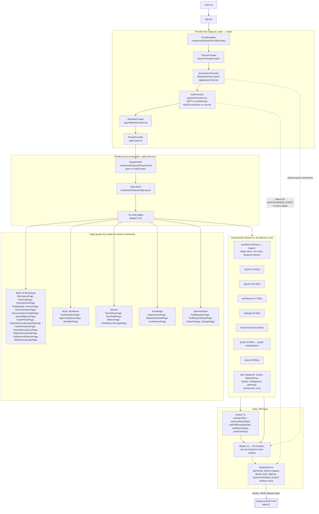

# 4. Frontend Architecture

## Explanation

**State management** is deliberately minimal and split by concern, not a
single global store:
- **Server state / caching**: TanStack Query (`@tanstack/react-query`),
  configured once in `app/queryClient.ts` and provided at the app root.
- **Auth state**: a hand-rolled React Context (`AuthContext.tsx`) holding the
  JWT (persisted to `localStorage` under `graphforge.token`) and the current
  `User`, fetched via `fetchCurrentUser` on mount.
- **AI model selection state**: a second, separate Context
  (`AiModelContext.tsx`).
- **Theme**: `theme/ThemeProvider`.
- No Redux/Zustand/Recoil or other general-purpose global store was found.

**API communication** goes through exactly one primitive: `apiFetch<T>()` in
`lib/api/client.ts` — a thin wrapper over the native `fetch()` API (no axios).
It attaches the JWT as a `Bearer` header, parses the backend's
`{"error": {"code", "message"}}` error shape into a typed `ApiError`, and
dispatches a `window` event (`graphforge:invalid-token`) specifically when
the backend reports `code === "invalid_token"` — `AuthContext` listens for
that event to force a logout, distinguishing "your session is dead" from any
other 401 (e.g. "GitHub isn't connected"). Every one of the 26 files in
`lib/api/` is a thin, typed set of functions built on `apiFetch`, one file
per backend router surface (`workflows.ts` ↔ `api/v1/routers/workflows.py`,
`repositories.ts` ↔ `repositories.py`, etc.) — a 1:1 naming correspondence
confirmed by directly comparing the two directory listings.

**Routing** is a single `react-router-dom` `createBrowserRouter` tree
exported as plain data (`routes`) specifically so tests can reuse the exact
route tree. Auth-gating is one wrapper route (`RequireAuth`) around every
authenticated page; `/login` and `/oauth/callback` sit outside it, and a
catch-all (`*`) renders `NotFoundPage` regardless of auth state.

**Component organization** is feature-based under `components/<feature>/`,
not atomic-design or type-based. `components/workflow/` (38 files) is by far
the largest, matching the workflow system's centrality in the backend
(see [09-workflow-architecture.md](09-workflow-architecture.md)).

## Confirmed vs. Uncertain

- **Confirmed**: provider nesting order, route tree, `apiFetch` behavior,
  and the 1:1 `lib/api/*.ts` ↔ backend-router correspondence (compared file
  lists directly).
- **Uncertain / requires verification**: the *internal* composition of
  individual feature components (e.g. exact prop-drilling vs. context use
  inside `components/workflow/`) was not traced file-by-file given the
  package's size (38 files) — the diagram represents it as one grouped node
  rather than asserting specific internal relationships that weren't
  directly verified.

## Sources

- `frontend/src/main.tsx`, `app/App.tsx`, `app/router.tsx`,
  `app/queryClient.ts`, `app/AuthContext.tsx`, `app/auth-context.ts`,
  `app/AiModelContext.tsx`, `app/ai-model-context.ts`.
- `frontend/src/lib/api/client.ts` (full read).
- `frontend/src/lib/api/*.ts` — directory listing (26 files) cross-checked
  against `backend/app/api/v1/routers/*.py` (30 files; the delta is routers
  with no dedicated frontend module, e.g. `health.py`, `metrics.py` served
  via `hooks/`, `system.py`).
- `frontend/src/components/*/` — directory listing and file counts.
- `frontend/src/pages/*.tsx` — directory listing, cross-referenced against
  `router.tsx`'s own section comments (`// ── Build: AI Workspace ──`, etc.).
