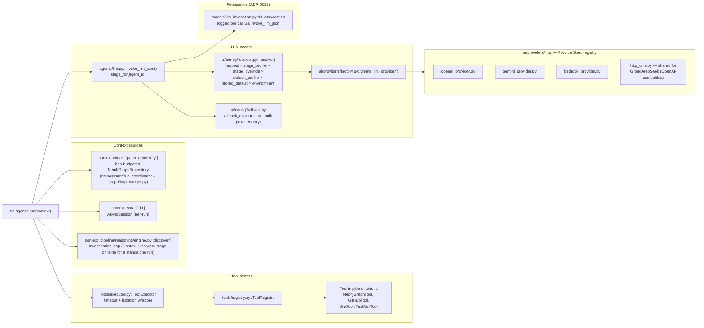
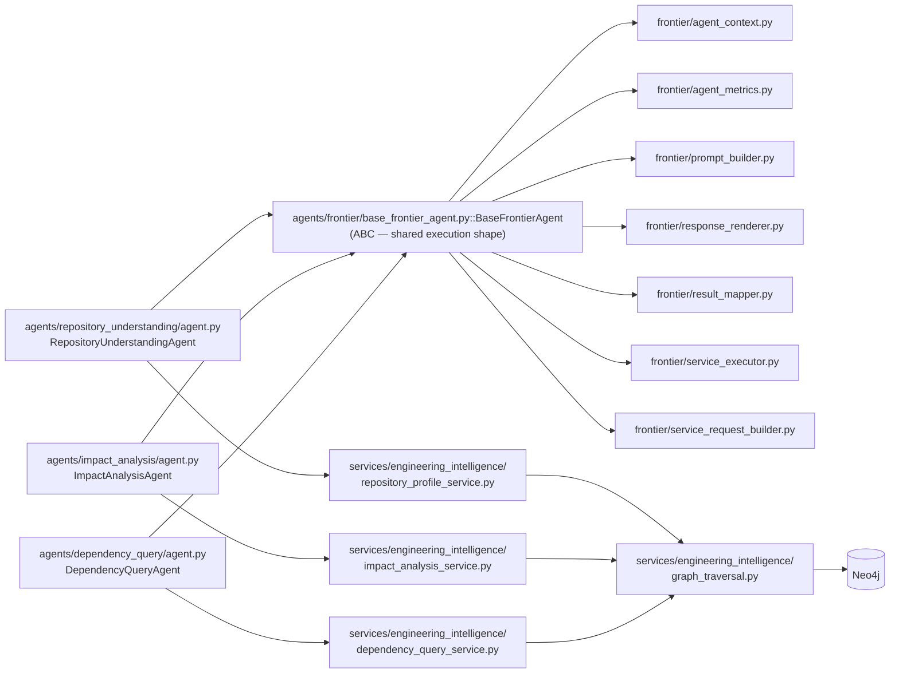

# 5. AI / Agent Architecture

## 5.1 Agent catalog and orchestration

```mermaid
flowchart TB
    subgraph Registration["Startup registration (app/main.py::create_app)"]
        setupAgents["agents/setup.py::register_agents()"]
        setupTools["tools/setup.py::register_all_tools()"]
    end

    GlobalReg["orchestrator/registry.py::global_registry<br/>agent_id → (AgentManifest, IAgent)"]
    ToolReg["tools/registry.py::get_tool_registry()<br/>tool_id → ToolSpec"]
    setupAgents --> GlobalReg
    setupTools --> ToolReg

    subgraph AgentCatalog["Registered agents (agents/setup.py, 20 entries)"]
        direction TB
        A1["review — ReviewAgentAdapter (goal: review_pr)"]
        A2["context_discovery — goal: discover_context"]
        A3["planning — goal: plan_freeform"]
        A4["development — goal: develop_change_plan"]
        A5["testing — goal: plan_tests"]
        A6["documentation_planning — goal: plan_documentation"]
        A7["documentation_review — goal: review_documentation"]
        A8["documentation_health — goal: analyze_documentation_health"]
        A9["api_intelligence — goal: analyze_api_intelligence"]
        A10["repository_understanding — Frontier Agent #1<br/>goal: analyze_repository_understanding"]
        A11["impact_analysis — Frontier Agent #2<br/>goal: analyze_impact_analysis"]
        A12["dependency_query — Frontier Agent #3<br/>goal: analyze_dependency_query"]
        A13["engineering_review — goal: review_readiness"]
        A14["code_generation — goal: generate_code"]
        A15["create_branch / commit_changes / run_tests /<br/>create_pull_request — git_ops agents"]
        A16["report_generation — goal: generate_report"]
    end
    GlobalReg -.-> AgentCatalog

    subgraph EntryPoints["Entry points that dispatch an agent"]
        RunsRouter["api/v1/routers/agent_runs.py<br/>POST /agent-runs"]
        WorkflowsRouter["api/v1/routers/workflows.py<br/>stage advancement"]
        BgExec["orchestrator/background_execution.py"]
    end

    RC["orchestrator/run_coordinator.py::RunCoordinator"]
    Sel["orchestrator/selector.py::AgentSelector<br/>goal → agent_id"]
    PF["orchestrator/preflight.py<br/>LLM-configured / Neo4j-reachable checks"]

    RunsRouter --> RC
    WorkflowsRouter --> RC
    BgExec --> RC
    RC --> Sel --> GlobalReg
    RC --> PF
    RC -- "agent.run(AgentContext)" --> AgentCatalog

    subgraph AsyncExec["Durable async execution"]
        JQ["orchestrator/job_queue.py::JobQueue<br/>Postgres-backed, SELECT..FOR UPDATE SKIP LOCKED"]
        Worker["orchestrator/worker.py::Worker<br/>embedded in the FastAPI process<br/>run_forever() poll loop"]
        BgExec --> JQ
        JQ --> Worker
        Worker --> BgExec
    end
```

## 5.2 Per-agent internals: tools, graph, LLM, context

## 5.3 Frontier Engineering Intelligence Agents

## Explanation

**Agent-to-agent relationships** in this codebase are not peer-to-peer calls
between agents; they are *sequential dispatch through Workflows* (see
[09-workflow-architecture.md](09-workflow-architecture.md)) and *reading a
prior agent's persisted output*. `RunCoordinator` dispatches exactly one
agent per `Run`; a later stage in the same workflow reads an earlier stage's
result back out of Postgres via `agents/git_ops/_artifact_reader.py::get_stage_result()`
(e.g. Planning reads Context Discovery's persisted result; Development reads
Planning's). Agents never call one another's `.run()` method directly.

**Two separate "agent" concepts exist and should not be conflated**:
- `app/agents/*` — the ~20 orchestrator-registered agents implementing the
  frozen `IAgent` protocol (`agents/_contract.py`), each with an
  `AgentManifest` declaring its accepted subject types, cost class, and
  graph-hop budget.
- `app/ai/agent/*` — a separate, smaller **Change Investigation Agent**
  (`InvestigationAgent`) used specifically by the AI-enriched PR analysis
  path (`ai/services/ai_analysis_service.py`), with its own
  `AgentPlanner`/`ToolRegistry`/`ToolExecutor` (distinct classes from
  `app.tools.*`, same names, different package — see Confirmed/Uncertain
  below). It runs a rule-based Goal→Plan→Select Tool→Execute→Observe→Decide
  loop and makes exactly one LLM call at the end for synthesis.

**Provider/model selection** never hardcodes a vendor. `ai/config/resolver.py::resolve()`
implements a six-tier precedence (request override → stage profile → stage
provider override → stored default profile → stored global default →
environment variable), consulted by every agent through `agents/llm.py`'s
`invoke_llm_json()`. Five providers are registered
(`ai/providers/registry.py`): OpenAI, Groq, DeepSeek, Gemini, Amazon
Bedrock — Groq and DeepSeek share an OpenAI-compatible HTTP client
(`http_utils.py`); Bedrock uses the AWS credential chain, not a stored API
key. Fallback across providers (`ai/config/fallback.py::fallback_chain()`)
is opt-in per installation, never automatic.

**Tool usage** is centralized: every agent that needs GitHub/Jira/TestRail/
the graph goes through `tools/executor.py::ToolExecutor`, which enforces a
20-second default timeout and isolates a failing tool from aborting the
whole run. `ToolRegistry` holds one singleton instance per `tool_id`; GitHub
is the deliberate exception (each run builds its own throwaway
`GitHubTool` instance from that run's own user's OAuth token, since GitHub
access is per-user, not install-wide — see `tools/setup.py`'s own comment).

## Confirmed vs. Uncertain

- **Confirmed**: all 20 agent registrations, their goals, and the
  `RunCoordinator` dispatch sequence — read directly from
  `agents/setup.py` and `orchestrator/run_coordinator.py`.
- **Confirmed**: the five registered AI providers and the resolver's
  precedence order — read directly from `ai/config/resolver.py`.
- **Uncertain / requires verification**: whether `app.ai.agent.tools.ToolRegistry`/
  `ToolExecutor` (used only by `InvestigationAgent`) share any code with
  `app.tools.registry`/`app.tools.executor` (used by the orchestrator-level
  agents) — both pairs were found by name but a byte-level comparison of
  their implementations was not performed; treat them as two distinct,
  same-named classes unless verified otherwise.

## Sources

- `backend/app/agents/setup.py` — full registration list (verbatim).
- `backend/app/agents/_contract.py` — `IAgent`, `AgentManifest`,
  `AgentContext`, `AgentOutput`.
- `backend/app/orchestrator/{registry,selector,run_coordinator,preflight,job_queue,worker,background_execution}.py`.
- `backend/app/agents/llm.py` — stage constants, `invoke_llm_json`.
- `backend/app/ai/config/resolver.py`, `ai/config/fallback.py`,
  `ai/providers/{factory,registry}.py`.
- `backend/app/agents/frontier/*.py`, `agents/repository_understanding/agent.py`,
  `agents/impact_analysis/agent.py`, `agents/dependency_query/agent.py`.
- `backend/app/services/engineering_intelligence/*.py`.
- `backend/app/tools/{registry,executor,setup}.py`,
  `tools/implementations/{neo4j_tool,github_tool,jira_tool,testrail_tool}.py`.
- `backend/app/ai/agent/investigation_agent.py`, `ai/agent/{planner,tools,models}.py`
  — the separate Change Investigation Agent.
- `backend/app/agents/git_ops/_artifact_reader.py` — cross-stage context
  read pattern.
