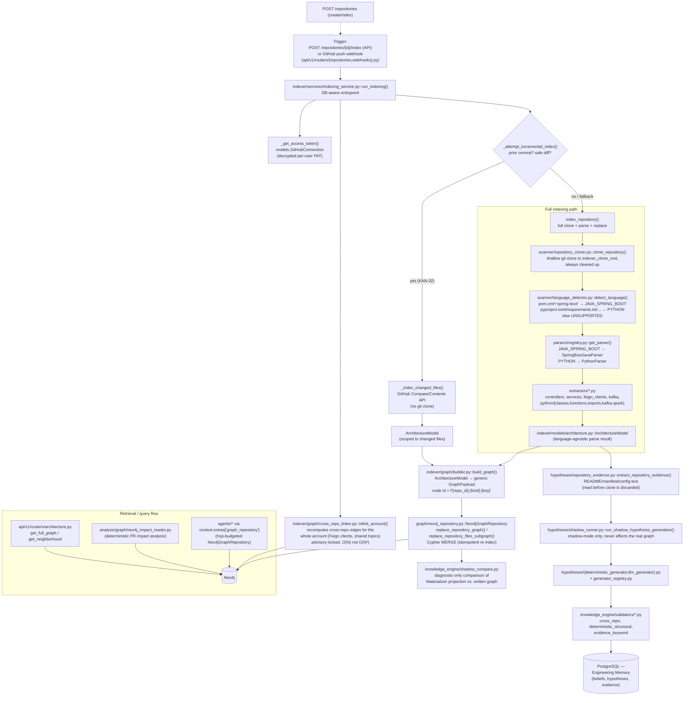

# 6. Indexing / Knowledge Architecture

## Explanation

Indexing is entirely deterministic (no LLM in the primary path) except for
one clearly-separated, shadow-only branch. The pipeline is:

1. **Clone** (`repository_cloner.py`) a shallow copy of the repo (or, for
   `KAN-32` incremental runs, fetch only the changed files via GitHub's
   Compare/Contents API — no clone at all).
2. **Detect language** deterministically by file presence/substring checks
   (no ML/heuristic scoring) — currently **Java+Spring Boot (Maven)** and
   **Python** are supported; anything else is `UNSUPPORTED` and the run
   fails with a 422.
3. **Parse** with the matching `ILanguageParser` (`SpringBootJavaParser` or
   `PythonParser`), which runs a set of `extractors/` (controllers,
   services, Feign clients, Kafka producers/consumers, Python classes/
   functions/imports/kafka/spark) to produce a language-agnostic
   `ArchitectureModel`.
4. **Build graph**: `indexer/graph/builder.py::build_graph()` is the single
   place that knows how a parsed entity becomes a Neo4j node/edge. Node ids
   are namespaced `f"{repository_id}:{kind}:{key}"` so re-indexing the same
   repository is idempotent (Cypher `MERGE`, not `CREATE`).
5. **Persist**: `Neo4jGraphRepository.replace_repository_graph()` (full) or
   `.replace_repository_files_subgraph()` (incremental, scoped to changed
   file paths, including a renamed file's old path for deletion).
6. **Cross-repository linking**: `relink_account()` recomputes edges across
   *every* repository the account owns (a Feign client or shared Kafka topic
   may reference a repository indexed earlier), serialized per-account with
   a Postgres advisory lock.
7. **Shadow hypothesis generation** (ADR 0018): read-only evidence
   (README/manifest text) is extracted from the same clone before it's
   discarded, then run through deterministic and (opt-in,
   `enable_frontier_llm_generator`) LLM-based hypothesis generators,
   validated (`knowledge_engine/validators/`), and persisted to Postgres as
   Engineering Memory (`beliefs`, `hypotheses`, `evidence` tables) — **this
   never writes to or reads from the Neo4j graph that agents/analysis
   actually query**; it is explicitly a parallel, diagnostic pipeline.

**Graph schema observed** (node labels / relationship types actually
written by `build_graph()`):

| Node labels | Relationship types |
|---|---|
| `Component` (+ `Controller`\|`Service`\|`FeignClient`\|`Function`\|`Module`\|`Class`), `Endpoint`, `KafkaTopic`, `Dependency`, `DataTable`, `Repository` | `CONTAINS`, `IMPORTS`, `CALLS`, `EXPOSES`, `DEPENDS_ON`, `PRODUCES_TO`, `CONSUMES_FROM`, `READS_FROM`, `WRITES_TO` |

**Retrieval** happens through three independent readers, all against the
same Neo4j store: agents (via a per-run, hop-budgeted
`Neo4jGraphRepository`), the deterministic PR-impact engine (via
`analysis/graph/neo4j_impact_reader.py`, a narrower read-only interface),
and the Architecture API (`get_full_graph`/`get_neighborhood`, paginated).

## Confirmed vs. Uncertain

- **Confirmed**: the full clone→detect→parse→build→persist pipeline,
  the two supported languages, and every node label/edge type listed above
  — read directly from `indexer/graph/builder.py`.
- **Uncertain / requires verification**: the precise set of `extractors/`
  invoked per language (e.g. whether every Python extractor listed under
  `indexer/extractors/python/` is wired into `PythonParser` vs. present but
  unused) was inferred from directory contents and the builder's node types,
  not from a line-by-line read of `parsers/python/python_parser.py`.

## Sources

- `backend/app/indexer/services/indexing_service.py` (full read).
- `backend/app/indexer/graph/builder.py` (full read of node/edge
  construction).
- `backend/app/indexer/scanner/{language_detector,repository_cloner,incremental}.py`.
- `backend/app/indexer/parsers/{base,registry}.py`.
- `backend/app/graph/{models,neo4j_repository,hop_budget,interfaces}.py`.
- `backend/app/indexer/hypotheses/{repository_evidence,shadow_runner,deterministic_generator,llm_generator,generator_registry}.py`.
- `backend/app/knowledge_engine/{shadow_compare,materializer,validators/*}.py`.
- `backend/app/indexer/graph/cross_repo_linker.py`.
- `backend/app/api/v1/routers/architecture.py`.
- `backend/app/analysis/graph/neo4j_impact_reader.py`.
- ADR: `docs/adr/0018-engineering-intelligence-platform.md`,
  `docs/adr/0020-incremental-indexing.md` (consulted for terminology only,
  cross-checked against the code above).
