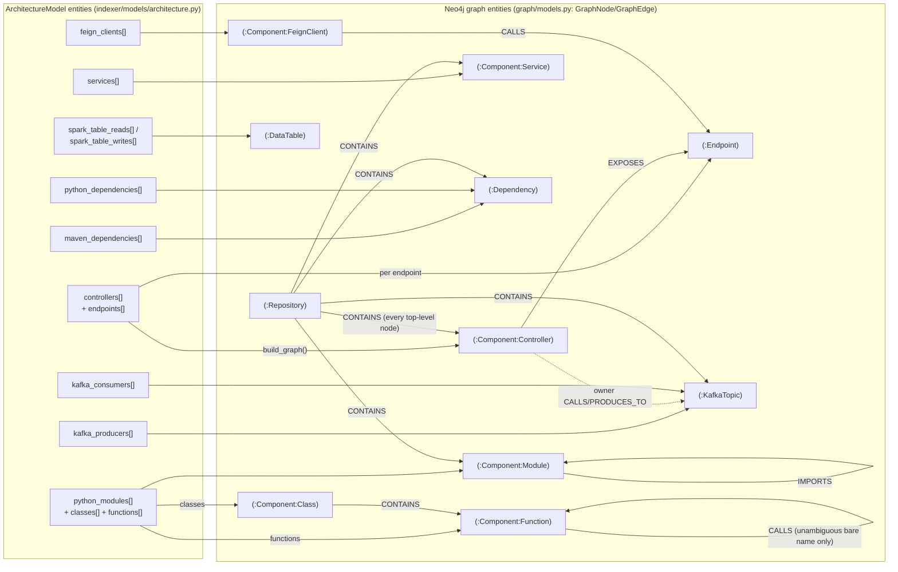
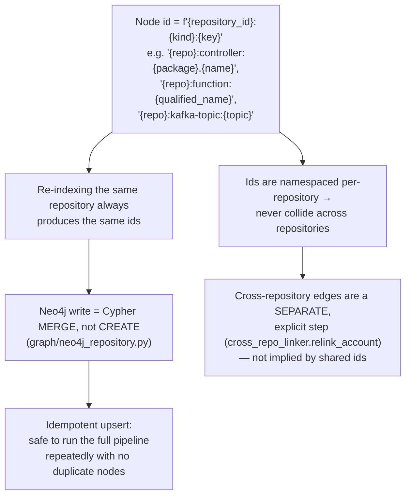
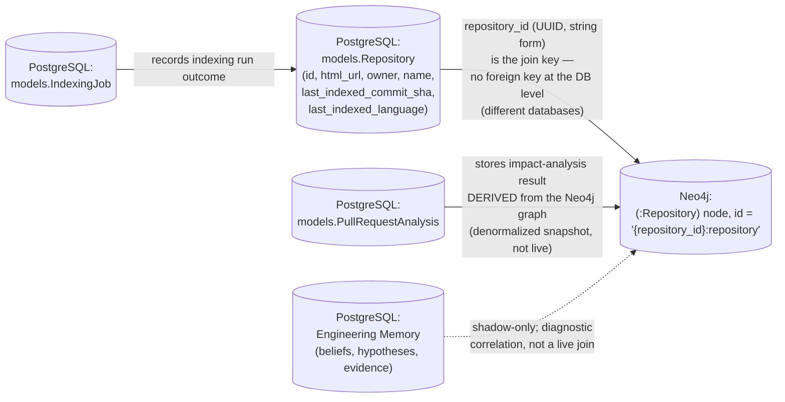

# 7. Dependency Graph Architecture

## 7.1 Code entity → graph entity mapping

## 7.2 Node identity scheme and idempotency

## 7.3 How graph data relates to PostgreSQL / indexed data

## Explanation

**How code entities become graph entities.** `app/indexer/graph/builder.py`
is the single translation point (its own docstring: "the one place that
knows how a discovered Java entity maps to a graph label and relationship
type"). It is purely a data transform — `ArchitectureModel → GraphPayload`
— with no I/O of its own; persistence happens afterward via
`Neo4jGraphRepository`. Python and Java entities are deliberately mapped
onto the *same* `Component` label family (plus a specific secondary label
like `Class`/`Controller`) so a caller querying the graph cannot tell which
language produced a given `Component` node without reading its
`properties.language` field.

**How relationships are created.** Every relationship in the graph traces
to one specific parse-time fact: a Controller's `@RequestMapping` becomes an
`EXPOSES` edge to an `Endpoint` node; a Feign client's target becomes a
`CALLS` edge to that `Endpoint`; a `@KafkaListener`/producer call becomes
`CONSUMES_FROM`/`PRODUCES_TO` to a `KafkaTopic`; a Python `import` becomes
`IMPORTS`; a function call becomes `CALLS` **only when the callee's bare
name is unambiguous repository-wide** — an ambiguous name (same method name
on two unrelated classes) is deliberately left unresolved rather than
guessed, matching this codebase's stated no-guessing precedent (ADR 0007).

**How Neo4j is used.** As the single graph store for the whole application
— there is no separate "dependency graph" database distinct from the
"architecture knowledge graph"; they are the same Neo4j instance and the
same node/edge set. `graph/neo4j_repository.py` is the only class issuing
Cypher; every reader (agents, the deterministic impact engine, the
Architecture API) goes through it or its narrower siblings
(`analysis/graph/neo4j_impact_reader.py`, `graph/test_case_repository.py`).

**How graph data relates to PostgreSQL/indexed data.** The two stores are
joined only by convention — `repository_id` (a Postgres UUID, stringified)
is embedded in every Neo4j node id for that repository — **not** by any
cross-database foreign key or transaction. `PullRequestAnalysis` rows in
Postgres are a point-in-time, denormalized *snapshot* of a graph traversal
result (recomputed on each impact-analysis request, not kept live-synced).
Engineering Memory (`beliefs`/`hypotheses`/`evidence` tables) is populated
by the shadow hypothesis pipeline described in
[06-indexing-knowledge-architecture.md](06-indexing-knowledge-architecture.md)
and is explicitly diagnostic — it does not feed back into the graph agents
actually query.

## Confirmed vs. Uncertain

- **Confirmed**: node id scheme, MERGE-based idempotency, and every
  relationship type in §7.1's table — read directly from `builder.py`.
- **Confirmed**: `repository_id` as the sole join convention between
  Postgres and Neo4j (no shared foreign-key constraint is possible between
  the two engines) — read from `models/repository.py` and
  `builder.py::_repository_node_id`.
- **Uncertain / requires verification**: whether every `ArchitectureModel`
  field (e.g. `spark_table_reads`/`writes`) is populated for both supported
  languages or Java-only — the extractor call sites inside
  `parsers/java/spring_boot_parser.py` and `parsers/python/python_parser.py`
  were not individually read line-by-line to confirm.

## Sources

- `backend/app/indexer/graph/builder.py` (full read).
- `backend/app/graph/models.py` (full read — `GraphNode`/`GraphEdge`/`GraphPayload`).
- `backend/app/graph/neo4j_repository.py` (Cypher `MERGE` pattern, grep of
  relationship-type usage).
- `backend/app/indexer/models/architecture.py` — `ArchitectureModel` shape.
- `backend/app/models/repository.py`, `models/pull_request_analysis.py`,
  `models/indexing_job.py`.
- `backend/app/knowledge_engine/materializer.py`, `knowledge_engine/shadow_compare.py`.
