# 8. End-to-End Data Flow

This shows the generic shape shared by every "ask GraphForge something"
request, instantiated for two concrete, code-confirmed paths: `POST /ask`
(deterministic, no LLM) and an agent-backed Workspace request (e.g.
Planning), which does call an LLM. Both are real, independently-triggerable
flows — not two phases of one flow.

```mermaid
flowchart TB
    User["User request<br/>(frontend page action)"]

    subgraph API_Layer["API layer"]
        Route["api/v1/routers/*.py<br/>FastAPI route handler"]
        AuthDep["api/v1/dependencies.py::get_current_user<br/>JWT decode"]
        Route --> AuthDep
    end
    User --> Route

    Route --> Branch{"Which capability?"}

    subgraph DeterministicPath["Deterministic path — services/ask_grounding.py::ground()"]
        Classify["classify question<br/>(_IMPACT_PATTERN / dependency regex,<br/>text_relevance for repo resolution)"]
        Retrieve1["services/engineering_intelligence/<br/>impact_analysis_service.py::compute_blast_radius()<br/>or dependency_query_service"]
        GraphRead1["graph/neo4j_repository.py<br/>Cypher traversal"]
        Classify --> Retrieve1 --> GraphRead1
        GraphRead1 --> NEO1[("Neo4j")]
        GraphRead1 --> Response1["AskResponse<br/>(fact / derived fields only —<br/>no LLM reasoning)"]
    end
    Branch -- "goal=ask_question" --> Classify

    subgraph AgenticPath["Agentic path — orchestrator/run_coordinator.py"]
        Select["AgentSelector.select(goal) → agent_id"]
        Dispatch["agent.run(AgentContext)<br/>e.g. PlanningAgent"]
        ContextDiscover["context_pipeline/reasoning/engine.py::discover()<br/>investigation loop"]
        GraphRead2["context.extras['graph_repository']<br/>(hop-budgeted)"]
        ToolCalls["tools/executor.py::ToolExecutor<br/>Jira / GitHub / TestRail"]
        LLMCall["agents/llm.py::invoke_llm_json()<br/>→ ai/config/resolver.resolve()<br/>→ ai/providers/factory"]
        Select --> Dispatch
        Dispatch --> ContextDiscover
        ContextDiscover --> GraphRead2 --> NEO2[("Neo4j")]
        ContextDiscover --> ToolCalls --> Ext["External systems"]
        Dispatch --> LLMCall --> LLM["LLM Provider<br/>(OpenAI/Groq/DeepSeek/Gemini/Bedrock)"]
        LLM --> LLMCall
        LLMCall --> LLMInvocationRow[("PostgreSQL:<br/>llm_invocations")]
        Dispatch --> Output["AgentOutput<br/>(confidence, evidence, result)"]
    end
    Branch -- "goal=plan_freeform, etc." --> Select

    Output --> Persist["orchestrator/run_coordinator.py<br/>persist Run + AgentStep"]
    Persist --> PG[("PostgreSQL:<br/>agent_runs, agent_steps")]

    Response1 --> HTTPResp["HTTP JSON response"]
    Persist --> HTTPResp

    HTTPResp --> FEUpdate["Frontend: TanStack Query cache update<br/>→ re-render page"]
```

## Explanation

Both paths share the same entry (`api/v1/dependencies.py::get_current_user`
JWT check) and the same exit shape (a typed JSON response the frontend's
`apiFetch` consumes), but diverge immediately after route dispatch:

- **Deterministic path** (`ask_grounding.py::ground()`, backing both
  `POST /ask` and the seed of every new conversation topic in
  `ConversationService`): classifies the question with closed-vocabulary
  regexes, resolves the target repository, and answers purely from a Neo4j
  traversal (`compute_blast_radius`/`dependency_query_service`) plus
  verbatim source facts. **No LLM is ever called on this path** — its own
  module docstring is explicit that every response field is either `fact`
  (read verbatim) or `derived` (computed deterministically).
- **Agentic path** (any Workspace capability or Workflow stage): goes
  through `RunCoordinator`, which resolves an agent via `AgentSelector`,
  runs pre-flight checks, and calls `agent.run()`. Inside the agent, graph
  reads go through the same `Neo4jGraphRepository` (but hop-budgeted per
  agent manifest), external-tool calls go through `ToolExecutor`, and any
  LLM call goes through `agents/llm.py::invoke_llm_json()` — which resolves
  a provider (`ai/config/resolver.py`) and persists an `LLMInvocation` row
  (ADR 0012) independent of the run's own outcome.

Every response — deterministic or agentic — is ultimately persisted
somewhere in Postgres before or as part of the HTTP response returning
(`Run`/`AgentStep` for agent runs; `PullRequestAnalysis` for impact
analysis), so the frontend's next poll/refetch sees a durable result, not
just an in-memory one.

## Confirmed vs. Uncertain

- **Confirmed**: both flows traced end-to-end from their router down to
  their persistence call, via direct code reads.
- **Uncertain / requires verification**: the diagram presents "Retrieve" as
  a single step for the deterministic path; `ask_grounding.py` actually
  branches further (impact vs. dependency vs. no-match) — collapsed here
  for readability. See [12-key-sequence-diagrams.md](12-key-sequence-diagrams.md)
  for the more granular `POST /ask` sequence.

## Sources

- `backend/app/services/ask_grounding.py` (module docstring + header read).
- `backend/app/orchestrator/run_coordinator.py`.
- `backend/app/agents/llm.py`, `ai/config/resolver.py`.
- `backend/app/api/v1/dependencies.py`.
- `backend/app/services/engineering_intelligence/{impact_analysis_service,dependency_query_service}.py`.
- `backend/app/models/llm_invocation.py`, `models/run.py`, `models/agent_step.py`.
