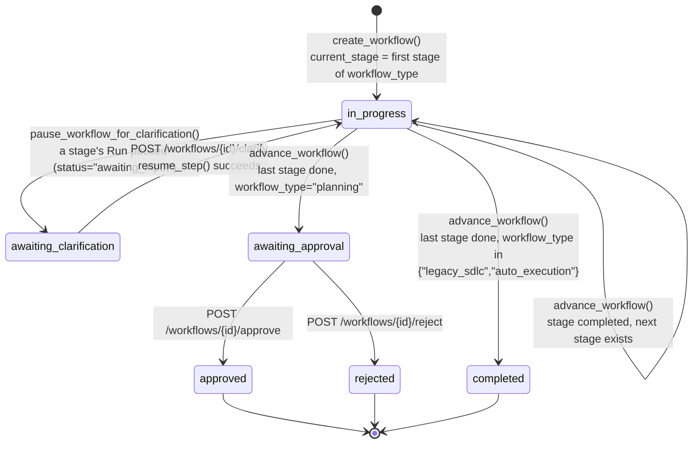
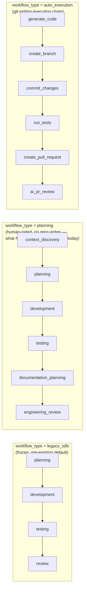

# 9. Workflow Architecture

## 9.1 Workflow status state machine

## 9.2 Stage sequences per workflow_type

## 9.3 Stage → agent goal mapping

```mermaid
flowchart TB
    ST1["context_discovery"] --> G1["goal: discover_context"] --> AG1["agent: context_discovery"]
    ST2["planning"] --> G2["goal: plan_freeform"] --> AG2["agent: planning"]
    ST3["development"] --> G3["goal: develop_change_plan"] --> AG3["agent: development"]
    ST4["testing"] --> G4["goal: plan_tests"] --> AG4["agent: testing"]
    ST5["review"] --> G5["goal: review_pr"] --> AG5["agent: review"]
    ST6["documentation_planning"] --> G6["goal: plan_documentation"] --> AG6["agent: documentation_planning"]
    ST7["engineering_review"] --> G7["goal: review_readiness"] --> AG7["agent: engineering_review"]
    ST8["generate_code"] --> G8["goal: generate_code"] --> AG8["agent: code_generation"]
    ST9["create_branch"] --> G9["goal: create_branch"] --> AG9["agent: create_branch"]
    ST10["commit_changes"] --> G10["goal: commit_changes"] --> AG10["agent: commit_changes"]
    ST11["run_tests"] --> G11["goal: run_tests"] --> AG11["agent: run_tests"]
    ST12["create_pull_request"] --> G12["goal: create_pull_request"] --> AG12["agent: create_pull_request"]
    ST13["ai_pr_review"] --> G13["goal: review_pr"] --> AG13["agent: review<br/>(same agent as review stage,<br/>different AI-config key: 'ai_pr_review')"]
```

## Explanation

A `Workflow` (Postgres `workflows` table) is a stateful sequence of agent
`Run`s. `Workflow.workflow_type` selects one of three fixed stage sequences
declared in `services/workflow_service.py::WORKFLOW_TYPE_STAGES` — this is
a **data table, not three separate code paths**: `advance_workflow`,
`build_stage_context`, and the workflow router's continue/approve endpoints
all read `workflow.workflow_type` once to pick a sequence and otherwise
share one implementation ("shared engine, not two engines" per the module's
own comment).

**Stage transitions** (`advance_workflow()`) happen when a stage's `Run`
reaches `status="completed"`; `workflow.current_stage` moves to
`next_stage()` in the type's sequence, or the workflow enters its terminal
status via `TERMINAL_BEHAVIOR`: `"planning"`-type workflows stop at
`awaiting_approval` (human gate, no repository writes performed yet);
`"legacy_sdlc"` and `"auto_execution"` go straight to `completed`.

**Pause/resume** is a distinct, orthogonal mechanism: any stage's agent may
set `AgentOutput.awaiting_input=True` (e.g. Context Discovery needing a
clarifying answer) instead of completing. `RunCoordinator._apply_agent_output`
then sets the `Run`/`AgentStep` to `"awaiting_input"`, and
`pause_workflow_for_clarification()` sets the *workflow* to
`"awaiting_clarification"`. `POST /workflows/{id}/clarify` resumes the exact
same `AgentStep` via `RunCoordinator.resume_step()` — no new step is
created — and the workflow returns to `"in_progress"`.

**Cross-stage context** is deliberately not held in memory on any
orchestrator object: `build_stage_context()` reads each prior stage's
persisted `Run`/`AgentStep` rows back out of Postgres for every subsequent
stage to consume (e.g. Development reads Planning's result via
`agents/git_ops/_artifact_reader.py::get_stage_result()`).

## Confirmed vs. Uncertain

- **Confirmed**: all three `workflow_type` stage sequences, the full status
  state machine, and the pause/resume mechanism — read directly from
  `services/workflow_service.py`.
- **Uncertain / requires verification**: whether every stage listed under
  `auto_execution` is reachable from the current frontend UI (`NewWorkflowPage`
  was noted as creating `"planning"`-type workflows "by default going
  forward" per the module's own comment) — this diagram documents what the
  *backend* supports, not which paths the UI currently exposes end-to-end.

## Sources

- `backend/app/services/workflow_service.py` (full read of the stage-table
  section and the `advance_workflow`/`pause_workflow_for_clarification`/
  `approve_workflow`/`reject_workflow` functions).
- `backend/app/models/workflow.py` — `status`/`current_stage` columns and
  defaults.
- `backend/app/agents/git_ops/_artifact_reader.py` — cross-stage context read.
- `backend/app/orchestrator/run_coordinator.py::resume_step` — pause/resume
  mechanics.
- `backend/app/api/v1/routers/workflows.py` (router endpoints referenced:
  `/clarify`, `/approve`, `/reject`).
