# 10. Integration Architecture

```mermaid
flowchart TB
    subgraph Catalog["knowledge/registry.py — declarative source catalog (9 entries)"]
        KSGitHub["github"]
        KSJira["jira"]
        KSConfluence["confluence"]
        KSGDrive["google_drive"]
        KSTestRail["testrail"]
        KSFilesystem["filesystem (local-only, no network)"]
        KSS3["s3 — available=False"]
        KSGitLab["gitlab — available=False"]
        KSAzDO["azure_devops — available=False"]
    end

    subgraph ConnMgmt["Settings → Integrations<br/>(Knowledge Connections)"]
        KnowledgeConnModel[("PostgreSQL:<br/>knowledge_connections<br/>encrypted_credentials")]
        KnowledgeRouter["api/v1/routers/knowledge.py"]
        KnowledgeRouter --> KnowledgeConnModel
    end

    subgraph ToolSync["tools/setup.py — Knowledge Connection → Tool Registry sync"]
        Sync["sync_knowledge_connection_to_tool()<br/>+ resync_knowledge_connections_for_source()<br/>(create/update/delete-safe, 'last enabled wins')"]
    end
    KnowledgeRouter --> Sync
    Sync --> ToolRegistry["tools/registry.py::ToolRegistry<br/>(singleton per tool_id)"]

    subgraph Tools["ITool implementations"]
        GHTool["github_tool.py::GitHubTool<br/>(per-run instance, per-user OAuth token —<br/>never the shared registry singleton)"]
        JiraTool["jira_tool.py::JiraTool<br/>MCP preferred, REST fallback"]
        TRTool["testrail_tool.py::TestRailTool<br/>REST only, Basic Auth"]
        Neo4jTool["neo4j_tool.py::Neo4jGraphTool<br/>internal, always enabled"]
        GDriveTool["google_drive_tool.py"]
    end
    ToolRegistry --> GHTool & JiraTool & TRTool & Neo4jTool & GDriveTool

    KSGitHub -.-> GHTool
    KSJira -.-> JiraTool
    KSTestRail -.-> TRTool
    KSGDrive -.-> GDriveTool
    KSConfluence -. "MCP only — no ITool at all;<br/>resolved via knowledge/access_resolver.py directly" .-> ConfluenceMCP["Teamwork Graph<br/>(mcp.atlassian.com)"]

    subgraph GitHubDetail["GitHub — three separate integration surfaces"]
        GHOAuth["GitHubOAuthProvider<br/>(integrations/github.py)<br/>'Connect GitHub' (repo access)<br/>+ 'Sign in with GitHub' (login, 501 today)"]
        GHVCS["GitHubVersionControlProvider<br/>IVersionControlProvider + IGitWriteProvider<br/>list_changed_files, create_branch,<br/>commit, open PR, post comment/check-run"]
        GHWebhook["POST /api/v1/webhooks/github<br/>HMAC-SHA256 signature verified<br/>(X-Hub-Signature-256)<br/>pull_request events only"]
    end
    GHTool --> GHOAuth
    GHVCS --> GitHub[("GitHub.com")]
    GHWebhook --> GitHub

    subgraph VCSAbstraction["integrations/factory.py"]
        VCSFactory["create_version_control_provider()<br/>settings.vcs_provider: 'github' | 'local_git'"]
        WriteFactory["create_git_write_provider()<br/>'local_git' raises<br/>VersionControlWritesUnsupportedError (read-only demo)"]
    end
    VCSFactory --> GHVCS
    VCSFactory --> LocalGit["local_git.py::LocalGitVersionControlProvider<br/>(demo: branches-on-disk, not real PRs)"]
    WriteFactory --> GHVCS

    subgraph AIProviders["AI provider layer (ai/providers/registry.py)"]
        OpenAIP["openai_provider.py"]
        GroqP["Groq (http_utils.py,<br/>OpenAI-compatible)"]
        DeepSeekP["DeepSeek (http_utils.py,<br/>OpenAI-compatible)"]
        GeminiP["gemini_provider.py"]
        BedrockP["bedrock_provider.py<br/>(AWS credential chain,<br/>no stored API key)"]
    end
    OpenAIP --> OpenAIAPI[("api.openai.com")]
    GroqP --> GroqAPI[("api.groq.com")]
    DeepSeekP --> DeepSeekAPI[("api.deepseek.com")]
    GeminiP --> GeminiAPI[("generativelanguage.googleapis.com")]
    BedrockP --> BedrockAPI[("AWS Bedrock (InvokeModel)")]
```

## Explanation

Integrations are organized around one declarative catalog
(`knowledge/registry.py`) that describes *what could* be connected (source
type × transport × auth method × capability), decoupled from *what's
actually configured* (`knowledge_connections` table, credentials encrypted
at rest via `core/crypto.py`) and *what's wired up to actually run*
(`tools/registry.py`'s `ToolRegistry`, one live instance per `tool_id`).
`tools/setup.py` is the sole translation layer between a Knowledge
Connection's generic fields (`base_url`, `email`, `api_token`) and each
tool's own prefixed config keys (`jira_base_url`, `jira_api_token`) —
described by each source's `TransportSpec.credential_field_map`, so adding a
new MCP-backed source needs no change to `tools/setup.py` itself.

**Confluence is architecturally distinct**: it has no `ITool`
implementation and no REST call path at all in this codebase (a prior
REST-based `ConfluenceTool` was removed after being confirmed to have zero
call sites). Confluence document discovery goes exclusively through
Atlassian's hosted MCP server (Teamwork Graph), reached directly via
`knowledge/access_resolver.py`, not via `ToolExecutor`.

**Jira** prefers MCP when a Jira MCP server URL is configured, falling back
to REST (Basic Auth with an API token) otherwise — both paths live inside
one `JiraTool.execute()`.

**GitHub** is the richest integration, spanning three unrelated concerns
that happen to share one vendor: OAuth (both "connect a repo" and an
unimplemented "sign in with GitHub" returning 501), an outbound
read/write REST client (`GitHubVersionControlProvider`, used for both PR
impact analysis's `list_changed_files` and the git_ops agents'
branch/commit/PR-creation), and an inbound signed webhook receiver. GitHub
tool access is deliberately **not** a shared registry singleton — every
agent run builds its own `GitHubTool` from that run's own user's decrypted
OAuth token, since GitHub is per-user, unlike Jira/TestRail's install-wide
credentials.

**The version-control abstraction** (`integrations/factory.py`) supports a
second, read-only implementation (`local_git`) used only by the local demo
environment (`demo/`), where "pull requests" are branches on disk. Calling
`create_git_write_provider()` while `vcs_provider="local_git"` raises
`VersionControlWritesUnsupportedError` by design — execution workflows
require a real write-capable backend.

## Confirmed vs. Uncertain

- **Confirmed**: all 9 catalog entries, the 5 working `ITool`
  implementations, GitHub's three surfaces, and the AI provider registry —
  read directly from `knowledge/registry.py`, `tools/setup.py`,
  `integrations/github.py`, `ai/providers/registry.py`.
- **Uncertain / requires verification**: Google Drive's transport/auth
  details were confirmed to exist (`google_drive_tool.py`,
  `integrations/google_drive.py`) but not read in full depth comparable to
  GitHub/Jira above.

## Sources

- `backend/app/knowledge/registry.py` (full read of source catalog).
- `backend/app/tools/setup.py` (full read).
- `backend/app/tools/implementations/{github_tool,jira_tool,testrail_tool,neo4j_tool,google_drive_tool}.py`
  (existence/signatures confirmed; `jira_tool.py`/`github_tool.py` docstrings
  read via `tools/setup.py`'s registration comments).
- `backend/app/integrations/{github,google_drive,local_git,factory,interfaces}.py`.
- `backend/app/api/v1/routers/{knowledge,webhooks,github,jira,google_drive,testrail}.py`.
- `backend/app/ai/providers/{registry,factory,openai_provider,gemini_provider,bedrock_provider,http_utils}.py`.
- `backend/app/core/config.py` — endpoint defaults
  (`github_mcp_default_server_url`, `jira_mcp_default_server_url`,
  `confluence_mcp_default_server_url`).
