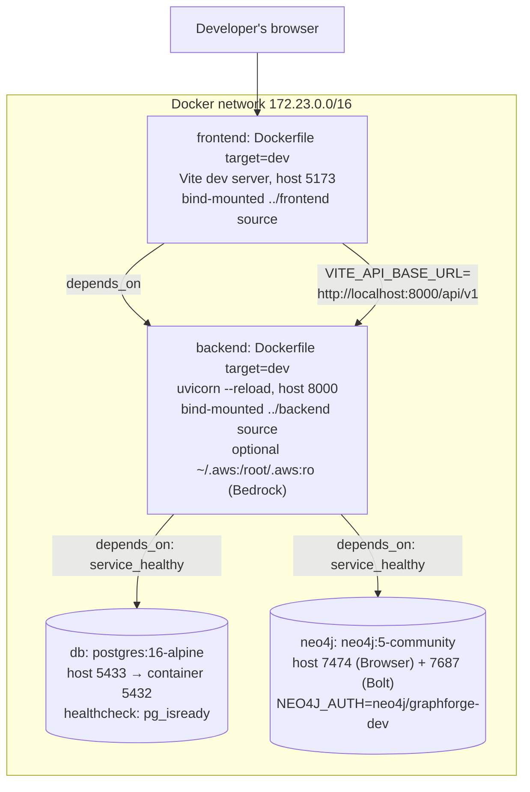
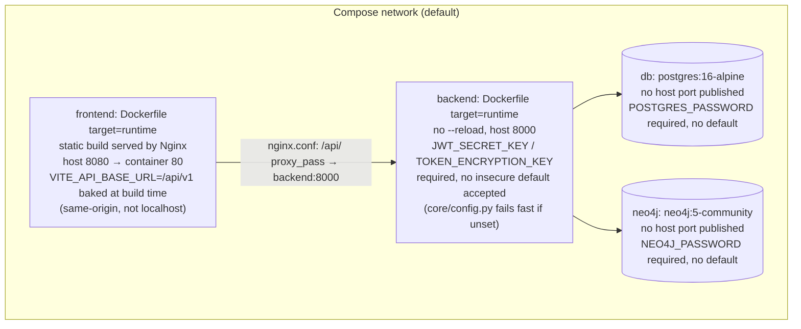
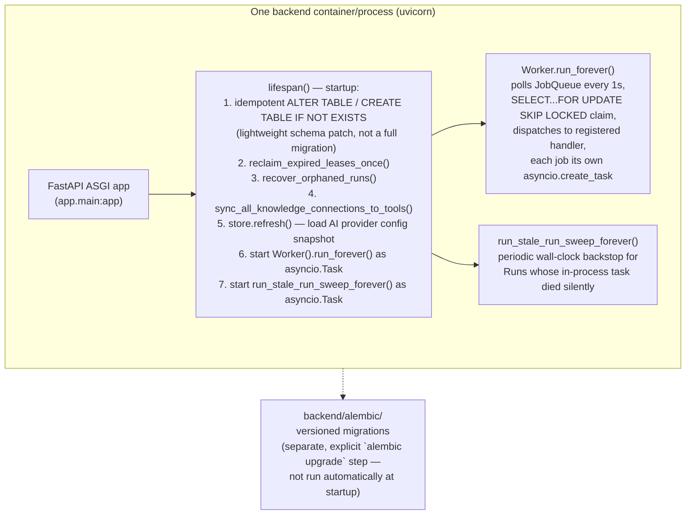

# 11. Deployment / Runtime Architecture

GraphForge ships as Docker Compose stacks; there is no Kubernetes manifest,
Terraform apply target for the app itself, or serverless config in this
repository — `docs/deployment/08_TERRAFORM_STRUCTURE.md` and friends
describe infrastructure documentation, but the actual runnable artifacts
found in-repo are the Dockerfiles + Compose files below.

## 11.1 Dev stack (`docker/docker-compose.yml`, project `graphforge-dev`)

## 11.2 Prod-style stack (`docker/docker-compose.prod.yml`, project `graphforge-prod`)

## 11.3 Backend process — single FastAPI app, embedded worker

## 11.4 Other Compose variants present in the repo

| File | Purpose (per its own header comment) |
|---|---|
| `docker/docker-compose.yml` | One-command local dev: Postgres + backend (hot reload) + frontend (Vite dev server). |
| `docker/docker-compose.prod.yml` | Production-style: no `--reload`, static Nginx-served frontend. |
| `docker/docker-compose.override.yml` | Compose override layer (auto-merged with `docker-compose.yml` by Docker Compose convention). |
| `docker/docker-compose.local-repos.yml` | Adds a bind-mounted host directory for `local_repos_root` (indexing local, non-GitHub repos). |
| `docker/docker-compose.local.yml` | Local-environment variant (not deep-read; name suggests dev-adjacent). |
| `docker/docker-compose.demo.yml` | Demo environment — pairs with `demo/DEMO_GUIDE.md` and `vcs_provider=local_git`. |
| `docker/docker-compose.ec2-demo.yml` | EC2-hosted demo variant, used by `scripts/deploy-ec2-demo.sh`. |

## Explanation

**Deployment topology** is consistently three containers (Postgres, Neo4j,
backend) plus a frontend container that is either a Vite dev server (dev
stack) or an Nginx-served static build (prod stack) — no separate worker
process/container exists in any Compose file found; the background job
worker runs **embedded inside the same FastAPI process** as an
`asyncio.Task` started from the app's `lifespan` context manager. The
`Worker` class's own docstring explicitly notes this doesn't prevent a
future dedicated worker process from also polling the same Postgres queue
concurrently (`SELECT ... FOR UPDATE SKIP LOCKED` is safe for N workers),
but no such second process is configured anywhere in this repo today.

**Startup recovery** runs three sweeps before the app accepts traffic:
reclaiming expired job leases, recovering `Run`s left orphaned by a crashed
prior process, and re-syncing Knowledge Connections into the in-memory Tool
Registry (which does not persist across restarts on its own).

**Configuration** is entirely environment-variable driven
(`core/config.py::Settings`, a single Pydantic `BaseSettings`) — the
codebase's own rule is that this is the *only* place allowed to read
`os.environ`. Production is guarded by a fail-fast validator
(`_reject_insecure_defaults_in_production`) that refuses to start if
`ENVIRONMENT=production` while `jwt_secret_key`/`token_encryption_key`/
`neo4j_password` still hold their public, checked-in dev defaults.

**Database migrations**: `backend/alembic/` contains a full versioned
migration history, run as an explicit separate step — the lifespan hook
only applies small, idempotent `IF NOT EXISTS` patches (e.g. a `role`
column, the `knowledge_connections` table) as a safety net for
environments that haven't run Alembic yet, not as a substitute for it.

## Confirmed vs. Uncertain

- **Confirmed**: all container/service definitions, healthchecks, port
  mappings, and the embedded-worker startup sequence — read directly from
  the Compose files and `backend/app/main.py`.
- **Uncertain / requires verification**: the exact contents of
  `docker-compose.local.yml` and `docker-compose.override.yml` were
  identified by filename/directory listing only, not read in full; their
  role is inferred from naming convention, not confirmed line-by-line.
- **Uncertain**: whether any real (non-Docker-Compose) production
  deployment exists — `docs/deployment/` describes AWS/Terraform-based
  infrastructure extensively, but no Terraform state, CDK, or Kubernetes
  manifest was found in this repository to corroborate it as implemented
  (vs. documented/planned).

## Sources

- `docker/docker-compose.yml`, `docker/docker-compose.prod.yml` (full reads).
- `docker/docker-compose.{local-repos,local,override,demo,ec2-demo}.yml`
  (header/existence only).
- `docker/nginx/nginx.conf`, `docker/Caddyfile`.
- `backend/Dockerfile`, `frontend/Dockerfile` (multi-stage: `dev`/`runtime`
  targets referenced by the Compose files).
- `backend/app/main.py::create_app`/`lifespan` (full read).
- `backend/app/core/config.py` (full read).
- `backend/alembic/` — directory presence, `env.py`, `versions/`.
- `scripts/{docker-dev.sh,docker-prod.sh,deploy-ec2-demo.sh,demo-up.sh,local-repos-up.sh,local-up.sh}` —
  existence only, confirming which Compose file each convenience script
  targets by name.
