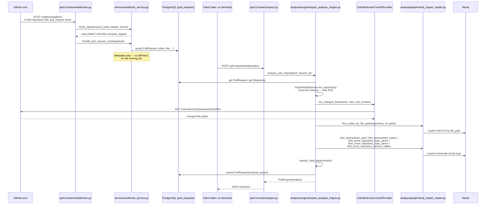
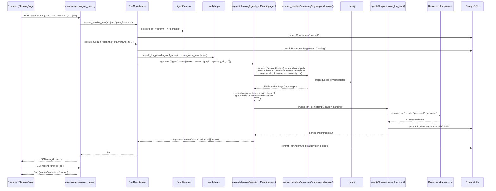
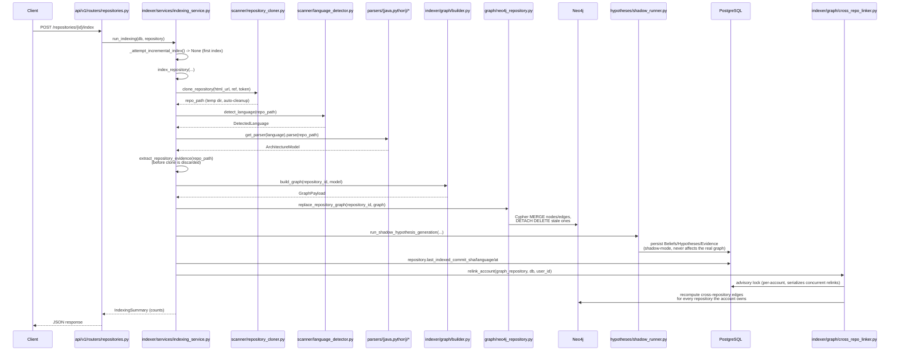
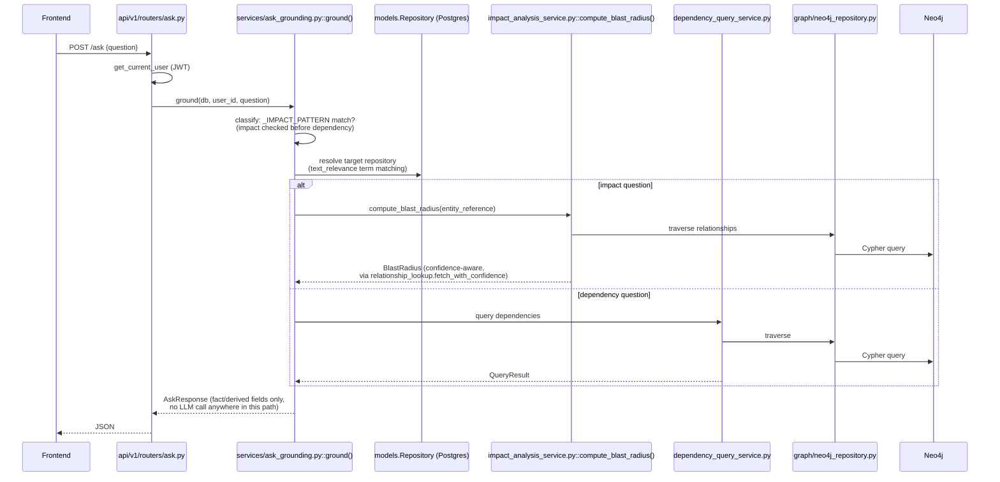

# 12. Key Sequence Diagrams

## 12.1 GitHub webhook → pull request sync → deterministic impact analysis

## 12.2 Planning Agent run (standalone Workspace request)

## 12.3 Repository indexing (full path)

## 12.4 `POST /ask` — deterministic single-shot grounding

## Sources

- `backend/app/api/v1/routers/webhooks.py`, `services/webhook_service.py`
  (full reads).
- `backend/app/analysis/engine/impact_analysis_engine.py` (full read).
- `backend/app/orchestrator/run_coordinator.py` (full read).
- `backend/app/agents/planning/agent.py` (header + import list read).
- `backend/app/context_pipeline/reasoning/engine.py` (header read).
- `backend/app/agents/llm.py` — `invoke_llm_json` (referenced from
  `planning/agent.py`'s imports and `ai/config/resolver.py`).
- `backend/app/indexer/services/indexing_service.py` (full read).
- `backend/app/indexer/graph/cross_repo_linker.py` (docstring, referenced
  from `indexing_service.py`).
- `backend/app/services/ask_grounding.py` (header + classification regex
  read).
- `backend/app/api/v1/routers/{impact,repositories,ask,agent_runs}.py`.
