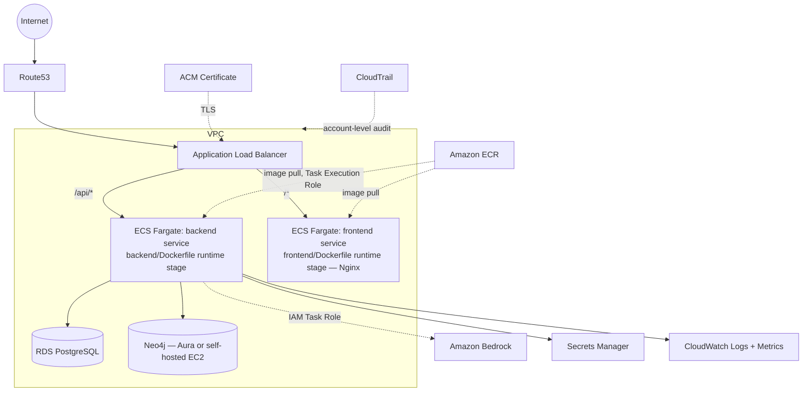

# 02 — AWS Infrastructure

## Purpose

Which AWS services this deployment uses, and why each one exists for GraphForge specifically — not a generic AWS reference. Ports/routing detail lives in `03_NETWORKING.md`; this document is the service inventory and rationale.

## Overview diagram

## Services and rationale

| Service | Why it exists for GraphForge |
|---|---|
| **VPC** | Isolates GraphForge's compute and data from the rest of AWS and the internet by default. See `03_NETWORKING.md` for the full subnet/routing design. |
| **ECS (Fargate)** | Runs the two containers this repo already builds — `backend/Dockerfile`'s `runtime` stage (FastAPI/uvicorn) and `frontend/Dockerfile`'s `runtime` stage (Nginx + built SPA). Fargate removes EC2 fleet management for a workload that doesn't need instance-level control (no GPU, no kernel customization). **Constraint carried over from the app's own architecture**: the backend service must run at `desiredCount=1` until the background-execution durability gap (`10_CODE_CHANGES.md`) is fixed — Fargate makes this an explicit, reviewable setting on the service, not an accident. |
| **ALB** | Terminates TLS, and does the same path-based split `docker/nginx/nginx.conf` already does in `docker-compose.prod.yml` (`/api/*` → backend, everything else → frontend) — this is a direct AWS-native replacement for that Nginx proxy rule, not a new design. |
| **RDS (PostgreSQL)** | Managed replacement for the `db` service in `docker/docker-compose.prod.yml` (`postgres:16-alpine`). Multi-AZ for automatic failover; automated backups replace the bind-mounted `postgres-data` volume. |
| **Neo4j** | No AWS-managed Neo4j exists. Two options — **Neo4j Aura (recommended)**, a managed SaaS reachable from the VPC, or self-hosted Neo4j on EC2 with an attached EBS volume. See the decision rationale in the original deployment blueprint conversation and `01_ARCHITECTURE.md`'s Neo4j section — the app connects via Bolt (`neo4j_uri`/`neo4j_user`/`neo4j_password`, all `Settings` fields) regardless of which is chosen, so this is purely an infrastructure decision, not a code change. |
| **ECR** | Stores the two Docker images this repo already builds (`docker build --target runtime` for both Dockerfiles) — the CI/CD pipeline (`07_CICD.md`) pushes here, ECS pulls from here. |
| **CloudWatch** | Log destination for both containers (`awslogs` log driver — zero code change, captures whatever `docker-entrypoint.sh`/`uvicorn`/`nginx` write to stdout/stderr today), plus Container Insights (CPU/memory/task-count) and custom metrics/alarms. See `12_OPERATIONS.md`. |
| **Route53** | DNS for the production domain, `ALIAS`ed to the ALB. |
| **ACM** | Public TLS certificate for that domain, DNS-validated via Route53, attached to the ALB's HTTPS listener. |
| **IAM** | Every role GraphForge's containers and pipeline assume — see `05_IAM.md`. No static AWS access keys anywhere; the app already does this correctly for Bedrock (`app/ai/providers/bedrock_provider.py` uses boto3's default credential chain, explicitly documented in its own module docstring as never storing AWS secret keys). |
| **Secrets Manager** | The production source for `DATABASE_URL`, `NEO4J_PASSWORD`, `JWT_SECRET_KEY`, `TOKEN_ENCRYPTION_KEY`, and (if enabled) GitHub OAuth credentials — every value `app/core/config.py`'s `Settings` reads that must never be a checked-in default in production. Full inventory in `06_SECRETS.md`. |
| **CloudTrail** | Account-level audit trail for AWS API activity (who changed a security group, who read a secret) — infrastructure hygiene, not GraphForge-specific configuration. Enable once, account-wide. |
| **S3** | **Not used by the application itself** — confirmed by inspection: `boto3` appears in exactly one place in the codebase (`app/ai/providers/bedrock_provider.py`, for the Bedrock Runtime client, not S3). Its legitimate uses in this deployment are infrastructure-only: ALB access logs, CloudTrail's log destination, and (only if the CloudFront-frontend alternative below is adopted) static SPA hosting. Do not design an application-level "GraphForge stores files in S3" feature into the infrastructure — the product has no upload/export feature today. |

## Compute decision record

**ECS Fargate**, not EC2, EKS, or App Runner. Evaluated specifically against this codebase:

| Alternative | Why not, for GraphForge specifically |
|---|---|
| ECS on EC2 | Only wins with GPU needs, heavy bin-packing for cost, or AMI-level customization — none apply; adds patching burden for no benefit here. |
| EKS | Justified past ~5-10 services or real Kubernetes-specific needs (CRDs, operators). GraphForge is 2 services plus 2 data stores — Kubernetes' complexity budget isn't earned yet. |
| App Runner | No VPC-native private networking to Postgres/Neo4j without a VPC Connector; weaker IAM granularity at the task-definition level than ECS; its concurrency-based scaling model doesn't fit long-running LLM calls well. |
| Lambda | Wrong shape entirely — agent runs are long-running (seconds to minutes per LLM call) and stateful mid-flight (the in-process `asyncio.Task`, see `01_ARCHITECTURE.md`); Lambda's execution-time limits fight this workload. |

## Frontend hosting: default vs. alternative

**Default (this blueprint's recommendation): ECS Fargate + Nginx**, exactly replicating `frontend/Dockerfile`'s `runtime` stage and `docker/nginx/nginx.conf`'s proxy rule — same-origin, zero CORS configuration needed in production.

**Named alternative, not the default**: S3 + CloudFront for the static build, with the backend still on ECS behind the ALB. Gets CDN caching essentially free, removes one ECS service — but reintroduces a cross-origin call (CloudFront's domain calling the ALB's domain) unless both are placed behind one CloudFront distribution with an ALB origin for `/api/*`, which is a larger design with more moving parts for a first production deployment. Revisit as a follow-up optimization once the ECS+ALB baseline is live and stable.

## What is deliberately *not* in this design, and why

- **No ElastiCache/Redis** — there is no server-side session store to back (`01_ARCHITECTURE.md`: auth is stateless JWT) and no existing caching layer in the codebase to migrate.
- **No SQS/worker fleet yet** — the durable-queue redesign for background execution (`10_CODE_CHANGES.md`) is scoped as a required follow-up, not part of the initial infrastructure, because it's an application-architecture change first and an infrastructure change second. Don't provision infrastructure for a queue the application code doesn't use yet.
- **No multi-region / cross-region DR** — nothing in the current codebase or product requirements suggests an RTO/RPO that demands it. Multi-AZ within one region (RDS Multi-AZ, ECS tasks spread across AZs) is the appropriate first target.

## See also

- `03_NETWORKING.md` — VPC/subnet/security group detail
- `05_IAM.md` — every role in this diagram
- `06_SECRETS.md` — what Secrets Manager actually holds
- `08_TERRAFORM_STRUCTURE.md` — how this is expressed as IaC
