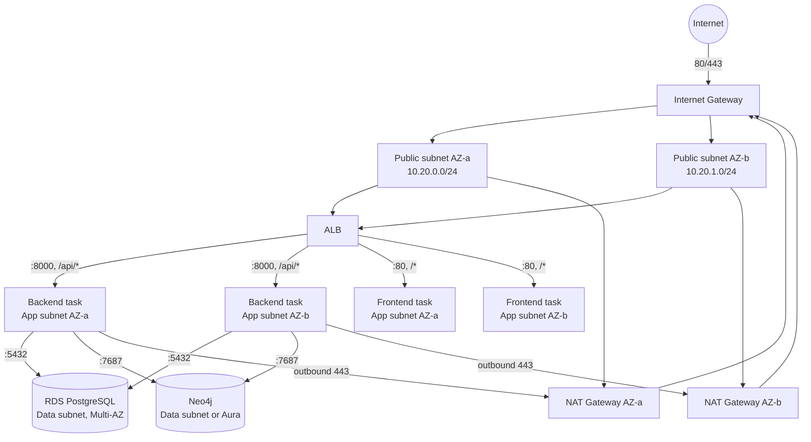
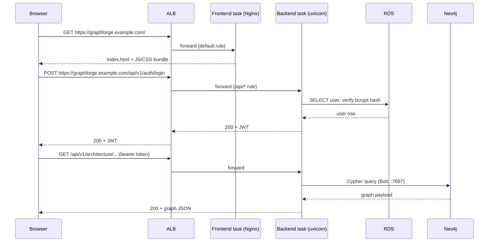

# 03 — Networking

## Purpose

VPC layout, subnets, security groups, route tables, and exact traffic flow/port mappings for the AWS deployment. This maps directly onto the container ports already defined in the repository's own Dockerfiles and Compose files — nothing here invents a new port scheme.

## Ports, as defined in the repository (source of truth)

| Component | Port | Source |
|---|---|---|
| Backend (FastAPI/uvicorn) | `8000` | `backend/Dockerfile` (`EXPOSE 8000`, `CMD [... "--port", "8000"]`), `docker/docker-compose.prod.yml` |
| Frontend (Nginx, production) | `80` | `frontend/Dockerfile` (`EXPOSE 80`), `docker/nginx/nginx.conf` (`listen 80`) |
| Frontend (Vite dev server, dev only — not deployed to AWS) | `5173` | `docker/docker-compose.yml` |
| PostgreSQL | `5432` | `docker/docker-compose.prod.yml` (no host port published — Compose-network-only, mirrored by "private-subnet-only" in AWS) |
| Neo4j Bolt | `7687` | `docker/docker-compose.prod.yml` |
| Neo4j Browser (dev convenience only) | `7474` | `docker/docker-compose.yml` — **not exposed in prod compose, and not exposed in AWS** |

## VPC layout

```
VPC — 10.20.0.0/16
│
├── Internet Gateway (IGW)
│
├── Public subnets (2 AZs)             10.20.0.0/24, 10.20.1.0/24
│     ├── ALB (internet-facing)
│     └── NAT Gateway (one per AZ, or one shared for cost)
│
├── Private subnets — app tier (2 AZs)  10.20.10.0/24, 10.20.11.0/24
│     ├── ECS Fargate tasks — backend service   (container port 8000)
│     └── ECS Fargate tasks — frontend service  (container port 80)
│
└── Private subnets — data tier (2 AZs) 10.20.20.0/24, 10.20.21.0/24
      ├── RDS PostgreSQL (port 5432, Multi-AZ)
      └── Neo4j (port 7687 — Aura reached over NAT, or self-hosted EC2 in this subnet)
```



## Security groups (least privilege, by tier)

| Security Group | Inbound | Outbound | Rationale |
|---|---|---|---|
| `sg-alb` | `443` from `0.0.0.0/0`; `80` from `0.0.0.0/0` (redirect-only, see HTTPS note below) | `8000` to `sg-ecs-backend`; `80` to `sg-ecs-frontend` | Only public-facing SG in the design |
| `sg-ecs-backend` | `8000` from `sg-alb` **only** | `443` to `0.0.0.0/0` via NAT (Bedrock, OpenAI, Gemini, Groq, GitHub REST/webhooks, Neo4j Aura if used); `5432` to `sg-rds`; `7687` to `sg-neo4j` | The only tier that talks to the internet outbound, and the only tier the data-tier SGs trust |
| `sg-ecs-frontend` | `80` from `sg-alb` **only** | none required | Nginx serves static assets only — it never calls the backend server-side; the browser does, via the ALB's separate path rule |
| `sg-rds` | `5432` from `sg-ecs-backend` **only** | none | No other principal, ever — not the frontend tier, not the internet |
| `sg-neo4j` (if self-hosted EC2) | `7687` from `sg-ecs-backend` **only**; `7474` only from a bastion/VPN SG if Neo4j Browser access is genuinely needed, never `0.0.0.0/0` | `443` outbound for OS patching | Same isolation principle as RDS |

## Route tables

| Route table | Associated subnets | Routes |
|---|---|---|
| Public RT | Public subnets (both AZs) | `10.20.0.0/16` → local; `0.0.0.0/0` → IGW |
| App-tier private RT (per AZ) | App-tier private subnet in that AZ | `10.20.0.0/16` → local; `0.0.0.0/0` → that AZ's NAT Gateway |
| Data-tier private RT | Data-tier private subnets | `10.20.0.0/16` → local **only** — no default route to a NAT Gateway at all, since RDS/Neo4j never need outbound internet access themselves (self-hosted Neo4j's OS patching is the one exception — if that's a requirement, either add a scoped NAT route or patch via a maintenance window through a bastion instead) |

## ALB routing (mirrors `docker/nginx/nginx.conf`)

| Listener rule | Priority | Target | Matches |
|---|---|---|---|
| `/api/*` | 1 (evaluated first) | Backend target group (port 8000) | Every backend API call — same rule `location /api/` implements in Nginx today |
| default (`/*`) | last | Frontend target group (port 80) | The SPA shell and its static assets, plus client-side routes that need the `try_files ... /index.html` fallback (handled *inside* the frontend container by Nginx, exactly as today — the ALB doesn't need to know about SPA routing, only about the `/api` vs. everything-else split) |

**Why this preserves the existing CORS-free design**: the browser only ever talks to one origin (the ALB's DNS name / your domain). `Settings.cors_allow_origins` (currently `["http://localhost:5173"]` in dev) stays a development-only convenience — production traffic never crosses origins under this routing scheme, so there is nothing to add to that list for the ALB-based deployment to work.

## Traffic flow — full round trip



## Internal communication summary

- **Frontend → Backend**: never happens server-side. The Nginx container serves static files only; the *browser* calls the backend, routed by the ALB.
- **Backend → RDS**: `asyncpg`, TCP `5432`, private-subnet-to-private-subnet only.
- **Backend → Neo4j**: Bolt protocol, TCP `7687`, same isolation.
- **Backend → AI providers**: outbound HTTPS (`443`) via NAT Gateway, except **Bedrock**, which is reached via AWS's own network path (the `bedrock-runtime.<region>.amazonaws.com` endpoint) — still routed via the NAT Gateway unless a **VPC Interface Endpoint (PrivateLink) for Bedrock** is added, which is a worthwhile hardening step (keeps Bedrock traffic off the public internet entirely) but not required for a first deployment, since it's the same outbound-443-via-NAT path as every other provider.
- **Backend → GitHub**: outbound HTTPS via NAT — the indexer's `git clone` (`app/indexer/scanner/repository_cloner.py`) and the GitHub REST API calls (`app/integrations/github.py`) both need this.

## See also

- `02_INFRASTRUCTURE.md` — the services these subnets/SGs host
- `05_IAM.md` — IAM is a separate control plane from network isolation; both are enforced
- `04_SECURITY.md` — how TLS/HTTPS layers on top of this network design
