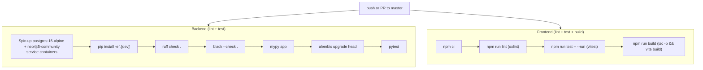
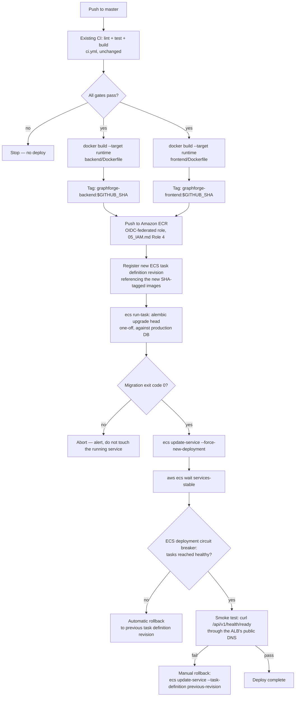

# 07 — CI/CD Pipeline

## Purpose

Document the CI/CD pipeline: what already exists (`.github/workflows/ci.yml` — real, currently running lint/test/build with no deployment stage), and the deployment (CD) stage this document specifies to extend it with. **The CD portion below is a specification, not yet implemented** — no workflow file has been created or modified as part of this documentation task.

## What already exists: `.github/workflows/ci.yml`

Verified by reading the file directly — this is exactly what runs today, on every push and PR to `master` (note: **`master`, not `main`** — this repository's default branch):

Both jobs run in parallel, both must pass. Note that the backend job **already runs `alembic upgrade head`** against its ephemeral Postgres service — this is currently a *test-correctness* step (proving migrations apply cleanly), not a deployment step; the CD extension below reuses the exact same command against the real production database, at the appropriate point in the deploy sequence.

**Tooling, exactly as configured** (`backend/pyproject.toml`, `frontend/package.json`, `scripts/lint.sh`, `scripts/test.sh`):

| Layer | Lint | Format | Type check | Test | Build |
|---|---|---|---|---|---|
| Backend | `ruff check .` | `black --check .` | `mypy app` | `pytest` | N/A (no build step — image build is separate, see below) |
| Frontend | `oxlint` (via `npm run lint`) | `prettier --check .` (`npm run format:check` — not currently in `ci.yml`, only in `scripts/lint.sh`; consider adding to CI for parity) | `tsc -b` (part of `npm run build`) | `vitest run` | `vite build` → `frontend/dist` |

## What this document specifies: the deployment (CD) extension

### Step-by-step

1. **Trigger**: `on: push: branches: [master]` — same trigger the existing `ci.yml` already uses; the CD job(s) should depend on (`needs:`) the existing `backend`/`frontend` CI jobs, so a lint/test/build failure blocks deployment automatically, with no duplicated logic.
2. **Docker build**: both Dockerfiles already define a `runtime` target (`backend/Dockerfile`, `frontend/Dockerfile`) — the CD job runs `docker build --target runtime` for each, nothing new to author in the Dockerfiles themselves.
3. **Tag**: `<ecr-repo>:<git-sha>` (`$GITHUB_SHA`) as the immutable, auditable tag. Also push `:latest` for convenience/browsing, but **the ECS task definition must always reference the SHA tag, never `:latest`** — this is what makes rollback deterministic (step 10).
4. **Push to ECR**: authenticated via the OIDC-federated `graphforge-github-actions-deploy-role` (`05_IAM.md`, Role 4) — no stored AWS access key in GitHub secrets.
5. **Register ECS task definition**: a new revision referencing the freshly-pushed image SHA. The previous revision remains registered and is the rollback target.
6. **Run database migration**: a one-off `aws ecs run-task`, using the *same* backend image, with the container command overridden to `alembic upgrade head`, targeting the production database — **before** the running service is touched. This reuses exactly the command `ci.yml` already runs against its ephemeral test database, now pointed at production via the injected `DATABASE_URL` secret.
7. **Gate on migration success**: if the migration task exits non-zero, the pipeline stops here. Never update the running service against a database whose migration failed.
8. **Deploy**: `aws ecs update-service --force-new-deployment` (or update the service's task definition reference — functionally equivalent). Requires `deploymentCircuitBreaker: { enable: true, rollback: true }` configured on the ECS service — this is what makes rollback *automatic* for failures ECS itself detects, with no custom rollback scripting.
9. **Health verification**: `aws ecs wait services-stable` blocks until the deployment stabilizes or the circuit breaker fires, followed by a real HTTP smoke test against the readiness endpoint (`10_CODE_CHANGES.md` §6.1 — `GET /api/v1/health/ready`) through the ALB's public DNS name, plus one genuine end-to-end check (e.g. login).
10. **Rollback**: two layers —
    - **Automatic**: the ECS deployment circuit breaker, for failures detected during rollout (tasks never reaching healthy).
    - **Manual**: `aws ecs update-service --task-definition <previous-revision>` for failures only visible under real production traffic (health checks pass, behavior is still wrong) — this is why every previous task definition revision is a valid one-command rollback target, and why images are never referenced by `:latest`.

### Environment separation

Parameterize the same pipeline per target environment (staging vs. production) via separate Secrets Manager paths (`graphforge/staging/*` vs `graphforge/prod/*`, per `06_SECRETS.md`'s naming convention) and separate ECS clusters/services — not separate pipeline logic. This corresponds to the environment-separation item in `10_CODE_CHANGES.md` §6.7.

## What is intentionally *not* changed

- `ci.yml`'s existing lint/test/build jobs are reused as-is (`needs:` dependency), not duplicated or rewritten.
- No change to `backend/Dockerfile`/`frontend/Dockerfile` — both already have a production-ready `runtime` stage.
- No change to `alembic upgrade head` itself — only *where* it's invoked from (already a CI step; the CD extension adds a second invocation against production, at the correct point in the deploy sequence).

## See also

- `10_CODE_CHANGES.md` §6.1 (readiness endpoint) and §6.2 (removing ad-hoc lifespan DDL) — both are prerequisites for the migration/health-check steps above to be fully correct
- `05_IAM.md` — Role 4, the OIDC deploy role this pipeline assumes
- `06_SECRETS.md` — where `DATABASE_URL` and the other secrets injected into the migration task and the service come from
- `09_DEPLOYMENT_RUNBOOK.md` — the first, manually-supervised run of this exact pipeline
