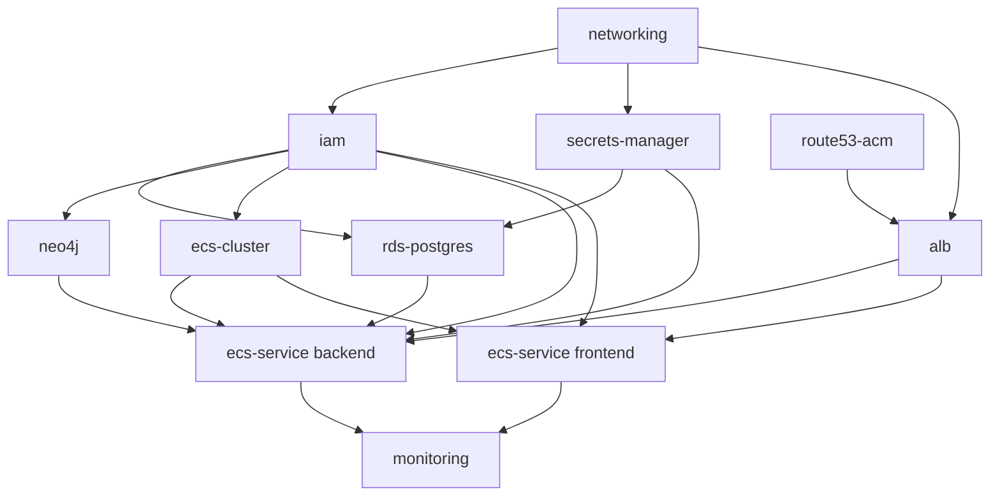

# 08 — Infrastructure as Code Structure

## Purpose

Document the recommended IaC approach and repository structure. **This is documentation only — no Terraform code exists in this repository as a result of this document, and none should be inferred to exist.**

## Recommendation: Terraform

| Option | Verdict for GraphForge |
|---|---|
| **Terraform** ✅ | Cloud-agnostic HCL, the largest ecosystem of AWS provider modules/examples, mature state management (S3 backend + DynamoDB lock table), and the most transferable tooling skill. No AWS lock-in in the *tool* (the infrastructure it describes is still AWS-specific, deliberately, per this deployment's scope). |
| AWS CDK | A genuinely strong alternative if the team wants infrastructure defined in the same language as the backend (CDK's Python bindings are mature, and this backend is already Python). Loses to Terraform here mainly on ecosystem maturity for the exact ECS+RDS+Neo4j-on-EC2 shape this deployment needs, and on state/plan tooling. Reasonable second choice with existing CDK experience — not wrong, just not the recommendation. |
| CloudFormation | Verbose, AWS-only, weaker local plan/diff ergonomics than either above. No specific advantage here. Not recommended. |

## Recommended repository structure

**A new top-level directory, separate from the application code** — e.g. `infra/` at the repository root, alongside `backend/` and `frontend/`:

```
infra/
├── environments/
│   ├── staging/
│   │   ├── main.tf              # wires modules together for staging
│   │   ├── terraform.tfvars     # staging-specific values (instance sizes, domain, etc.)
│   │   └── backend.tf           # S3 state backend config, staging state key
│   └── production/
│       ├── main.tf
│       ├── terraform.tfvars
│       └── backend.tf
├── modules/
│   ├── networking/               # VPC, subnets, IGW, NAT, route tables, security groups — see 03_NETWORKING.md
│   ├── ecs-cluster/              # the cluster itself, shared across services
│   ├── ecs-service/              # reusable module, parameterized per service (backend/frontend) — see 02_INFRASTRUCTURE.md
│   ├── alb/                      # ALB, target groups, listener rules — see 03_NETWORKING.md's routing table
│   ├── rds-postgres/             # RDS instance, subnet group, parameter group — see 02_INFRASTRUCTURE.md
│   ├── neo4j/                    # either an Aura Terraform provider resource, or an EC2+EBS module — decision in 02_INFRASTRUCTURE.md
│   ├── secrets-manager/          # secret resources named per 06_SECRETS.md's convention
│   ├── iam/                      # every role from 05_IAM.md, as named, individually reviewable resources
│   ├── route53-acm/              # hosted zone, DNS record, ACM cert + validation
│   └── monitoring/                # CloudWatch dashboards, alarms, log groups — see 12_OPERATIONS.md
└── README.md                     # how to plan/apply, how state locking works, who can apply to production
```

### Why this shape

- **`environments/*` are thin.** They only set variables and call modules — this guarantees staging and production are *structurally identical*, parameterized differently, rather than independently-drifting copies. The single most common source of "works in staging, breaks in production" is environments defined as separate code rather than as parameterizations of the same modules.
- **`modules/*` hold the actual resource definitions**, each independently reviewable and (via `terraform plan` scoped to one module during development) independently testable.
- **One module per concern, matching this document set's own section boundaries** — the `networking` module corresponds to `03_NETWORKING.md`, `iam` to `05_IAM.md`, and so on, so a reviewer can cross-reference the Terraform against the design document it implements.

## Module dependency order



This mirrors the provisioning order already specified in `09_DEPLOYMENT_RUNBOOK.md` — the runbook is the operational sequence; this diagram is the same sequence expressed as Terraform module dependencies (`depends_on` / implicit references via output variables).

## State management

- **Backend**: S3 bucket (versioned, encrypted) for state storage + a DynamoDB table for state locking — standard, well-documented Terraform pattern, referenced per-environment in each `environments/*/backend.tf`.
- **One state file per environment** (staging, production) — never a shared state file across environments; this is what makes `environments/staging/` and `environments/production/` safely independent despite calling the same modules.
- **Who can `apply` to production**: restrict via the CI/CD deploy role (`05_IAM.md`) or a separate, more tightly-scoped Terraform-apply role — infrastructure changes to production should go through the same reviewed-PR-then-pipeline-apply discipline as application deploys (`07_CICD.md`), not ad-hoc local `terraform apply` runs against production state.

## What this document does not do

Per the scope of this documentation task: no `.tf` files, no module implementations, no `terraform.tfvars` values. An implementing engineer uses this structure and the module list above as the specification for what to build, cross-referencing each module against the corresponding design document (`02_INFRASTRUCTURE.md` through `06_SECRETS.md`) for the resource-level detail (security group rules, IAM policy JSON, secret names) already documented there.

## See also

- `02_INFRASTRUCTURE.md`, `03_NETWORKING.md`, `05_IAM.md`, `06_SECRETS.md` — the design documents each module implements
- `09_DEPLOYMENT_RUNBOOK.md` — the operational provisioning order this module graph mirrors
