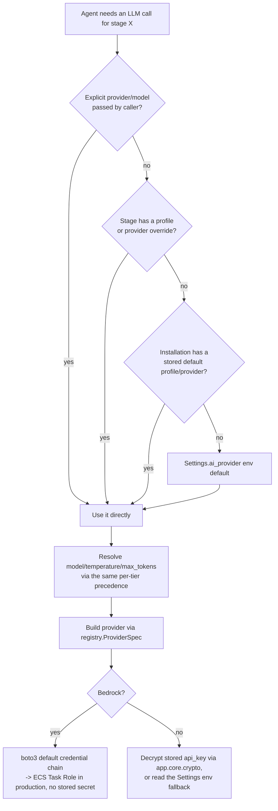

# 13 — AI Provider Configuration

## Purpose

How GraphForge decides which LLM provider serves any given call today, in full detail, and the specific design to evolve it into the requested User → Organization → Bedrock hierarchy.

## Current provider architecture

**Location**: `backend/app/ai/`

| Module | Responsibility |
|---|---|
| `providers/registry.py` | Declares each provider once as a `ProviderSpec` (identity, capabilities via the `Capability` enum, model catalogue, how to build it) — adding a provider is one registry entry, never an `if`/`elif` chain scattered through the app |
| `providers/openai_provider.py`, `providers/gemini_provider.py`, `providers/bedrock_provider.py` | Concrete `ILLMProvider` implementations |
| `providers/factory.py` | Builds a provider instance from a `ProviderBuildConfig` via the registry — no vendor-name string comparisons live here |
| `config/resolver.py` | **The resolution engine** — decides *what to run* (provider, model, temperature, max_tokens) before any provider is constructed |
| `config/store.py` | An in-memory, invalidate-on-write snapshot (`ConfigSnapshot`) of DB-stored provider configuration — exists because `create_llm_provider()` is called synchronously from ~20 call sites across the agent framework; loading config from Postgres at call time would force all of them to become async. Decrypted API keys live in this snapshot **in memory only** — never serialized, logged, or returned by an API response |

Groq, Cerebras, DeepSeek, OpenRouter and Ollama are all served through the OpenAI-compatible Chat Completions API path (no separate provider class needed for any of them — each is registered as its own `ProviderSpec` in the registry via `registry._openai_compatible()`, pointed at that vendor's base URL, but all reuse `OpenAIProvider`'s request/response shape, retry/error handling, and streaming). DeepSeek additionally supports an env-configured base URL override (`DEEPSEEK_BASE_URL`, see `resolver._ENV_BASE_URL_FIELDS`) for self-hosted or third-party OpenAI-compatible DeepSeek endpoints.

### Provider capabilities (`Capability` enum, `registry.py`)

`STREAMING`, `STRUCTURED_OUTPUT`, `VISION`, `TOOL_CALLING`, `REASONING` — reported to the frontend so the UI never hardcodes provider-specific knowledge about what a given provider/model can do.

## Current resolution order (`resolver.resolve()`)

Verified directly from `app/ai/config/resolver.py` — most specific wins:

```
1. Explicit call argument       (per-request provider=/model= — used internally, not exposed as a user-facing control today)
2. Stage profile                (snapshot.stage_profile(stage) — a named "profile" like "fast-planner" pinned to a stage)
3. Stage provider override      (stage_overrides["planning"]["provider"])
4. Stored default profile       (ai_settings.default_profile_slug)
5. Stored global default        (ai_settings.default_provider / default_model)
6. Environment variables        (Settings.ai_provider, currently defaults to "openai" — legacy Settings, kept for
                                  backward compatibility: "An installation that has configured nothing in the UI
                                  resolves exactly as it did before this layer existed." — resolver.py's own docstring)
```



**Important**: steps 2–5 above all read from **one global, installation-wide snapshot** (`ConfigSnapshot`, backed by the `AIProviderConfig`/`AISettings` tables) — there is **no per-user row anywhere in this chain today**. Confirmed by inspecting the schema: neither table has a `user_id` column, and there is no `Organization` model anywhere in the codebase (a repository-wide search for it returns nothing) — "Organization name," visible in the Settings UI, is a display-only field, not a tenancy boundary. So today's system genuinely has **two** configurable layers (installation-wide stored config, and environment/deployment defaults), not the three the target design calls for.

## Bedrock specifically

`app/ai/providers/bedrock_provider.py` never stores an API key — its own module docstring: *"Credentials are resolved through the standard AWS credential chain: environment variables, `~/.aws/credentials`, IAM roles, EC2/ECS instance profiles. GraphForge never stores or handles AWS secret keys directly."* Confirmed in `_get_client()`: it calls `boto3.client("bedrock-runtime", ...)` with no explicit credential arguments. This is already exactly the IAM Task Role pattern the rest of this deployment relies on (`05_IAM.md`) — no code change needed here.

## Fallback chain (distinct from the resolution order above)

`resolver.fallback_chain(primary)` — only returns a non-empty list if an operator has **explicitly enabled fallback** (`snapshot.fallback_enabled`); a run must never silently cross vendors just because two keys happen to be configured. When enabled, it walks `snapshot.fallback_order`, skipping the primary provider, any unimplemented/unregistered provider, and any disabled or missing provider record. `profile_fallback_chain(slug)` does the equivalent for named profiles, cycle-protected and depth-capped at 4 hops.

## Target design: User → Organization → Bedrock

### The gap, restated precisely

Requested:
```
1. User-configured provider (UI)
2. Organization-configured provider
3. Amazon Bedrock (default fallback)
```

Actual today:
```
1–5 above, all reading ONE installation-wide "stored" tier (there is no narrower or broader scope than this)
6. Environment fallback, defaulting to "openai"
```

### Proposed change 1 — add a genuine user-scoped tier

New table `user_ai_provider_config` (a new table, not a nullable `user_id` column bolted onto the existing table — kept separate so "my personal override" and "the installation default" remain independently listable and auditable rows, rather than overloading one table's meaning based on whether a nullable column happens to be set). Same shape as today's `ProviderRecord`: `provider_key`, `api_key` (encrypted via the same `app.core.crypto` functions already used for GitHub tokens and the installation-wide provider keys), `model`, `temperature`, `max_tokens`, `enabled`.

`ConfigSnapshot` stays exactly as it is today (one global, cached, synchronous snapshot — this is deliberate, per its own docstring, to avoid making ~20 synchronous call sites async). Add a small, **separately cached, per-user** lookup that the resolver checks first, rather than making the whole snapshot mechanism request-scoped and async — this preserves the existing performance characteristic (no new database round-trip on every agent call) while adding the new tier.

### Proposed change 2 — insert it into the resolution order

```
explicit call argument
  -> stage profile / stage override                (unchanged mechanism)
  -> user-configured provider                        (NEW — this request's user_id, if they have one configured)
  -> installation ("organization") stored default     (existing stored_default tier — unchanged)
  -> environment variable fallback                    (existing — see change 3)
```

### Proposed change 3 — change one default value

`Settings.ai_provider` currently defaults to `"openai"`. **Change the default to `"bedrock"`.** Combined with Bedrock's existing zero-stored-secret design, this means an installation that configures nothing at all — no UI, no installation default — automatically and correctly falls back to Bedrock, using only the ECS Task Role, exactly as requested. This is a one-line change plus the new tier above; it does not require rebuilding the resolution mechanism, which is already sound.

### What does *not* need to change

- `registry.py`'s declarative-provider pattern — already the right design, extend it, don't replace it.
- `factory.py` — already free of vendor-name string comparisons outside the registry.
- The one existing, deliberately-contained exception: `resolver.py`'s `_ENV_KEY_FIELDS`/`_ENV_PROVIDER_OPTIONS`/`_ENV_MODEL_ONLY` dicts, mapping legacy env var names to provider keys. The module's own docstring calls this "legacy only" — it's isolated to one file and is not the kind of hardcoding the "don't hardcode provider-specific logic" requirement is warning against.

## Affected modules for the target design

`backend/app/ai/config/store.py`, `backend/app/ai/config/resolver.py`, a new model (or new table added to `backend/app/models/ai_provider_config.py`), a new Alembic migration, `backend/app/api/v1/routers/ai_workspace.py` (extend to accept a user-scoped save, not just the installation-wide one it handles today).

## Migration impact

Purely additive — a new table and a new resolution-order branch. No existing installation-wide configuration is affected; a user who has configured nothing at the new tier resolves exactly as they do today. The one-line `ai_provider` default change only affects installations with **nothing** configured anywhere (new deployments) — any existing installation-wide or environment-level provider configuration still wins over the new lower-priority default.

## See also

- `01_ARCHITECTURE.md` — where the AI provider layer sits in the overall system
- `06_SECRETS.md` — how the new user-tier API keys would be encrypted (same mechanism as today's installation-wide keys)
- `10_CODE_CHANGES.md` §6.4 — the same change, listed with priority/complexity/rollout
- `05_IAM.md` — the Bedrock Task Role permissions this design continues to rely on
