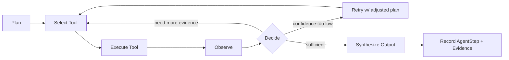
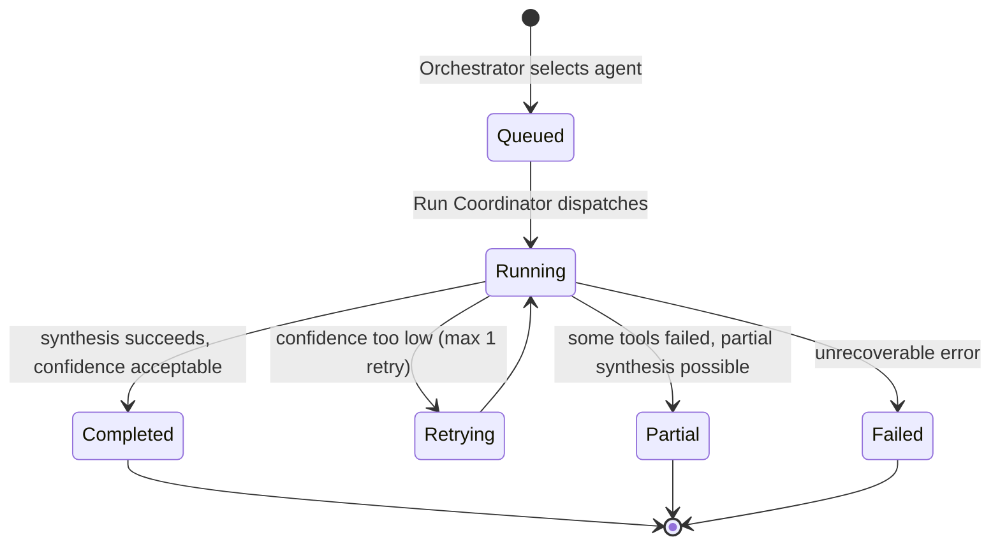

# AGENT_FRAMEWORK.md — GraphForge

> **Superseded by the normative Reasoning Engine contract for the
> execution-flow/loop concepts below.** The `Plan → Select Tool → Execute →
> Observe → Decide` loop this document names as "preserved unchanged" is
> the historical predecessor this repository's canonical
> [`REASONING_ENGINE_ARCHITECTURE.md`](REASONING_ENGINE_ARCHITECTURE.md)
> now generalizes into the Control Plane / Reasoning Plane split, the
> ActionProposal model, and the one-shared-loop design — read that
> document, not this section, for the target reasoning architecture. This
> document's Agent Manifest/contract table below remains a reasonable
> description of the Role-level packaging around that loop and is not
> itself superseded.
>
> Separately, the "Tools" row in that table describes agent-scoped tools in
> the pre-contract sense. **Tool** and **Capability** are now distinct,
> normatively-defined terms — see
> [`CAPABILITIES_CONTROL_PLANE_ARCHITECTURE.md`](CAPABILITIES_CONTROL_PLANE_ARCHITECTURE.md)
> §1 and its §0.1 terminology-collision table before treating anything
> below as a Capability definition.

Generalizes the existing Change Investigation Agent (`app/ai/agent/investigation_agent.py`,
`planner.py`, `tools.py`, `models.py`) into a reusable base every future agent extends. The
existing agent's `Plan → Select Tool → Execute → Observe → Decide` loop is preserved unchanged as
the intra-agent execution loop; this document names its parts and generalizes them.

## Agent Contract

Every agent is a subclass of `BaseAgent` (`app/agents/_framework/base_agent.py`, new) and ships
exactly these parts:

| Part | Existing precedent | Required |
|---|---|---|
| `AgentManifest` | none today (implicit) | Yes — id, purpose, accepted `SubjectType`s, `Goal`s handled, cost class |
| Inputs | `AgentContext` (generalizes today's `AIContext`) | Yes |
| Outputs | `AIAnalysisResult` today, generalized to `AgentOutput[T]` | Yes |
| Prompt Template | `app/ai/prompts/impact_analysis.md` | Yes — one Jinja/plain template per agent, versioned |
| Execution Flow | `planner.py`'s Plan/Select/Execute/Observe/Decide | Yes |
| Confidence | `ConfidenceScore` (existing schema) | Yes |
| Evidence | tool observations (existing, informal) | Yes — formalized as `Evidence[]` |
| Tools | `tools.py` (existing: `read_dependency_graph`, `get_diff`, ...) | Yes, agent-scoped |
| Dependencies | none formalized today | Yes — which other agents' outputs this agent may consume |
| Shared Context | none today (single agent) | Via `RunContext` (Shared Memory) |
| Memory | none today | Via `RunContext` (ephemeral) + graph (durable) |
| Output Schema | `AIAnalysisResult` Pydantic model (existing) | Yes — typed, versioned |
| Error Handling | existing: never swallow, `GitHubApiError` etc. propagate | Yes |
| Retries | `should_retry_after_low_confidence` (existing) | Yes, generalized |
| Logging | `loguru` structured logs (existing) | Yes, with `run_id`/`agent_id`/`subject_id` |
| Evaluation Metrics | none formalized today | Yes — see Evaluation Metrics below |

## Agent Manifest

```python
@dataclass(frozen=True)
class AgentManifest:
    agent_id: str                      # "review", "requirement", "planning", ...
    purpose: str                       # one sentence, shown in Agents UI
    accepted_subject_types: set[SubjectType]
    goals: set[str]                    # e.g. {"review_pr"} for Review agent
    cost_class: Literal["cheap", "standard", "expensive"]
    max_graph_hops: int                # bounds Context Assembler traversal depth
    output_schema: type[BaseModel]
```

Registered once per agent in `app/agents/<agent>/manifest.py`; the Agent Registry
(`app/orchestrator/registry.py`) imports every manifest at startup. This is the single file a
reviewer reads to understand what an agent does without reading its implementation.

## Execution Flow (per-agent, unchanged from today's Review agent)



This is exactly the existing `investigation_agent.py` loop with the Feature-2 retry-on-low-confidence
enhancement already built. Every new agent implements this same five-state loop; only the tool
set, prompt, and output schema differ per agent.

## Tools

Tools are the only way an agent touches the outside world (graph, integrations, LLM). Existing
`tools.py` pattern generalizes to a per-agent `ToolRegistry`:

```python
class Tool(Protocol):
    name: str
    description: str          # shown to the LLM for tool selection
    cost_class: Literal["cheap", "expensive"]
    async def run(self, context: AgentContext, **kwargs) -> ToolObservation: ...
```

Existing tools (`read_dependency_graph`, `traverse_dependency_graph`, `get_diff`,
`get_recent_file_authors`, CODEOWNERS fallback) become the Review agent's `ToolRegistry`
unchanged. New agents define their own tool set — e.g. Requirement agent's tools might be
`search_confluence`, `find_related_stories`, `read_adr_index`.

**Rule**: a tool never writes to the graph directly. It reads (graph, integration) and returns an
`Observation`; only the agent's synthesis step, via `GraphWriter`, writes facts. This keeps read
and write paths auditable separately.

## Prompt Templates

Existing convention (`app/ai/prompts/impact_analysis.md`, plain Markdown with template
placeholders rendered by `PromptBuilder`) is retained per-agent: `app/agents/<agent>/prompts/`.
Each prompt is versioned (existing `prompt_version` field on `AIAnalysisResult` generalizes to
every agent's output). A prompt change is a version bump, never a silent edit — this is what
makes the Evaluation Metrics below meaningful over time (comparing v1.0 vs v1.1 output quality).

## Confidence & Evidence

`ConfidenceScore { score: float, reasoning: str }` (existing schema) is used by every agent,
unchanged. `Evidence` is new and formalizes what was previously an informal tool-observation
string:

```python
class Evidence(BaseModel):
    kind: Literal["graph_traversal", "tool_call", "graph_fact", "llm_reasoning"]
    reference: str          # graph node id, tool name, or fact id
    summary: str
```

**Rule**: an agent's output confidence score must be justified by at least one `Evidence` entry.
An agent that returns `confidence.score > 0` with an empty `evidence` list fails a lint-equivalent
review check (see Evaluation Metrics) — this is the code-level enforcement of "evidence over
assertion" from `PRODUCT_VISION.md`.

## Output Schema

Generalizes `AIAnalysisResult`:

```python
class AgentOutput(BaseModel, Generic[T]):
    agent_id: str
    subject_id: str
    result: T                      # agent-specific payload, e.g. AIAnalysisResult for Review
    confidence: ConfidenceScore
    evidence: list[Evidence]
    graph_facts_written: list[str]  # fact ids, for traceability
    prompt_version: str
```

Every agent's `T` is its own Pydantic model (Review's is the existing `AIAnalysisResult`
unchanged). The outer `AgentOutput` envelope is uniform so the Orchestrator, Shared Memory, and
Agents UI can handle any agent's output generically without a type switch per agent.

## Error Handling & Retries

- Tool failure: caught at the tool-call boundary, recorded as a failed `Observation`, fed back into
  Decide — the agent may route around it (existing CODEOWNERS-fallback precedent: git-blame fails
  → fall back to CODEOWNERS) or terminate with `status=partial`.
- LLM failure (timeout, rate limit, malformed output): existing provider-level retry
  (`app.ai.providers`) is reused unchanged.
- Low confidence: existing `should_retry_after_low_confidence` generalizes to every agent — one
  retry with an adjusted plan (typically: gather more evidence) before accepting a low-confidence
  result rather than silently returning it.
- **Never**: swallow an error and return a plausible-looking default. An agent that cannot reach a
  conclusion returns `status=failed` or `status=partial` with a reason, full stop.

## Logging

Every log line from agent code includes `run_id`, `agent_id`, `subject_id`, `step_number` (existing
`loguru` structured pattern, extended with these mandatory fields). This is what lets an engineer
grep one `run_id` and see the entire cross-agent execution, not just one agent's internal steps.

## Evaluation Metrics

Every `AgentStep` records, uniformly across all agents:

| Metric | Purpose |
|---|---|
| Latency (ms) | Cost/UX budget tracking per agent |
| Token cost | Feeds the existing "Estimated cost" UI element, generalized per-agent |
| Confidence score | Input to calibration tracking below |
| Retry count | Signals prompt/tool quality — high retry rate flags a prompt needing revision |
| Tool-call count | Cost/complexity signal |
| **Confidence calibration** | Post-hoc: did human feedback (thumbs up/down, PR outcome) agree with the confidence score? Tracked per agent, per prompt version — this is how a prompt regression is caught before it's a silent quality drop. |

Calibration tracking is implemented (`app.models.confidence_calibration`, `/api/v1/calibration` —
one row per `AgentStep` + human approve/reject decision pair); the other metrics are free
byproducts of the existing execution loop.

## Extensibility — Adding a New Agent

1. Create `app/agents/<new_agent>/` with `manifest.py`, `tools.py`, `prompts/`, and the agent
   class extending `BaseAgent`.
2. Define its output schema (a new Pydantic model — do not force-fit `AIAnalysisResult` onto a
   non-review agent just because it exists).
3. Register the manifest in `app/agents/_framework/registry.py`.
4. Add a Selector rule mapping the `Goal`(s) it handles.
5. No changes required to: the Orchestrator's Run Coordinator, other agents, the GraphWriter, or
   the frontend Agents page (it renders any `AgentOutput` generically via `AgentCard`).

This is the concrete test of the Plugin Architecture claim in `ARCHITECTURE.md`: if step 5 is ever
violated (a new agent requires touching another agent or the orchestrator core), the framework has
a leak that must be fixed before the next agent ships.

## Agent Lifecycle



## How Agents Collaborate

Two mechanisms, matched to how tightly coupled the collaboration is:

1. **Sequential handoff** (e.g. Requirement → Planning → Architecture): agent N's `AgentOutput` is
   written to `RunContext` (Shared Memory); the Run Coordinator includes it in agent N+1's
   `AgentContext` verbatim. Tight coupling, same run.
2. **Graph-mediated** (e.g. Review agent benefiting from a fact the Architecture agent wrote last
   week): agent B's tools traverse the graph and find agent A's `GraphFact` like any other graph
   data — no direct dependency, no shared run. Loose coupling, asynchronous, durable.

Rule: use graph-mediated collaboration by default. Only use sequential handoff when the
downstream agent genuinely cannot proceed without the upstream agent's fresh output in the same
run (e.g. Planning needs Requirement's *this-run* clarification, not last month's).

## How the Orchestrator Chooses Agents

Phase 1: static `Goal → [agent_id]` rule table (see `ARCHITECTURE.md` § Agent Orchestrator). A
`Goal` is itself a closed enum (`review_pr`, `clarify_requirement`, `plan_story`,
`assess_architecture_impact`, `plan_freeform`, ...), set by whatever triggered the run (a webhook
event, a UI button, an API call) — never inferred from free text by an LLM in Phase 1, to keep
agent selection deterministic and debuggable while the framework is new. LLM-based Goal inference
from free-text entry points is an explicit Phase 3 upgrade, isolated behind `ISelector` so it's a
drop-in replacement, not a rearchitecture.

`plan_freeform` maps to the Planning Agent's standalone-input variant: a free-text goal resolved
through a minimal Entry Resolver,
with no linked Story and no upstream Requirement Agent output in context. This is distinct from
`plan_story`, which assumes the sequential-handoff Planning Agent described earlier in this
document (§ How Agents Collaborate) — consuming a real Requirement Agent's output in the same
run. Both map to the same underlying Planning Agent implementation today; `plan_story`'s full
sequential-handoff behavior is Phase 2/3 backlog work, not yet built.

## How Context Flows

`Context Builder` (see `ARCHITECTURE.md`) resolves the entry point to a `Subject`, then the
Context Assembler traverses the graph bounded by the selected agent's `max_graph_hops`, producing
an `AgentContext`. If a sequential handoff applies, the Run Coordinator layers the upstream
agent's `AgentOutput` on top before dispatch. The agent's own tools may then pull *additional*
graph data mid-execution (existing Review-agent behavior, unchanged) — the initial context is a
starting point, not an exhaustive payload, which is why agents keep their own tool-use loop rather
than being pure prompt-completion functions.
