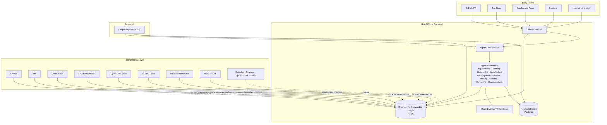
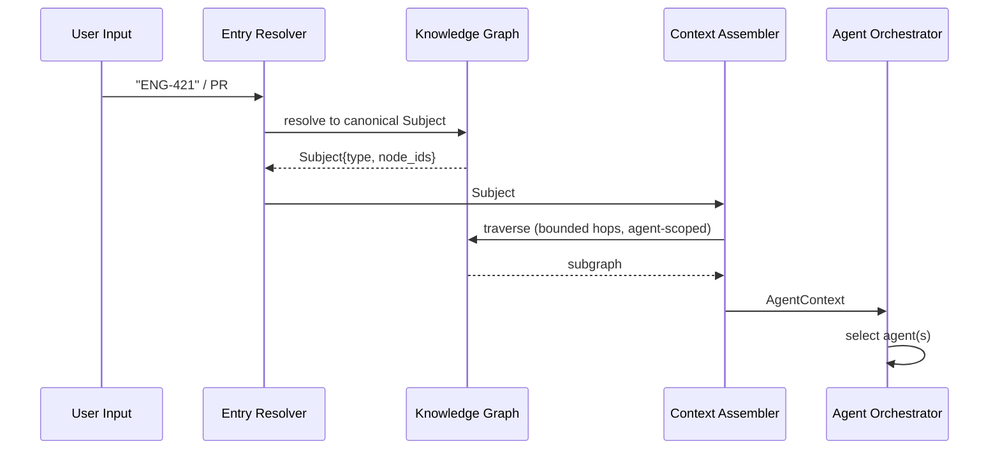
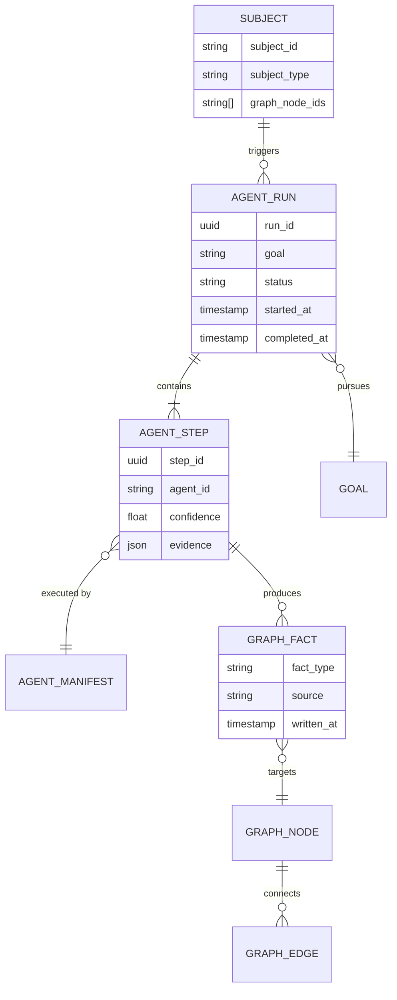
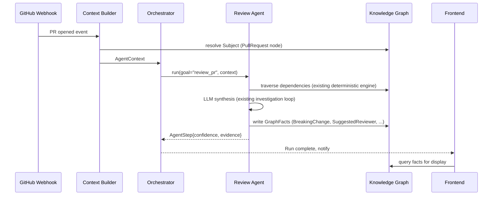
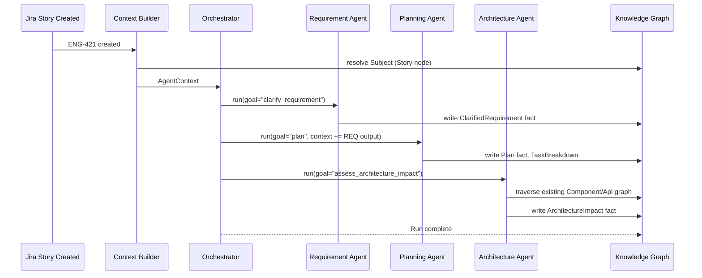

# ARCHITECTURE.md — GraphForge

This document evolves the existing ChangeGuard backend/frontend into GraphForge. It does not
propose a rewrite. Every section states what already exists, what changes, and why.

## High Level Architecture



**Reused as-is:** the Postgres relational store, the FastAPI hexagonal layering
(`api → services → engine/agent → integrations/graph`), the Neo4j knowledge graph, the
indexer pipeline, and the auth/session layer. **New:** the Agent Orchestrator as a distinct
component (today, agent selection is hardcoded per-endpoint — one endpoint runs one agent), and
a generalized Context Builder that resolves *any* entry point, not just a `PullRequest.id`.

## Context Builder

**Today**: `app.ai.services.context_builder.ContextBuilder` builds an `AIContext` from exactly
one input shape — a `PullRequest` row plus its deterministic analysis. It is PR-specific by
construction.

**GraphForge evolution**: generalize into a two-stage resolver.

1. **Entry Resolver** — maps an arbitrary entry point (`pr:1234`, `jira:ENG-421`,
   `confluence:98765`, `incident:INC-88`, or free text) to a canonical **Subject**: one or more
   Knowledge Graph node IDs plus a `SubjectType` enum. Each source has one resolver
   (`GitHubEntryResolver`, `JiraEntryResolver`, ...) behind a shared `IEntryResolver` interface —
   same pattern as `IVersionControlProvider` today.
2. **Context Assembler** — given a Subject, traverses the graph outward (configurable hop depth
   per agent) and assembles an `AgentContext`: the ordered, budgeted, agent-specific payload
   handed to the LLM. This replaces today's single `AIContext` with a generic, agent-parameterized
   context object — see Domain Model below.

**Entry Resolver status** (KAN-27, current as of the resolver audit below — update in the same
change as any resolver work, the same discipline `docs/handbook/16_REALITY_CHECK.md` applies):

| Resolver | Status | Notes |
|---|---|---|
| `freetext` | **Real, working** | `app/context/resolvers/freetext.py` — pure function, no I/O |
| GitHub (repository id, pull request URL) | **Real, working** | `app/context/resolvers/github.py` — `resolve_repository_id`, `resolve_pull_request_url`; used by `POST /agent-runs` |
| Jira | **Not built** | Blocked on a real Jira integration existing at all (today's Jira access is read-only, no `IIssueTrackerProvider` implementation — see KAN-43) |
| Confluence | **Not built** | Same blocker as Jira |

None of the resolvers above are classes implementing a shared `IEntryResolver` Protocol as
originally sketched — each is a plain, independently-typed function returning a
`Subject` (`app.agents._contract.Subject`), following the same lightweight-function convention
`freetext.py` established first. Introducing a formal shared interface is worth doing once a
third source needs one; two working resolvers with parallel signatures is not evidence a shared
Protocol is buying anything yet.



Rationale: keeping resolution and assembly as two steps means a new entry point (Slack message,
Datadog alert) only requires a new `IEntryResolver` — the assembly and agent-selection logic
never changes.

## Knowledge Graph

**Today**: Neo4j holds `Repository`, `Component`, `Api`, `Topic` (Kafka), `Library` nodes and
`DEPENDS_ON` / `PUBLISHES` / `CONSUMES` edges, populated by `app.indexer`.

**GraphForge evolution**: extend the schema (additively — no breaking migration of existing
node/edge types) to first-class SDLC entities:

| Node label | Source | Introduced by |
|---|---|---|
| `Repository`, `Component`, `Api`, `Topic`, `Library` | code indexer | existing |
| `PullRequest`, `Commit` | GitHub | existing (currently relational-only; promote to graph nodes) |
| `Story`, `Epic` | Jira | new |
| `Document`, `ADR` | Confluence / `docs/adr` | new |
| `TestSuite`, `TestCase`, `TestRun` | CI / test results | new |
| `Release`, `Deployment` | release metadata | new |
| `Owner` (team/person) | CODEOWNERS | new — promotes today's file-based CODEOWNERS lookup to a graph edge |
| `Incident` | future (Datadog/Grafana/Splunk) | future |

Edges follow a `VERB_CASE` convention: `IMPLEMENTS`, `RESOLVES`, `TESTED_BY`, `DEPLOYED_IN`,
`OWNS`, `REFERENCES`, `CAUSED_BY`, `DOCUMENTED_IN`. Every edge write carries `source` (which
integration wrote it) and `written_at`, so provenance is queryable — required for the "evidence
over assertion" principle in `PRODUCT_VISION.md`.

**Write path**: integrations never write directly. They emit typed `GraphFact` events (see
`AGENT_FRAMEWORK.md` § Output Schema) to a `GraphWriter` service, which validates against the
schema registry before committing. This is the single choke point that keeps the graph
internally consistent as integration count grows.

## Agent Orchestrator

**Today**: does not exist as a component. `investigation_agent.py` contains its own internal
planner (`Plan → Select Tool → Execute → Observe → Decide`) but there is exactly one agent, and
the router picks it by calling it directly.

**GraphForge evolution**: introduce `app/orchestrator/` as a new top-level package.

- **Agent Registry**: every agent registers a manifest (`AgentManifest`: id, purpose, input/output
  schema, required Subject types, cost class). Static, code-defined — no dynamic plugin loading
  in Phase 1 (see Roadmap).
- **Selector**: given an `AgentContext` and a `Goal` (what the user/system is trying to accomplish
  — "review this PR," "plan this story," "diagnose this incident"), the Selector picks the
  ordered set of agents whose manifests match. Phase 1 selection is rule-based (Goal →
  agent list, e.g. `pr_opened → [Review]`, `story_created → [Requirement, Planning]`); an
  LLM-based selector is a Phase 2/3 upgrade behind the same `ISelector` interface, so swapping it
  never touches callers.
- **Run Coordinator**: executes the selected agents — sequentially where one agent's output is
  another's input (Requirement → Planning → Architecture), in parallel where independent (Review
  + Testing on the same PR) — and persists the run in Shared Memory.

This directly generalizes the existing single-agent `Plan/Select/Execute/Observe/Decide` loop:
that loop becomes the *intra-agent* tool-selection loop (unchanged, lives in each agent), while
the Orchestrator adds an *inter-agent* layer on top.

## Shared Memory

**Today**: no run-level memory; each agent invocation is stateless beyond the DB rows it reads/writes
at the start/end.

**GraphForge evolution**: `RunContext` — a short-lived (Redis-backed, TTL'd) key-value store
scoped to one orchestrator run (`run_id`). Holds intermediate agent outputs *before* they're
committed to the Knowledge Graph or Postgres, so agent N+1 in a sequential chain can read agent
N's draft output without a round-trip through the graph. On run completion, everything durable
gets written to the graph/Postgres; `RunContext` is discarded. This keeps the graph the permanent
source of truth (per Core Principle 4) while giving agents a fast scratch space mid-run.

**Current-state note**: the implementation uses an in-memory `RunContext` (single-process), not
Redis. This is a deliberate, temporary substitution: Redis-backing is required before any
multi-process/multi-replica deployment, and this note should be removed once that migration
happens.

## Backend

Reused wholesale: FastAPI, async SQLAlchemy, Alembic, the `IVersionControlProvider` /
`IOAuthProvider` interface pattern, `app.core` (config/security/crypto/exceptions), the LLM
provider factory (`app.ai.providers`). New top-level packages: `app.orchestrator`,
`app.context` (Entry Resolvers + Context Assembler), `app.graphwriter`. Existing `app.ai.agent`
becomes one agent module among several under a renamed `app.agents` package (see Folder Structure).

## Frontend

Reused wholesale: Vite + React + TS, the Card/Table/StatusBadge/RiskBadge component library, the
dark theme, `AuthContext`/`AiModelContext` provider pattern, the `lib/api` client convention. New:
a top-level "Pipeline" view (SDLC-stage-based navigation) and a generalized "Agents" surface
replacing the current AI-analysis-is-a-card-on-the-PR-page pattern — see `UI_GUIDELINES.md`.

## Integrations

Every integration implements one narrow interface and is registered once:

```python
class IKnowledgeSource(Protocol):
    source_id: str  # "github", "jira", "confluence", ...
    async def sync(self, scope: SyncScope) -> list[GraphFact]: ...
```

`IVersionControlProvider` (existing) becomes one specialization used by the GitHub/local-git
sources specifically for code-level facts; Jira/Confluence/etc. implement `IKnowledgeSource`
directly since they have no "diff" concept. This mirrors the existing precedent of not forcing
`post_pull_request_comment` onto `IVersionControlProvider` when it had no local-git analog —
the same judgment call applies at the integration-interface level.

## Folder Structure

```
backend/app/
  core/                    # unchanged: config, security, crypto, exceptions
  database/                # unchanged
  models/                  # unchanged (Postgres ORM) + new: Run, RunStep, GraphSyncCursor
  schemas/                 # unchanged pattern, + orchestrator/agent request/response schemas
  graph/                   # unchanged: Neo4j session + IGraphRepository
  graphwriter/             # NEW: schema registry, GraphFact validation, single write choke point
  context/                 # NEW: replaces app.ai.services.context_builder
    resolvers/             # IEntryResolver impls: github, jira, confluence, incident, freetext
    assembler.py           # Context Assembler
  orchestrator/            # NEW
    registry.py            # AgentManifest registry
    selector.py            # ISelector + rule-based impl
    run_coordinator.py      # sequencing/parallelism, writes RunContext + Run/RunStep
    run_context.py         # Redis-backed Shared Memory
  agents/                  # RENAMED from app.ai.agent; one subpackage per agent
    requirement/
    planning/
    knowledge/
    architecture/
    development/
    review/                # = today's Change Investigation Agent, moved + renamed
      tools.py
      planner.py
      investigation_agent.py
    testing/
    release/               # = today's Release Coordination logic, moved
    monitoring/            # future, stubbed manifest only
    documentation/         # future, stubbed manifest only
    _framework/            # shared base: BaseAgent, AgentManifest, ToolRegistry, RetryPolicy
  analysis/                # unchanged: deterministic risk/impact engine (Review agent's tool)
  indexer/                 # unchanged: code graph indexing
  integrations/            # unchanged github/local_git + NEW: jira.py, confluence.py, codeowners.py (promoted)
  api/v1/routers/          # unchanged pattern + NEW: orchestrator.py, agents.py, graph.py
  services/                # unchanged

frontend/src/
  app/                     # unchanged: AuthContext, AiModelContext, router
  pages/                   # existing pages retained + NEW: PipelinePage, AgentsPage, ProjectPage
  components/
    graph/                 # unchanged: DependencyGraph
    agents/                # NEW: AgentCard, AgentRunTimeline, ConfidenceBadge, EvidencePanel
    pipeline/               # NEW: StageColumn, StageCard
  lib/api/                 # unchanged pattern + NEW: orchestrator.ts, agents.ts, graph.ts
  hooks/                    # unchanged pattern + NEW: useAgentRun, useKnowledgeGraphSearch
  types/                    # unchanged pattern + NEW: agent.ts, orchestrator.ts, graph.ts
```

## Domain Model



`Subject`, `AgentRun`, `AgentStep` are new Postgres tables (run-level audit trail — durable,
queryable, the basis for the Agents UI timeline). `GraphFact`/`GraphNode`/`GraphEdge` live in
Neo4j. This split (Postgres for *that an agent ran and what it concluded*, Neo4j for *the
knowledge itself*) mirrors the existing split between `PullRequestAnalysis`/`PullRequestAIAnalysis`
(Postgres, today) and the dependency graph (Neo4j, today) — same pattern, generalized.

## Component Responsibilities

| Component | Owns | Does not own |
|---|---|---|
| Context Builder | Resolving entry points, assembling agent-scoped context | Deciding which agents run |
| Agent Orchestrator | Agent selection, sequencing, run lifecycle | Graph schema, tool implementations |
| Agent Framework (`agents/_framework`) | Common execution loop, retries, evidence capture | Domain logic of any specific agent |
| Individual Agent (e.g. Review) | Domain reasoning, its own tool selection | Cross-agent handoff, context assembly |
| GraphWriter | Schema validation, single commit path to Neo4j | Deciding *what* facts to write (agents decide) |
| Integrations | Pulling/pushing to external systems, emitting `GraphFact`s | Interpreting facts, graph traversal |

## Sequence Diagrams

### PR opened → Review Agent → Graph write → UI



### Jira story → multi-agent chain



## Extensibility Strategy

Three additive axes, none of which requires touching the others:

1. **New integration** → implement `IKnowledgeSource` (or `IVersionControlProvider` for
   code-hosting-like systems), register in the source registry. Zero orchestrator/agent changes.
2. **New agent** → implement `BaseAgent` + `AgentManifest`, register in the Agent Registry, add
   its Selector rule. Zero changes to existing agents or the graph schema (unless it needs new
   node/edge types — additive migration only).
3. **New node/edge type** → extend the GraphWriter schema registry additively. Existing agents
   unaffected unless they explicitly opt into traversing the new type.

## Plugin Architecture

Phase 1–2: agents and integrations are compiled-in Python packages, registered at startup via
static imports (`agents/_framework/registry.py` imports every agent subpackage's `manifest.py`).
This keeps deployment simple and typed — no dynamic code loading, no plugin marketplace security
surface, yet. Phase 3+ (see `ROADMAP.md`) revisits a true out-of-process plugin protocol
(agents as sidecar services communicating over a typed RPC contract) once there is real demand
for third-party or customer-authored agents — not before, to avoid building marketplace
infrastructure for a market of zero external developers.

## Future Architecture

Datadog/Grafana/Splunk/Kubernetes/Slack all become `IKnowledgeSource` implementations feeding an
`Incident` and `Deployment` node type already scaffolded in the Domain Model above. A future
Monitoring Agent consumes these the same way the Review Agent consumes the code graph today —
no core architecture change required, only new agent + integration modules.

## Scalability Considerations

- **Graph size**: Neo4j traversals are bounded per-agent (max hop depth in `AgentManifest`) to
  keep Context Assembler latency predictable as the graph grows across an org's full repo set,
  not just one indexed repo.
- **Run concurrency**: Run Coordinator uses the existing async SQLAlchemy session-per-request
  model; parallel agent execution within a run uses `asyncio.gather`, bounded by a per-run
  concurrency limit to avoid thundering-herd LLM provider calls.
- **Multi-tenancy** (KAN-33 status check, current as of this audit): **no `organization_id`
  column exists anywhere in the codebase today** — grepped across every model and every Neo4j
  write path, zero matches. The tenancy boundary that actually exists is `user_id`: every
  Repository, Workflow, Run, and PullRequest row is scoped to the single user who owns it, and
  every graph node inherits its owning `Repository`'s scope via `repository_id`, which every
  router-level ownership check resolves *before* any Neo4j query runs (see `docs/handbook/
  16_REALITY_CHECK.md` and KAN-33's isolation test suite, `tests/integration/
  test_workflows_cross_user_isolation.py`, for the verified detail). This paragraph's original
  `organization_id` design was aspirational — describing a future org-level grouping *above*
  today's per-user model, not something partially built. Treat any other `organization_id`
  reference in this document the same way until an actual `Organization` concept ships.
- **Indexing at scale**: the existing indexer's clone-and-parse model remains for Phase 1;
  incremental (webhook-driven, diff-only) indexing is a Phase 2 requirement once repo count per
  org exceeds what full re-clones can keep current.

## Error Handling

- Agents never swallow tool/LLM failures — an `AgentStep` records `status=failed` with the
  underlying error, surfaced verbatim in the UI. Partial success (some tools failed, synthesis
  still possible) is recorded as `status=partial` with an explicit reason, never silently omitted.
- GraphWriter rejects a `GraphFact` that fails schema validation rather than coercing it — bad
  writes fail loudly at the choke point, not silently corrupt the graph.

## Logging

Structured JSON logs (existing `loguru` convention) with mandatory fields on every agent-related
log line: `run_id`, `agent_id`, `subject_id`. This is what makes "which agent run produced this
graph fact" answerable in production without a debugger. (`organization_id` here is the same
not-yet-built field flagged in Scalability Considerations above — omitted from this list as of
this audit, not silently dropped from logging.)

## Telemetry

Every `AgentStep` emits: latency, token cost, confidence score, tool-call count, retry count.
Aggregated per-agent, this is the basis for the Evaluation Metrics required in
`AGENT_FRAMEWORK.md` — an agent's real-world confidence-vs-correctness calibration is only
visible if every run is instrumented identically.

## Security Considerations

- Access tokens for every integration remain encrypted at rest via the existing `app.core.crypto`
  Fernet pattern — extended, not replaced, for Jira/Confluence tokens.
- **Corrected by KAN-33's audit**: there is no `organization_id` scoping — see Scalability
  Considerations above. What actually prevents cross-tenant graph access today: every endpoint
  that reads or writes the graph first resolves and ownership-checks a Postgres `Repository` row
  (`Repository.user_id == current_user.id`, `NotFoundError` — not `Forbidden`, so a repository
  owned by someone else is indistinguishable from one that doesn't exist) *before* any Cypher
  query runs, and every graph node/edge carries the corresponding `repository_id`. This is real
  and independently verified for the workflow-lifecycle endpoints (KAN-33's isolation suite,
  `tests/integration/test_workflows_cross_user_isolation.py`), but it is an **API-layer
  convention applied per-router**, not a structural guarantee inside the query builder itself —
  nothing today would stop a new Cypher-touching endpoint from being written without the
  preceding ownership check. Extracting that ownership check into a shared, structurally-required
  dependency (so an unscoped graph query becomes impossible to write, not just discouraged by
  convention) is scoped as KAN-33 follow-up work, not yet done.
- Agent tool calls that reach external systems (posting a GitHub comment, updating a Jira ticket)
  require the same explicit-permission-required category discipline the product already applies
  to user-facing actions — an agent auto-commenting on a PR is a "send a message" action and must
  be classed and gated as such, not treated as an implicit side effect of "running the agent."
