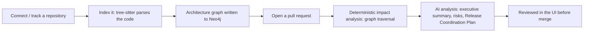
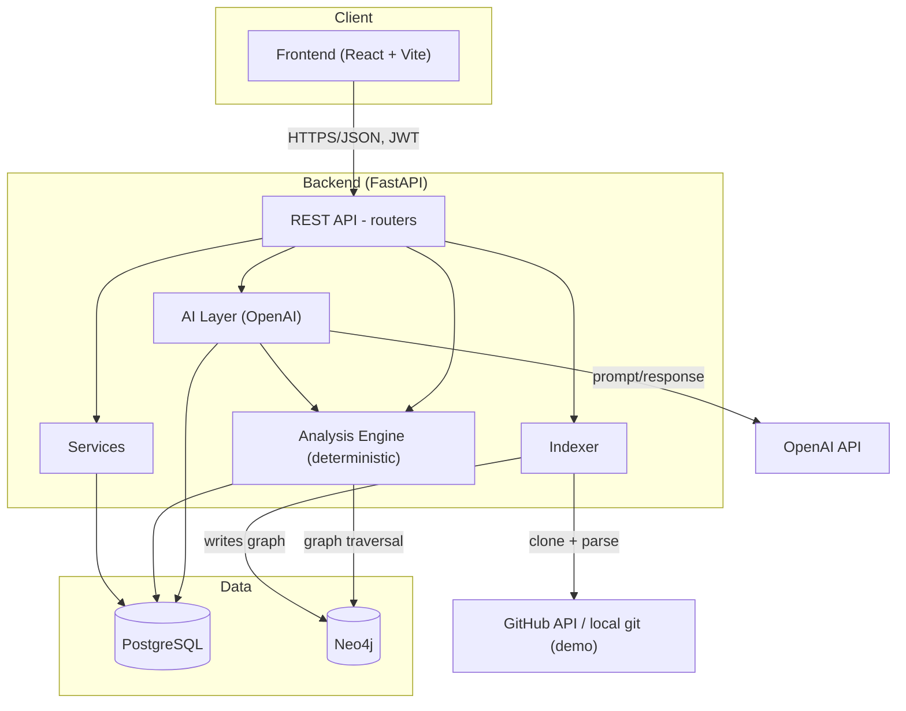
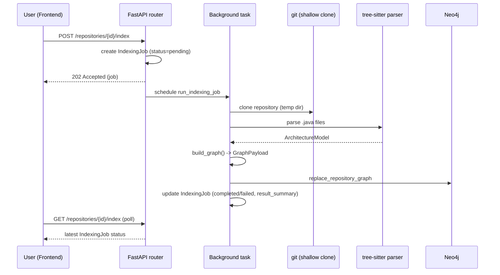
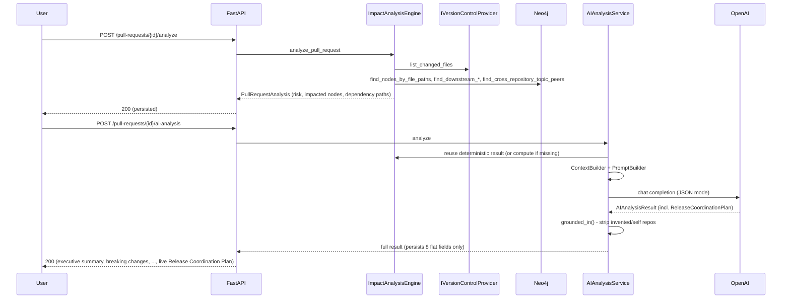

# ChangeGuard — Project Documentation

**Audience:** new developers, architects, and hackathon judges.
**Status:** living document — reflects the codebase as of this session, including the local demo environment and the Architecture/Repositories page optimizations.

---

## 1. Project Overview

### Purpose

ChangeGuard analyzes the *impact* of a pull request before it merges — which services, APIs, Kafka topics, and downstream repositories a change touches — combining a deterministic, graph-based analysis engine with an AI enrichment layer that turns that graph data into human-readable risk explanations, migration advice, and a cross-repository release coordination plan.

### Problem it solves

In a microservice organization, a single PR in one repository can silently break another repository if they're coupled through an event topic or a shared API contract. Standard code review only sees the diff inside one repo — it cannot see that `order-service` renaming a Kafka event field will break `inventory-service` and `notification-service`. ChangeGuard indexes the *architecture* of every tracked repository into a shared knowledge graph, so impact analysis crosses repository boundaries the same way the actual coupling does.

### Target users

- Engineering teams running a microservice architecture who want pre-merge blast-radius visibility.
- Platform/DevOps teams coordinating multi-repository releases.
- Engineering leadership wanting an architecture-level view of a fleet of repositories.

### High-level workflow



### Main capabilities

| Capability | Summary |
|---|---|
| Repository indexing | Clones a repo, parses Java/Spring Boot source with tree-sitter, builds a graph of its architecture. |
| Knowledge graph | Neo4j graph of Controllers, Services, Feign clients, Endpoints, Kafka topics, Maven dependencies. |
| Cross-repository coupling | Detects shared Kafka topics across independently-indexed repositories by topic-name matching. |
| Deterministic impact analysis | Graph traversal that classifies a PR's risk (HIGH/MEDIUM/LOW) with zero AI involvement. |
| AI analysis | Executive summary, breaking changes, migration advice, suggested reviewers, regression tests. |
| Release Coordination Plan | AI-generated, ephemeral, cross-repository deployment order + who-to-notify. |
| Dependency graph visualization | Progressive drill-down: repository-level overview → expanded per-repo component graph. |
| Bulk repository management | Multi-select, bulk indexing, indexing-status filtering. |
| Local demo environment | Four real Spring Boot repos + seed script, no GitHub or real infra required. |

---

## 2. System Architecture



- **Frontend** — React SPA; talks only to the backend's REST API, never to Postgres/Neo4j/OpenAI directly.
- **Backend** — FastAPI, clean/hexagonal layering (routers → services/engines → interfaces → adapters).
- **Database (PostgreSQL)** — all relational state: users, tracked repositories, pull requests, indexing jobs, persisted analysis results.
- **Neo4j** — the architecture knowledge graph only (no relational data). One logical subgraph per repository, all in one database, namespaced by a `repository_id` property on every node.
- **Graph generation** — the indexer (tree-sitter parsing → `GraphNode`/`GraphEdge` construction) is the only writer of the Neo4j graph.
- **Indexing** — an async background task per repository, triggered by `POST /repositories/{id}/index`, tracked via an `IndexingJob` row.
- **APIs** — versioned under `/api/v1`, JWT-authenticated, one router per resource area.

---

## 3. Technology Stack

| Layer | Technology | Why |
|---|---|---|
| Backend language | Python 3.12 | Async-first, strong typing via Pydantic, rich ecosystem for tree-sitter/Neo4j/HTTP. |
| Backend framework | FastAPI | Async natively, automatic OpenAPI docs, Pydantic-based validation matches the schema-heavy domain. |
| ORM / migrations | SQLAlchemy 2.0 (async) + Alembic | Async ORM matches FastAPI's async model; Alembic gives reviewable, versioned schema migrations. |
| Relational DB | PostgreSQL | Mature, transactional store for all non-graph state (users, jobs, persisted analyses). |
| Graph DB | Neo4j 5 (Bolt driver) | Purpose-built for traversal queries ("what depends on this component," "who else consumes this topic") that would be painful in SQL. |
| Parsing | tree-sitter + tree-sitter-java | Fast, incremental, real-grammar Java parsing — far more robust than regex-based source scanning. |
| AI provider | OpenAI (Chat Completions, JSON mode) | Only implemented provider; `ILLMProvider` interface keeps the door open for others. |
| Auth | PyJWT + bcrypt | Standard, well-audited primitives for local email/password auth and GitHub OAuth token exchange. |
| Backend testing | pytest + pytest-asyncio | Async-native test runner matching the async codebase; tests run against real Postgres/Neo4j, not mocks, per this project's testing philosophy. |
| Backend lint/type | black, ruff, mypy | Formatting, linting, and static typing enforced on every change in this session. |
| Frontend framework | React 19 + TypeScript | Component model + static typing for a data-heavy, interactive UI. |
| Build tool | Vite 8 | Fast dev server with HMR, used for both the dev container and production build. |
| Styling | Tailwind CSS v4 | Utility-first styling, no separate CSS files to maintain per component. |
| Routing | react-router-dom v7 | Standard SPA routing; route tree exported as data so tests can reuse it. |
| Graph rendering | `@xyflow/react` (React Flow) | Mature, React-native node/edge canvas with pan/zoom/minimap out of the box. |
| Graph layout | `@dagrejs/dagre` | Deterministic, dependency-free layered graph layout algorithm; React Flow doesn't lay out nodes itself. |
| Frontend testing | Vitest + Testing Library | Vite-native test runner; Testing Library for behavior-focused component tests. |
| Frontend lint/format | oxlint, Prettier | Fast linting, consistent formatting. |
| Containerization | Docker Compose | One-command dev stack (Postgres + Neo4j + backend + frontend), with a separate demo overlay. |

---

## 4. Folder Structure

```
changeguard/
├── backend/
│   ├── app/
│   │   ├── api/v1/routers/        # HTTP endpoints (one file per resource area)
│   │   ├── core/                  # Settings, security, crypto, exception types
│   │   ├── database/              # SQLAlchemy engine/session/Base
│   │   ├── models/                # ORM models (User, Repository, PullRequest, IndexingJob, ...)
│   │   ├── schemas/                # Pydantic request/response schemas
│   │   ├── services/                # Application services (auth, GitHub, webhooks)
│   │   ├── integrations/          # External-system adapters (GitHub, local git, interfaces)
│   │   ├── graph/                  # Neo4j connection + generic GraphNode/GraphEdge repository
│   │   ├── indexer/                # tree-sitter parsing → architecture graph pipeline
│   │   ├── analysis/                # Deterministic impact analysis engine
│   │   └── ai/                      # AI context building, prompts, providers, orchestration
│   ├── alembic/                    # DB migrations
│   ├── scripts/                    # seed_demo.py
│   └── tests/{unit,integration}/    # pytest suites, real Postgres/Neo4j
├── frontend/
│   └── src/
│       ├── pages/                  # One component per route
│       ├── components/              # Reusable UI (Card, Table, badges, graph/)
│       ├── hooks/                    # Data-fetching/aggregation hooks
│       ├── lib/{api,graph}/           # HTTP client + graph merge/aggregation helpers
│       ├── types/                    # TS types mirroring backend schemas
│       └── app/                       # Router, AuthContext, top-level App
├── demo/
│   ├── repositories/                 # 4 real local Spring Boot git repos (order/payment/inventory/notification-service)
│   ├── scenarios/                     # 4 demo-scenario write-ups
│   └── DEMO_GUIDE.md
├── docker/                             # docker-compose.yml / .prod.yml / .demo.yml
├── docs/                                # ADRs, architecture notes, setup guide, this file
└── scripts/                             # one-command dev/prod/demo/test/lint scripts
```

---

## 5. Frontend Architecture

### Pages (`src/pages/`)

| Page | Route | Responsibility |
|---|---|---|
| `LoginPage` | `/login` | Email/password auth (GitHub OAuth login disabled/placeholder). |
| `DashboardPage` | `/` | Org-wide stats (repos, open PRs, high-risk count, avg indexing time) + recent PRs + repo health, all from real data via `useDashboardData`. |
| `PullRequestsPage` | `/pull-requests` | Every tracked PR across all repos, with computed risk, via `usePullRequestsData`. |
| `PullRequestDetailPage` | `/pull-requests/:id` | Triggers/shows deterministic analysis, AI analysis, and the Release Coordination Plan. |
| `RepositoriesPage` | `/repositories` | Repository table: multi-select, bulk indexing, indexing-status filters. |
| `RepositoryDetailPage` | `/repositories/:id` | Single repo's indexing status/trigger + its PR list. |
| `ArchitecturePage` | `/architecture` | Dependency graph: repository overview with dependency edges, drill-down into one repo's graph. |
| `ReportsPage` | `/reports` | Placeholder (still mock data — not wired to a backend feature). |
| `SettingsPage` | `/settings` | GitHub connect/select (real), org/notification settings (placeholder). |

### Reusable components (`src/components/`)

- `Card` — generic bordered container with optional title/description/action slot.
- `Table<T>` — generic typed data table (`header` can be any `ReactNode`, enabling the "select all" checkbox header).
- `StatusBadge` / `RiskBadge` — tone-based pill badges (domain-agnostic vs. risk-specific).
- `StatCard` — a `Card` + big number, used on the Dashboard.
- `GitHubIntegrationCard` — the full connect/select/save GitHub flow.
- `graph/DependencyGraph.tsx` — the two graph renderers (see §11).

### State management

No global store (Redux/Zustand) — state is local to each page via `useState`/`useEffect`, plus two shared data hooks:

- `useDashboardData` — repos + all their PRs + deterministic analysis status, aggregated into dashboard stats and per-repo health.
- `usePullRequestsData` — a flat, risk-annotated list of every PR across every repo.

Auth state lives in `AuthContext` (`src/app/AuthContext.tsx`): JWT in `localStorage`, current user fetched once per token.

### API layer (`src/lib/api/`)

Deliberately minimal — no axios, no TanStack Query. `client.ts` exports `apiFetch<T>(path, {method, body, token})`, which throws a typed `ApiError {status, code, message}` on non-2xx. Each domain gets one file (`auth.ts`, `github.ts`, `repositories.ts`, `analysis.ts`) of thin one-function-per-endpoint wrappers; the caller supplies the token explicitly (no ambient authenticated client).

### Graph rendering

`src/components/graph/DependencyGraph.tsx` exports two renderers on top of `@xyflow/react` + `@dagrejs/dagre` (see §11 for the full explanation):

1. `DependencyGraph` — a single repository's (or focused repository's) component graph, with dagre layout and optional repository-clustering (group boxes) when multiple repos' nodes are present.
2. `RepositoryOverviewGraph` — one card per tracked repository, with directed dependency edges between cards.

### Routing

`src/app/router.tsx` exports the route tree as plain data (`RouteObject[]`) so tests can build a `createMemoryRouter` from the exact same tree used in production. All authenticated routes are nested under `<RequireAuth>` → `<AppLayout>`.

---

## 6. Backend Architecture

Clean/hexagonal layering: **routers** (HTTP) → **services / engines** (business logic) → **interfaces** (ports) → **adapters** (concrete implementations of external systems). This lets, e.g., `IVersionControlProvider` be backed by either `GitHubVersionControlProvider` (production) or `LocalGitVersionControlProvider` (local demo) with zero change to the engine that consumes it.

### Routers (`app/api/v1/routers/`)

| Router | Responsibility |
|---|---|
| `auth.py` | Register/login/current-user (local email+password JWT auth). |
| `github.py` | GitHub OAuth connect flow + listing/selecting available repos. |
| `webhooks.py` | GitHub `pull_request` webhook receiver (HMAC-verified). |
| `repositories.py` | Track/list repositories, trigger + poll indexing, read the graph (full/services/dependencies), cross-repository links (per-repo and org-wide). |
| `pull_requests.py` | Trigger/read deterministic impact analysis. |
| `ai_analysis.py` | Trigger/read AI analysis (POST returns the live Release Coordination Plan; GET returns the persisted, plan-less record). |

### Models (`app/models/`)

`User`, `GitHubConnection`, `Repository`, `PullRequest`, `IndexingJob`, `PullRequestAnalysis` (deterministic), `PullRequestAIAnalysis` (AI, 8 flat columns — no Release Coordination Plan columns; it's never persisted).

### Schemas (`app/schemas/`)

Pydantic request/response models, one file per domain (`auth.py`, `github.py`, `indexing.py`, `analysis.py`, `ai_analysis.py`). Established convention: **GET responses are flat** (`ConfigDict(from_attributes=True)`, mirrors ORM columns 1:1); **POST responses are nested** (mirror the in-memory domain schema shape, e.g. `confidence: {score, reasoning}` instead of two flat columns).

### Services (`app/services/`)

`auth_service.py` (register/authenticate), `github_service.py` (OAuth + repository tracking), `webhook_service.py` (webhook → `PullRequest` upsert).

### Graph layer (`app/graph/`)

`Neo4jGraphRepository` is the *only* code that talks to Neo4j for writing/reading the raw graph: `replace_repository_graph`, `get_full_graph`, `get_nodes_by_label`, `has_graph`. Enforces an allowlist of node labels and edge types at write time.

### Indexer (`app/indexer/`)

See §10 for the full flow. Key pieces: `scanner/language_detector.py` (Spring Boot detection via `pom.xml`), `scanner/repository_cloner.py` (shallow `git clone` to a temp dir), `parsers/java/spring_boot_parser.py` + `extractors/*.py` (tree-sitter-based, name-based annotation whitelisting — not tree-sitter's query DSL), `graph/builder.py` (`ArchitectureModel` → `GraphNode`/`GraphEdge`), `workers/index_worker.py` (the background task itself).

### Analysis engine (`app/analysis/`)

`ImpactAnalysisEngine.analyze_pull_request` — the deterministic, AI-free engine (§7/§10). `Neo4jImpactGraphReader` implements `IImpactGraphReader` with the graph traversal queries (`find_nodes_by_file_paths`, `find_downstream_apis/topics`, `find_same_repository_topic_peers`, `find_cross_repository_topic_peers`).

### AI layer (`app/ai/`)

`ContextBuilder` (assembles `AIContext` from already-computed deterministic data — DB-free by design), `PromptBuilder` (loads/renders the Markdown+YAML-frontmatter prompt templates), `OpenAIProvider` (implements `ILLMProvider`, calls OpenAI in JSON mode, validates the response against `AIAnalysisResult`), `AIAnalysisService` (orchestrates: resolve impacted repo names → build context → call provider → ground the Release Coordination Plan → persist the 8 flat fields).

### Integrations (`app/integrations/`)

`interfaces.py` defines the ports (`IOAuthProvider`, `IVersionControlProvider`, `IIssueTrackerProvider`). `github.py` implements the real GitHub-backed adapters. `local_git.py` (`LocalGitVersionControlProvider`) is the demo-only adapter resolving "pull requests" to local git branches; `factory.py` (`create_version_control_provider`) switches between them based on `Settings.vcs_provider` — defaults to GitHub, so production behavior is unaffected unless the demo explicitly opts in.

---

## 7. Data Flow

### End-to-end, repository to reviewed PR

```mermaid
flowchart LR
    R[Repository tracked] --> I[POST /repositories/id/index]
    I --> CL[git clone - shallow, temp dir]
    CL --> P["tree-sitter parse (Java/Spring Boot)"]
    P --> G["Build GraphNode/GraphEdge"]
    G --> N[(Neo4j: replace_repository_graph)]
    N --> D["POST /pull-requests/id/analyze"]
    D --> DA["Deterministic engine: graph traversal + risk classification"]
    DA --> PG1[(Postgres: PullRequestAnalysis)]
    PG1 --> AI["POST /pull-requests/id/ai-analysis"]
    AI --> CTX[ContextBuilder + PromptBuilder]
    CTX --> OAI[OpenAI Chat Completions]
    OAI --> GR["grounded_in(): strip invented/self repos"]
    GR --> PG2[(Postgres: PullRequestAIAnalysis, 8 flat fields)]
    GR --> RESP["Live response only: Release Coordination Plan"]
    PG1 --> FE[Frontend renders risk + graph]
    PG2 --> FE
    RESP --> FE
```



### Sequence: indexing a repository



### Sequence: analyzing a pull request (deterministic + AI)



---

## 8. Graph Model

### Node labels (allowlist enforced at write time)

| Label | Represents | Discovered from |
|---|---|---|
| `Repository` | The repo itself | Index run metadata |
| `Component` | Generic base label on every architectural node | Always present alongside a more specific label |
| `Controller` | `@RestController`/`@Controller` class | Class-level annotation |
| `Service` | `@Service` class | Class-level annotation |
| `FeignClient` | `@FeignClient` interface | Class-level annotation |
| `Endpoint` | One REST method (controller or Feign) | `@GetMapping`/`@PostMapping`/etc. |
| `KafkaTopic` | One Kafka topic name | `@KafkaListener(topics=...)` or `KafkaTemplate.send("literal", ...)` |
| `MavenDependency` | One `pom.xml` dependency | `pom.xml` parsing |

A class annotated only with `@Component`, `@Repository` (Spring bean), `@Configuration`, `@Entity`, or Lombok annotations gets **no node at all** unless it also happens to hold a `KafkaTemplate` field or a `@KafkaListener` method (in which case it gets a bare `Component` node).

### Relationship types

| Type | From → To |
|---|---|
| `CONTAINS` | `Repository → Controller/Service/FeignClient/Component/MavenDependency` |
| `EXPOSES` | `Controller → Endpoint` |
| `CALLS` | `FeignClient → Endpoint` (its own declared remote call — **same-repo only**, never linked to the real target controller) |
| `PRODUCES_TO` | `Component → KafkaTopic` |
| `CONSUMES_FROM` | `Component → KafkaTopic` |
| `DEPENDS_ON` | `Repository → MavenDependency` |

### Node id scheme

Every id is namespaced `f"{repository_id}:{kind}:{key}"` (e.g. `f"{repo_id}:kafka-topic:order.created"`). Every node additionally carries a `repository_id` property (merged in at write time), which is how the frontend recovers "which repo owns this node" without a separate lookup.

### Repository graph vs. component graph

- **Repository graph** (`GET /repositories/{id}/graph`) — the full node/edge set for one repository.
- **Component graph** — the subset with label `Component` (`GET /repositories/{id}/services`) or `MavenDependency` (`.../dependencies`).

### Cross-repository dependencies

**No edge ever crosses a repository boundary in Neo4j.** `KafkaTopic` nodes are namespaced per repository — two repos sharing a topic name get *two separate nodes*. Cross-repository coupling is discovered by **topic-name string equality**, via `find_cross_repository_topic_peers`, and by the frontend deduplicating same-named `KafkaTopic` nodes visually (see §11). This is a deliberate design choice (see ADR 0008): it's simple, requires no schema change to add a new cross-repo signal type, and matches Kafka's actual pub/sub semantics (a topic name *is* the contract).

Example: `order-service` produces to `order.created`; `inventory-service` and `notification-service` each consume it. Three `KafkaTopic("order.created")` nodes exist in Neo4j (one per repo); the impact-analysis and cross-repository-links queries join them by `name`.

---

## 9. APIs

All endpoints are under `/api/v1` and require `Authorization: Bearer <jwt>` unless noted.

### Auth

| Endpoint | Method | Purpose |
|---|---|---|
| `/auth/register` | POST | Create a local account. Body: `{email, password, full_name}`. Response: `UserResponse`. |
| `/auth/login` | POST | Body: `{email, password}`. Response: `{access_token, token_type}`. |
| `/auth/me` | GET | Current authenticated user. |

### GitHub

| Endpoint | Method | Purpose |
|---|---|---|
| `/github/connect` | GET | Returns the GitHub OAuth authorization URL. |
| `/github/callback` | GET | OAuth callback (exchanges code, stores connection). |
| `/github/connection` | GET/DELETE | Connection status / disconnect. |
| `/github/repositories` | GET | List the connected account's repos with `is_selected`. |

### Repositories

| Endpoint | Method | Purpose | Request | Response |
|---|---|---|---|---|
| `/repositories` | GET | List tracked repos | — | `RepositoryResponse[]` |
| `/repositories` | POST | Replace the tracked set | `{repositories: [{provider_repo_id, owner, name, full_name, private, default_branch, html_url}]}` | `RepositoryResponse[]` |
| `/repositories/{id}/pull-requests` | GET | PRs for one repo | — | `PullRequestResponse[]` |
| `/repositories/{id}/index` | POST | Trigger indexing (202, background) | — | `IndexingJobResponse` (status=pending) |
| `/repositories/{id}/index` | GET | Latest indexing job (poll) | — | `IndexingJobResponse` |
| `/repositories/{id}/graph` | GET | Full graph | — | `GraphResponse {nodes, edges}` |
| `/repositories/{id}/services` | GET | `Component`-labeled nodes only | — | `GraphResponse` |
| `/repositories/{id}/dependencies` | GET | `MavenDependency` nodes only | — | `GraphResponse` |
| `/repositories/{id}/cross-repository-links` | GET | Lightweight cross-repo relationships for **one** repo | — | `CrossRepositoryLinkResponse[]` |
| `/repositories/cross-repository-links` | GET | Same, for **every** tracked repo in one call | — | `CrossRepositoryLinkResponse[]` |

**`CrossRepositoryLinkResponse` example:**
```json
{
  "repository_id": "b2f1...",
  "repository_name": "inventory-service",
  "component_id": "b2f1...:component:OrderCreatedListener",
  "component_name": "OrderCreatedListener",
  "relationship": "CONSUMES_FROM",
  "topic_name": "order.created"
}
```

### Pull requests (deterministic)

| Endpoint | Method | Purpose | Response |
|---|---|---|---|
| `/pull-requests/{id}/analyze` | POST | Run deterministic impact analysis (replaces any prior result) | `PullRequestAnalysisResponse` |
| `/pull-requests/{id}/analysis` | GET | Read the persisted result (404 if never run) | `PullRequestAnalysisResponse` |

**Example response:**
```json
{
  "risk": "HIGH",
  "directly_impacted_services": [{"name": "OrderEventPublisher", "node_type": "Service", ...}],
  "indirectly_impacted_services": [{"name": "OrderCreatedListener", "repository_id": "...", ...}],
  "impacted_topics": [{"name": "order.created", ...}],
  "dependency_paths": [{"steps": [{"node_name": "OrderEventPublisher", ...}, {"node_name": "order.created", ...}]}]
}
```

### AI analysis

| Endpoint | Method | Purpose | Response |
|---|---|---|---|
| `/pull-requests/{id}/ai-analysis` | POST | Runs (or re-runs) AI analysis; **only response that includes the Release Coordination Plan** | `AIAnalysisResultResponse` |
| `/pull-requests/{id}/ai-analysis` | GET | Persisted result — **no** Release Coordination Plan (ephemeral, never stored) | `AIAnalysisResponse` |

---

## 10. Repository Indexing

### How it works

1. `POST /repositories/{id}/index` creates an `IndexingJob(status="pending")` and returns immediately (202) — the real work runs as a FastAPI `BackgroundTask`.
2. The background task shallow-clones the repo (`git clone --depth ...`) into a temp directory (or, in the local demo, resolves a `file://`-equivalent path directly).
3. `language_detector.py` checks the root `pom.xml` literally contains `"spring-boot"` — otherwise the repo is `UNSUPPORTED` and indexing fails immediately. No Gradle, no multi-module.
4. `SpringBootJavaParser` walks every `.java` file, parses it with `tree-sitter-java`, and runs five independent extractors (controllers, services, feign clients, kafka consumers, kafka producers) using hand-written recursive tree traversal — not tree-sitter's query DSL.
5. `graph/builder.py` turns the resulting `ArchitectureModel` into `GraphNode`/`GraphEdge` objects.
6. `Neo4jGraphRepository.replace_repository_graph` **deletes and rewrites** that repository's entire subgraph (idempotent re-indexing).
7. The `IndexingJob` is updated: `status`, `result_summary` (counts per stereotype), `started_at`/`finished_at`, `error_message` on failure.
8. The temp clone directory is always cleaned up, success or failure.

### Background jobs & status tracking

Only one job may be `pending`/`running` per repository at a time (`POST /index` returns 409 if one already is). Status is polled via `GET /repositories/{id}/index`, which returns the most recent job by `created_at`.

### Failure handling

Any exception during clone/parse/write sets `status="failed"` with `error_message` populated; the job row is preserved (never deleted), so the UI can show *why* the last indexing attempt failed.

### Bulk indexing

The Repositories page adds client-side bulk indexing on top of the exact same single-repo endpoints — no new backend API:

1. `POST /index` fired for every selected repo, in parallel (the backend already supports concurrent independent background jobs).
2. Poll `GET /index` for every selected repo every ~1.5s until each reaches a terminal status.
3. Progress shown as "Indexing X of N repositories…"; one repo's failure doesn't stop the others.
4. Result summary: "✓ Successfully indexed: X" / "⚠ Failed: Y".

### Current limitations

- Spring Boot + Maven + single-module only (no Gradle, no multi-module aggregator POMs).
- Kafka topic names must be **string literals** at the call site (`kafkaTemplate.send("x", ...)`); a constant or variable topic is silently dropped from the graph.
- No line-level attribution — `SourceLocation.line` is never populated, only `file_path`.
- Bulk indexing is N sequential HTTP requests from the client, not a real backend batch API (see §17).

---

## 11. Dependency Graph

### How graphs are built (frontend)

The Architecture page never renders a raw backend graph unmodified — it's always transformed client-side by `src/lib/graph/mergeGraphs.ts`:

| Function | Purpose |
|---|---|
| `mergeGraphs(graphs)` | Combines multiple repos' graphs, deduplicating `KafkaTopic` nodes that share a `name`. |
| `mergeCrossRepositoryLinks(ownGraph, links)` | Appends lightweight peer nodes/edges (from the links endpoint) onto one repo's own graph — no full peer-graph download. |
| `buildRepositoryDependencyEdges(links)` | Aggregates a flat cross-repository-links list into repo-to-repo edges (producer → consumer, with shared-topic counts) for the overview. |

### Repository overview (`RepositoryOverviewGraph`)

- One card per tracked repository, built from that repo's **indexing summary counts only** (`IndexingJob.result_summary`) — no graph nodes fetched or rendered for repos the user hasn't expanded.
- Directed edges between cards are drawn from a **single** `GET /repositories/cross-repository-links` call (org-wide), aggregated client-side; label = number of shared topics, native `title` tooltip on hover lists the topic names (no extra request on hover).
- Layout: `@dagrejs/dagre` (`rankdir: LR`) when edges exist; a plain grid when there are none yet.

### Expanded repository view (`DependencyGraph`)

- Clicking/selecting a repo fetches exactly two things: that repo's own graph (`GET /repositories/{id}/graph`) and its links (`GET /repositories/{id}/cross-repository-links`), merged via `mergeCrossRepositoryLinks`.
- Nodes are laid out with dagre; if the merged graph spans more than one repository (own + peers), nodes are visually clustered into per-repository group boxes (React Flow parent/child grouping) so the graph reads as "these nodes belong to repo A, these to repo B."
- A "← Back to overview" action collapses back to the summary view.

### Lazy loading

- **Nothing** is fetched eagerly for repos the user hasn't looked at. Overview load = repo list + summaries (cheap). Expand = own graph + own links (2 requests, cached — never refetched on re-select).

### Caching

- `graphsByRepoId` and the org-wide `allLinks` are held in component state and populated exactly once; switching between "all" and a given repo re-renders from cache with zero new requests.

### Layout algorithm

`@dagrejs/dagre`, left-to-right (`rankdir: "LR"`), used identically for both the component graph and the repo-overview graph — one layout engine, no bespoke positioning code beyond the repository-clustering bounding-box computation.

---

## 12. Features

| Feature | Status | Business value | Technical implementation |
|---|---|---|---|
| Repository indexing | Existing | Turns source code into a queryable architecture graph. | tree-sitter + Neo4j, §10. |
| Deterministic impact analysis | Existing | Zero-hallucination, explainable risk classification. | Graph traversal, §7/§10. |
| AI analysis | Existing | Human-readable summary/migration advice/reviewers. | OpenAI + grounded prompting, §6/§7. |
| Release Coordination Plan | Existing | Cross-repo deployment order + who to notify. | Ephemeral, AI-generated, grounded against real graph data. |
| Dashboard (real data) | Newly implemented | Org-wide at-a-glance status, no more mock numbers. | `useDashboardData`, §5. |
| Architecture overview + drill-down | Newly implemented | Scales to hundreds/thousands of repos without rendering every node upfront. | Progressive drill-down, §11. |
| Cross-repository dependency edges on overview | Newly implemented | Makes producer/consumer coupling visible at a glance, org-wide. | Single aggregate endpoint, §9/§11. |
| Bulk repository indexing | Newly implemented | Re-index many repos in one action instead of one at a time. | Client-side loop over existing per-repo endpoints, §10. |
| Indexing status/timestamp + filtering | Newly implemented | Quickly find repos that failed to index or were never indexed. | Per-repo `IndexingJob` lookup + client-side filter, §5. |
| Local demo environment | Newly implemented | Full hackathon demo with zero external dependencies (no GitHub, optional OpenAI). | `LocalGitVersionControlProvider` + 4 real Spring Boot repos + seed script, §20. |

---

## 13. Performance Optimizations

| Optimization | Why |
|---|---|
| Lazy per-repository graph loading | The overview previously fetched every repository's full graph on page load — O(total org nodes) just to open the page. Now it's O(1) per repo (summary counts only) until the user expands something. |
| Repository summary cards from `IndexingJob.result_summary` | Avoids fetching/parsing full node/edge graphs just to show "12 components, 4 dependencies" — the summary already exists cheaply from the last index run. |
| Lightweight `/cross-repository-links` endpoint | Discovering cross-repo coupling previously required downloading every other repository's full graph. This endpoint returns only `{repository_id, repository_name, component_id, component_name, relationship, topic_name}` — no nodes, no edges, no layout. |
| Org-wide `/repositories/cross-repository-links` | Reduced overview initialization from **N HTTP requests** (one per repo) to **one**, by reusing the same Neo4j query (`find_cross_repository_topic_peers`) with a sentinel `exclude_repository_id` that excludes nothing. |
| Repository clustering instead of one flat merged graph | Grouping nodes by owning repository (dagre + React Flow group nodes) keeps a multi-repo graph readable instead of one undifferentiated node mass. |
| Caching fetched graphs/links in component state | Re-selecting a previously-expanded repo, or returning to the overview, costs zero additional requests. |
| Bulk indexing reusing per-repo endpoints | No new backend surface area was needed — the backend already supports concurrent independent background jobs per repository. |

---

## 14. Files Modified During This Session

*(Grouped by feature; not exhaustive line-by-line, but covers every file touched.)*

| File | Purpose | Why Modified |
|---|---|---|
| `backend/app/integrations/local_git.py` | `LocalGitVersionControlProvider` | New: resolve "pull requests" to local git branches for the demo. |
| `backend/app/integrations/factory.py` | `create_version_control_provider` | New: switch GitHub ↔ local-git provider via `Settings.vcs_provider`. |
| `backend/app/core/config.py` | Settings | Added `vcs_provider`, `demo_repositories_root`. |
| `backend/app/api/v1/routers/pull_requests.py`, `ai_analysis.py` | Routers | Use the new provider factory instead of hardcoding GitHub. |
| `backend/app/api/v1/routers/repositories.py` | Router | Added `GET .../index` (poll), `GET .../cross-repository-links` (per-repo and org-wide). |
| `backend/app/schemas/indexing.py` | Schemas | Added `CrossRepositoryLinkResponse`. |
| `backend/scripts/seed_demo.py` | Script | New: seeds the 4 demo repos + 4 scenario PRs end-to-end. |
| `backend/tests/unit/integrations/*`, `tests/integration/test_indexing_api.py` | Tests | Coverage for the above. |
| `demo/repositories/*` | 4 real git repos | New local Spring Boot demo microservices + scenario branches. |
| `demo/DEMO_GUIDE.md`, `demo/scenarios/*.md` | Docs | Demo architecture + 4 scenario walkthroughs. |
| `docker/docker-compose.demo.yml`, `docker/demo-gitconfig`, `scripts/demo-up.sh` | Infra | Demo-only compose overlay (local-git mode, git safe.directory fix). |
| `frontend/src/types/{pullRequest,graph,analysis}.ts` | Types | Mirror the real backend schemas (previously only mock types existed). |
| `frontend/src/lib/api/{repositories,analysis}.ts` | API client | New endpoint wrappers (graph, indexing, analysis, cross-repository-links). |
| `frontend/src/lib/graph/mergeGraphs.ts` | Graph aggregation | `mergeGraphs`, `mergeCrossRepositoryLinks`, `buildRepositoryDependencyEdges`. |
| `frontend/src/hooks/useDashboardData.ts`, `usePullRequestsData.ts` | Hooks | Real-data aggregation for Dashboard/PullRequests pages. |
| `frontend/src/pages/DashboardPage.tsx` | Page | Rewired off mock data. |
| `frontend/src/pages/PullRequestsPage.tsx` | Page | Rewired off mock data. |
| `frontend/src/pages/RepositoriesPage.tsx` | Page | Rewired off mock data; then bulk-select/index/filter added. |
| `frontend/src/pages/RepositoryDetailPage.tsx` | Page | New: single-repo indexing trigger/status + its PRs. |
| `frontend/src/pages/PullRequestDetailPage.tsx` | Page | New: deterministic + AI analysis + Release Coordination Plan UI. |
| `frontend/src/pages/ArchitecturePage.tsx` | Page | Real graph data; progressive drill-down; cross-repo edges; org-wide single-call optimization. |
| `frontend/src/components/graph/DependencyGraph.tsx` | Component | New: `DependencyGraph` + `RepositoryOverviewGraph`, dagre layout, clustering, dependency edges. |
| `frontend/src/components/Table.tsx` | Component | Widened `header` to `ReactNode` (for the select-all checkbox). |
| `frontend/src/app/router.tsx` | Routing | New `:id` routes for repository/PR detail pages. |
| `frontend/src/app/App.test.tsx`, `mergeGraphs.test.ts`, `useDashboardData.test.tsx` | Tests | Coverage for all of the above. |

---

## 15. Design Decisions

| Decision | Rationale |
|---|---|
| Lazy loading everywhere in the graph UI | The original design fetched every repo's full graph on page load; this doesn't scale past a handful of repos. Fetching only what's on screen (summaries) or explicitly requested (expand) is the only approach that scales to "hundreds or thousands." |
| Repository summary cards from `IndexingJob.result_summary` | This data already exists and is cheap; recomputing it from a full graph fetch would be strictly worse for no benefit. |
| Separate lightweight `/cross-repository-links` endpoints | The UI's real need is "which repos are connected and why," not "give me every node." A purpose-built, narrow response shape is both faster and a clearer contract than filtering a full graph client-side. |
| Reusing `find_cross_repository_topic_peers` unchanged (including for the org-wide endpoint) | Avoids duplicating the exact business rule for "what counts as a cross-repo link." The org-wide variant reuses it via a sentinel exclude id rather than writing a second query. |
| Caching fetched graphs/links in component state | Simplest possible cache with correct invalidation semantics for this app's lifetime (component unmount = cache gone, which is fine — nothing here needs to survive a page reload). |
| Progressive drill-down (overview → expand) over one giant merged graph | A single merged graph becomes unreadable well before an org reaches "hundreds of repos"; a two-level hierarchy (summary → detail) is the standard scalable pattern for this class of problem. |
| `ReleaseCoordinationPlan` is ephemeral (never persisted) | It's fully derivable from already-persisted deterministic data at any time; persisting it adds storage/migration cost with no benefit until reporting/history features exist (see ADR 0009). |
| `IVersionControlProvider` as a swappable interface | Lets the entire deterministic + AI pipeline run against local git branches for the demo with **zero** change to the engine, router, or AI service code — only a settings-driven factory swap. |
| GET responses flat, POST responses nested | Established convention before this session (confidence score) and carried through consistently (Release Coordination Plan) — GET mirrors persisted columns, POST mirrors the richer in-memory domain shape. |

---

## 16. Known Limitations

| Limitation | Why it exists |
|---|---|
| Spring Boot + Maven + single-module only | The indexer's language detector and parser were built for this session's scope; Gradle/other frameworks/multi-module aggregation were never implemented. |
| No cross-repository Feign linkage | `FeignClient.target_name` is parsed and stored but never matched against anything — only Kafka topic-name equality crosses repository boundaries today. |
| Kafka topic name must be a string literal | The producer extractor only resolves `kafkaTemplate.send("literal", ...)`; a constant or variable silently drops that producer from the graph. |
| No line-level attribution | Only file-level; `SourceLocation.line` is never populated. |
| Release Coordination Plan not persisted | By design (see §15) — but it does mean it must be regenerated (a new OpenAI call) every time it's needed, rather than being instantly re-readable. |
| Bulk indexing is N sequential HTTP calls, not a real batch API | No backend batch endpoint exists yet; see §17. |
| Cross-repository-links org-wide endpoint still does N small Neo4j lookups internally | Reduced browser-to-backend round trips from N to 1, but the topic-name collection step is still one `get_nodes_by_label` call per tracked repo, executed server-side. |
| AI analysis requires a real `OPENAI_API_KEY` | No local/offline model is wired up; without a key, AI analysis and the Release Coordination Plan are unavailable (deterministic analysis still works fully). |
| Reports page still mock | Never wired to a real backend feature in this session's scope. |
| No pagination/virtualization on the repository overview | Fine for hundreds of repos; would need it for tens of thousands. |

---

## 17. Future Roadmap

Prioritized by business value vs. technical effort:

1. **Backend batch indexing endpoint** (`POST /repositories/index-batch`) — High value, low effort. Collapses N HTTP calls into 1 and lets the backend manage its own concurrency/backpressure.
2. **A single `topic_names → repository_id` Neo4j query** for the org-wide cross-repository-links endpoint — Medium value, low effort. Removes the last N-internal-lookups from that endpoint.
3. **Cross-repository Feign linkage** (match `FeignClient.target_name` against another repo's declared app name) — High value, medium effort. Currently the single biggest gap in cross-repo signal beyond Kafka.
4. **Persisted history/reporting on the Release Coordination Plan** — Medium value, medium effort. Would justify persisting it (currently deliberately not persisted, see §15).
5. **Gradle / multi-module support in the indexer** — High value for broader adoption, high effort (new parser + build-file detection).
6. **WebSocket/SSE push for indexing job completion** — Medium value, medium effort. Replaces polling (both single-repo and bulk) with real-time updates.
6. **Graph overview pagination/virtualization** — Low value today, becomes high value at true "thousands of repos" scale.
7. **Wire the Reports page to a real feature** — Currently out of scope/mock.
8. **Support an offline/local LLM provider** — Removes the `OPENAI_API_KEY` hard dependency for the AI layer.

---

## 18. Development Guide

### Run everything (one command)

```bash
scripts/docker-dev.sh
```
Starts Postgres + Neo4j + backend (`uvicorn --reload`) + frontend (Vite dev server), all containerized, source bind-mounted for hot reload.

### Run the local demo environment instead

```bash
scripts/demo-up.sh
cd backend && uv run python scripts/seed_demo.py
```
Same stack, plus the backend is wired to the four local demo repos instead of GitHub (see §20).

### Run frontend only

```bash
cd frontend
npm install
npm run dev        # Vite dev server
npm run build      # production build
npm run lint       # oxlint
npm run format     # prettier --write
npx vitest run     # tests
```

### Run backend only

```bash
cd backend
uv sync
uv run uvicorn app.main:app --reload
uv run alembic upgrade head
uv run pytest
uv run black . && uv run ruff check . && uv run mypy app
```

### Environment variables (backend, `.env` — see `.env.example`)

| Variable | Purpose |
|---|---|
| `DATABASE_URL` | Async Postgres connection string. |
| `NEO4J_URI` / `NEO4J_USER` / `NEO4J_PASSWORD` | Neo4j Bolt connection. |
| `JWT_SECRET_KEY` | Local auth token signing (change for any real deployment). |
| `TOKEN_ENCRYPTION_KEY` | Encrypts stored GitHub access tokens at rest. |
| `GITHUB_CLIENT_ID` / `GITHUB_CLIENT_SECRET` | GitHub OAuth App (only needed for real GitHub connect). |
| `OPENAI_API_KEY` | Required for AI analysis / Release Coordination Plan. |
| `VCS_PROVIDER` | `github` (default) or `local_git` (demo only). |
| `DEMO_REPOSITORIES_ROOT` | Path to the demo repos, when `VCS_PROVIDER=local_git`. |

### Neo4j setup

Handled entirely by Docker Compose (`neo4j:5-community` image, Bolt on `7687`, Browser UI on `7474`). No manual schema setup — `Neo4jGraphRepository` creates its own indexes on first use.

### Testing

Backend tests run against **real** Postgres and Neo4j (no mocks for infrastructure) — this project's established testing philosophy. Frontend tests use Vitest + Testing Library, mocking only the HTTP boundary (`lib/api/*`).

### Common workflow

1. `scripts/docker-dev.sh` (or `demo-up.sh`).
2. Track a repository (`POST /repositories` or the Settings/GitHub UI).
3. Index it (`POST /repositories/{id}/index`, or the Repositories page's "Index Selected").
4. Open a PR against it (or, in the demo, use one of the pre-built scenario branches).
5. Run deterministic analysis, then AI analysis, from the PR detail page.

---

## 19. Troubleshooting

| Symptom | Likely cause | Fix |
|---|---|---|
| Indexing fails immediately with "unsupported" | Root `pom.xml` missing or doesn't contain `"spring-boot"` | Only single-module Maven Spring Boot repos are supported today. |
| `git clone` fails with "dubious ownership" (demo only) | Demo repos are bind-mounted from the host; git refuses to operate on files owned by a different UID inside the container | Already handled by `docker/demo-gitconfig` (`safe.directory = *`, mounted at `/root/.gitconfig`) — only relevant if you're extending the demo compose file. |
| Neo4j connection errors on startup | Neo4j container not yet healthy, or wrong `NEO4J_URI`/credentials | Wait for the healthcheck; confirm `bolt://neo4j:7687` (containerized) vs `bolt://localhost:7687` (native). |
| "No graph data yet" on the Architecture page | Repository was tracked but never indexed | Trigger indexing from the Repositories or Repository Detail page. |
| AI analysis returns 503 "not configured" | `OPENAI_API_KEY` unset | Set it in `backend/.env`; deterministic analysis works without it. |
| Cross-repository links show nothing | The two repos don't share an *exact* Kafka topic name, or one/both aren't indexed yet | Re-index both; confirm topic string literals match exactly. |
| Frontend shows stale data after a backend change | Vite HMR occasionally misses a dependency change (e.g. after adding a new npm package inside Docker) | `docker compose ... up -d --build frontend`, then `docker exec <container> npm install` if the anonymous `node_modules` volume predates the change. |
| 409 on `POST /repositories/{id}/index` | An indexing job is already `pending`/`running` for that repo | Wait for it to finish, or check `GET .../index` for its current status. |

---

## 20. Demo Guide

Recommended order for a hackathon walkthrough, using the local demo environment (`scripts/demo-up.sh` + `backend/scripts/seed_demo.py` — no GitHub, no real infra required beyond an optional `OPENAI_API_KEY`):

1. **Show the four real repositories** (`demo/repositories/`) — genuine git history, genuine Spring Boot code, not toy examples. Point out `order-service` (producer + Feign caller), `payment-service` (pure REST, no Kafka), `inventory-service`/`notification-service` (consumers).
2. **Dashboard** (`/`) — real, live counts: repositories monitored, open PRs, high-risk changes this week, avg. indexing time.
3. **Architecture overview** (`/architecture`) — one card per repository with real component/dependency/messaging counts, and directed edges showing who publishes to whom.
4. **Expand a repository** — click `order-service`: its full component graph, clustered, plus its cross-repository neighbors.
5. **Repositories page** — select 2–3 repos, click "Index Selected," watch the progress counter, show the success/failure summary.
6. **Scenario 1 — breaking Kafka schema** (`pr-1` on `order-service`): open the PR detail page, run deterministic analysis (HIGH risk, both `inventory-service` and `notification-service` flagged), then run AI analysis and show the executive summary, breaking changes, and the **Release Coordination Plan** (deployment order + who to notify).
7. **Scenario 2 — Feign client change** (`pr-2`): show HIGH risk but **no** cross-repo hop to `payment-service` — an honest, explainable limitation, not a bug.
8. **Scenario 3 — new Kafka consumer** (`pr-3` on `inventory-service`): show the graph gaining a new topic/edge, and why the *deterministic risk* comes back LOW (new files aren't in the pre-PR indexed graph) — a genuinely interesting nuance to narrate.
9. **Scenario 4 — delete a topic producer** (`pr-4`): show the blast radius — both downstream consumers flagged, AI framing it as "will silently break X and Y."
10. **Close** by pointing at the Neo4j Browser (`localhost:7474`) to show the raw graph underlying everything just demonstrated.

---

## 21. Conclusion

ChangeGuard pairs a **deterministic, explainable graph-based impact analysis engine** with an **AI enrichment layer** that never gets to invent facts the graph doesn't support — every AI claim is grounded against real, indexed data (`grounded_in()`, the closed `urgency` vocabulary, the single-repository deployment-order guard). The architecture is intentionally hexagonal: swappable interfaces (`IVersionControlProvider`, `ILLMProvider`) mean the same engine that analyzes real GitHub PRs in production runs unmodified against a fully local demo environment.

The most recent phase of work (this session) took the Architecture and Repositories pages from "renders every node up front" to a genuinely scalable design: repository summaries instead of full graphs, progressive drill-down instead of one merged graph, and a single aggregate endpoint instead of N per-repository requests — each change reusing existing backend logic (`find_cross_repository_topic_peers`, the single-repo indexing endpoint) rather than introducing new business rules.

**Strengths:** clean separation of deterministic and AI concerns; real cross-repository detection via a simple, well-understood mechanism (topic-name matching); a fully local, GitHub-free demo path; consistent architectural conventions (flat GET / nested POST, interface-driven adapters) applied throughout.

**Where to look next:** §17 (Future Roadmap) and §16 (Known Limitations) are the honest map of what to build next — cross-repository Feign linkage and a real backend batch-indexing endpoint are the two highest-value, most self-contained next steps.
